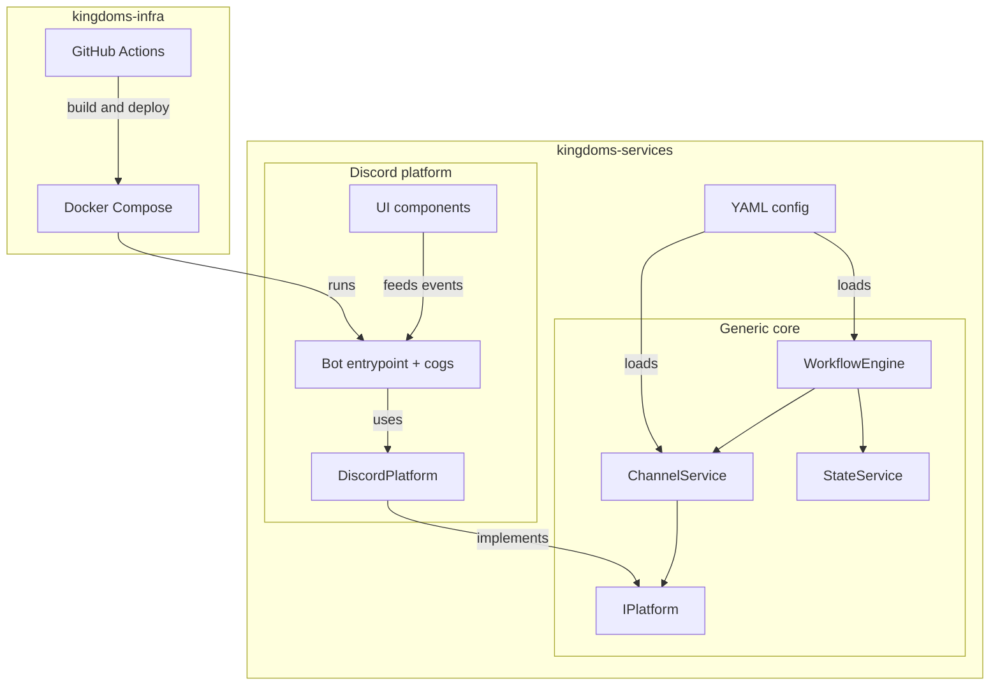
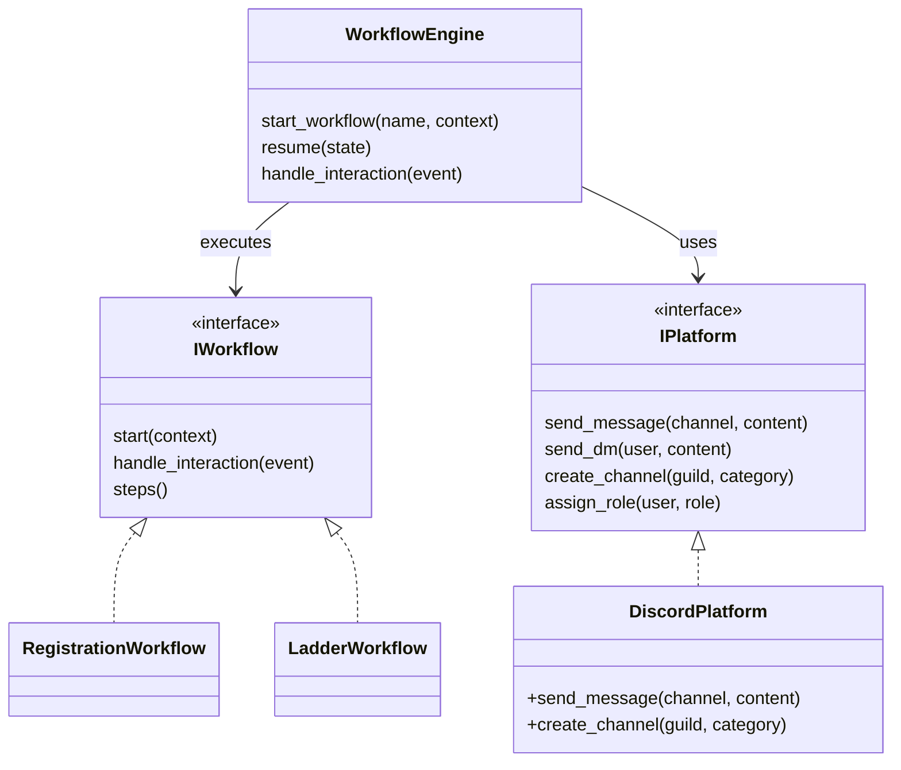
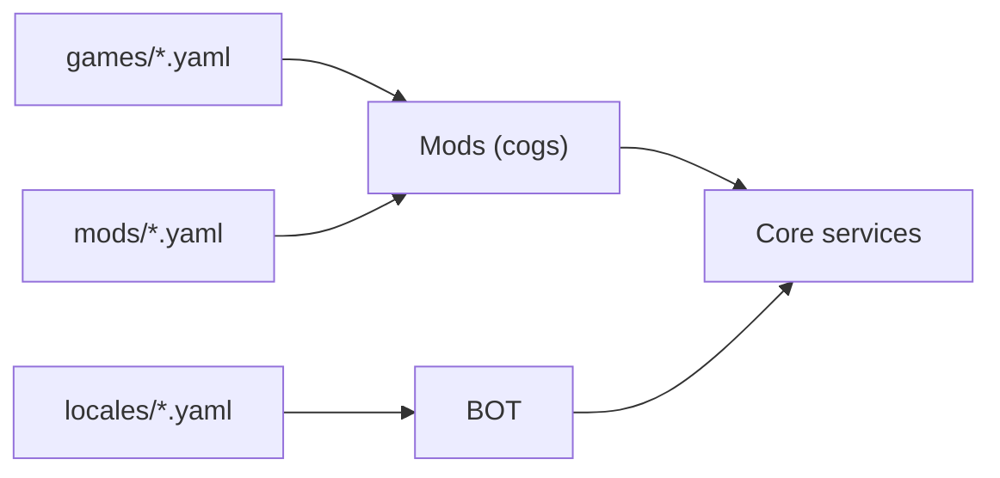
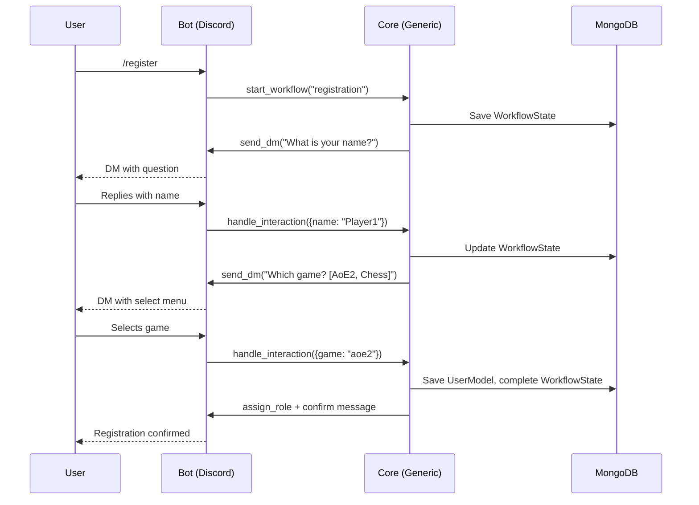
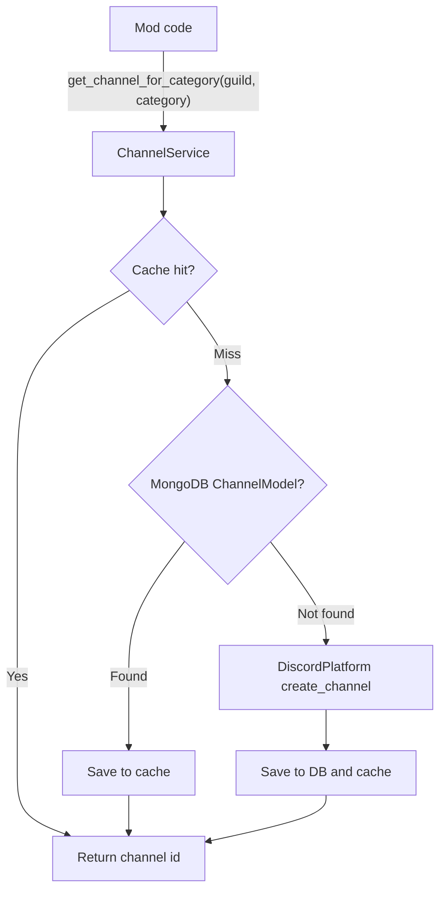
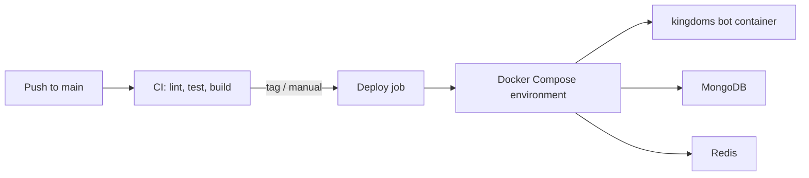

# Architecture

This document describes the technical architecture of Kingdoms: a modular,
multi-platform Discord bot platform. It is the reference for how the three
repositories fit together, how the generic core is organized, and how data
flows through the system.

The five architectural pillars:

1. **Multi-platform**: abstraction via `IPlatform` (Discord now, Twitch later)
2. **Modular**: generic core + specific implementations
3. **Workflow-based**: a workflow engine drives interaction sequences
4. **Channel categories**: intelligent message routing; core keeps only platform-level categories (`ADMIN`, `REPORTS`, `LOGS`), mods declare their own (`ladder:ladder_rankings`, ...)
5. **GitOps**: deployment via Docker Compose manifests

## 1. Overview

Kingdoms is split across three repositories:

| Repository | Role |
| ---------- | ---- |
| `kingdoms` (this repo) | Source of truth: architecture, workflows, ADRs, mods docs, generated dev docs |
| `kingdoms-services` | All Python code: generic core, Discord platform implementation, mods, YAML configs |
| `kingdoms-infra` | Docker, CI/CD, GitOps manifests, deployment scripts |

### Global architecture

### Data flow between repositories

- `kingdoms` (docs) describes rules and decisions; `kingdoms-services`
  implements them; `kingdoms-infra` deploys the implementation.
- Any code change in `kingdoms-services` or `kingdoms-infra` must come with — or
  be followed by — a doc update in this repo (see [AGENTS.md](../AGENTS.md)).
- Technical docs are generated **in the repository hosting the sources**:
  the pydoc of `kingdoms-services` is produced by that repo itself
  (`scripts/generate_pydoc.py`, `make docs`) and freshness-checked on every
  one of its PRs.

## 2. Generic core (`kingdoms-services/src/kingdoms/core/`)

The generic core contains everything platform-agnostic. Mods and workflows are
written against the core only; they never import Discord-specific code.

### `interfaces/`

All contracts are `typing.Protocol` classes (`@runtime_checkable`):
implementations satisfy them **structurally**, without inheritance —
conformance is verified by mypy strict, not at instantiation time
([ADR-0011](DECISIONS/011-protocol-interfaces.md)).

- **`IPlatform`**: the platform abstraction. Methods cover messaging
  (send/edit/delete), channel management (create/get by category), role
  assignment, and DMs. First implementation: `DiscordPlatform`.
- **`IMessage`, `IChannel`, `IUser`**: platform-agnostic models exchanged
  between the core and platforms. Adapters convert platform objects to these
  models and back.
- **`IWorkflow`**: contract for an interaction sequence (steps, transitions,
  timeouts). Implemented by concrete workflows and executed by the
  `WorkflowEngine`.

### `models/`

MongoDB-backed persistence models (MongoDB is used for schema flexibility —
workflow payloads evolve with the game rules):

- **`UserModel`**: platform user identity, registration data, per-game profiles
- **`GuildModel`**: per-server configuration (locale, channel category mapping)
- **`ChannelModel`**: channel registry keyed by `ChannelCategory`
- **`WorkflowState`**: persisted workflow instances (current step, payload,
  status) so flows survive restarts
- **`db.py`**: MongoDB client setup — singleton sync (`MongoClient`) and async
  (`AsyncMongoClient`, the native pymongo async API — no Motor dependency)
  clients configured from `MONGO_URI`/`MONGO_DB`; models expose
  `to_mongo()`/`from_mongo()` for lossless document round trips

### `services/`

- **`ChannelService`**: channel category management. Mods ask for a channel by
  category, never by name or ID. Resolution order: cache → database → platform
  creation.
- **`StatusService`**: operational report (version, uptime, configured games,
  enabled mods with their declared channels/roles, bot admins) — powers the
  generic `/status` command.
- **`AdminService`** (kingdoms-services#35): distinguishes **bot admins**
  (operators, defined by the `BOT_ADMINS` environment variable — provisioned
  via GitHub secrets in hosted environments) from **guild admins**
  (guild-scoped: platform permissions or mod-declared admin roles). Bot
  admins operate the bot; guild admins administer their guild only.
- **`WorkflowEngine`**: workflow execution. Declares nothing itself; loads
  workflow definitions, drives step transitions, persists state through
  `StateService`, and dispatches UI events to the right running workflow.
- **`StateService`**: state management in Redis for hot data (current step,
  short-lived payloads), with MongoDB as durable backing store.

### `enums/`

- **`ChannelCategory`**: platform-level routing keys (`ADMIN`, `REPORTS`, `LOGS`); mod-scoped categories are declared per mod (`mod:key`)
  used by `ChannelService`
- **`PlatformType`**: `DISCORD`, `TWITCH`, ...
- **`WorkflowStatus`**: `PENDING`, `IN_PROGRESS`, `COMPLETED`, `CANCELLED`,
  `TIMED_OUT`

## 3. Discord implementation (`kingdoms-services/src/kingdoms/discord/`)

### `platform/`

- **`DiscordPlatform`**: implements `IPlatform` on top of discord.py
- **`adapters.py`**: converts discord.py objects (`Message`, `TextChannel`,
  `User`/`Member`) to core models (`IMessage`, `IChannel`, `IUser`) and back

### `bot/`

- **`main.py`**: entry point — loads config, wires the core services, starts
  the Discord client, syncs slash commands on ready (guild-scoped when
  `CICD_GUILD_ID` is set, global otherwise)
- **`cogs/`**: Discord mods (`register.py`, `ladder.py`, ...). Each cog maps
  commands and interactions to core services; no game logic lives in cogs.
- **`status.py`**: the generic `/status` command — bot and per-guild
  operational report (uptime, version, games, enabled mods with their
  declared channels/roles, bot admins, guild admins). Not a mod: it is a
  platform capability, gated by admin levels (kingdoms-services#35).

### `ui/`

- **`views.py`**: buttons and select menus
- **`modals.py`**: forms (modal dialogs)
- **`embeds.py`**: rich message builders

UI conventions (persistent views, dynamic items, `custom_id` scheme) are
documented in [architecture/discord.md](architecture/discord.md).

## 4. Configuration (`kingdoms-services/config/`)

All configuration is versioned YAML, loaded at startup:

- **`locales/`**: i18n message catalogs (`en.yaml`, `fr.yaml`) — common keys;
  mod strings arrive with their mods
- **`games/`**: game declarations (name, aliases, team size) — added per game,
  none shipped yet
- **`mods/`**: mod declarations (`_example.yaml` is the documented template) —
  enabled flags, channels, roles, workflows, commands, dependencies

## 5. Infra (`kingdoms-infra/`)

- **`deploy/`**: Docker Compose manifests per environment (dev, staging,
  production). One command launches the bot and its dependencies (MongoDB,
  Redis).
- **Images**: the bot image is a **multi-stage build** (deps → build →
  runtime) published by the `kingdoms-services` `Docker` workflow to
  `ghcr.io/merlin-pinpin/kingdoms-services` (tags: `main`, `vX.Y.Z`, `sha-*`).
  Environments pull it from GHCR; production pins the exact tag via
  `KINGDOMS_BOT_IMAGE`.
- **Backups**: every deployment runs a **mandatory pre-deploy backup of both
  stores** (`scripts/backup_db.sh`): MongoDB via `mongodump --archive --gzip`,
  Redis via a `BGSAVE` RDB snapshot. Both artifacts share a timestamp prefix,
  are verified (non-empty, gzip integrity for Mongo) and abort the deployment
  on failure.
- **Rollback**: `scripts/rollback.sh` restores the latest backup (or a given
  archive) and reverts the manifests; `deploy.sh` triggers it automatically
  when the post-deploy health gate fails.
- **Smoke/preflight**: the bot image ships a `--preflight` mode that runs the
  real startup path (environment, MongoDB, Redis, locale catalogs) without
  connecting to the Discord gateway; CI runs it through the real container
  entrypoint on every PR.
- **`.github/workflows/`**: CI/CD — shellcheck, compose validation, smoke
  test (dev stack boot), **backup/restore round-trip test** (seed → dump →
  wipe → restore → byte-for-byte diff, on MongoDB **and** Redis), then
  deploy. Deployment is GitOps-style: environments are defined by versioned
  manifests, and deploys are reproducible from the repo state.

## 6. Key diagrams

### Communication flow: registration example

### Channel management

### Deployment flow

## 7. Key decisions

| Decision | Rationale | ADR |
| -------- | ---------- | --- |
| `IPlatform` abstraction | **Extensibility** — Twitch later without touching game logic | [ADR-0001](DECISIONS/001-multi-platform-architecture.md) |
| `typing.Protocol` contracts | **Decoupling** — adapters satisfy interfaces structurally, no inheritance | [ADR-0011](DECISIONS/011-protocol-interfaces.md) |
| MongoDB | **Flexibility** — dynamic schemas for evolving workflow payloads | — |
| Redis + MongoDB state split | **Responsiveness** — hot state in Redis, durability in MongoDB | [ADR-0002](DECISIONS/002-workflow-engine.md) |
| Channel categories | **Portability** — same mod on any server without code changes | [ADR-0003](DECISIONS/003-channel-categories.md) |
| Discord permissions & delivery | **Least surprise** — runtime role checks, DM/channel content policies, drift alerting, admin-triggered sync | [ADR-0016](DECISIONS/016-discord-permissions-and-delivery.md) |
| Docker Compose | **Simplicity** — one command to launch everything | — |
| GitOps | **Reproducibility** — versioned, reviewable environments | — |

New major decisions follow the ADR process in [DECISIONS/](DECISIONS/)
(template: [templates/decision-template.md](../templates/decision-template.md)).

## See also

- [architecture/core.md](architecture/core.md) — core services design deep-dive
- [architecture/mods.md](architecture/mods.md) — mod system design
- [architecture/testing.md](architecture/testing.md) — hybrid testing strategy  (`MockDiscord` mock objects + SimCord behavioral simulator)
- [architecture/discord.md](architecture/discord.md) — Discord.py components guide
- [architecture/discord-permissions.md](architecture/discord-permissions.md) — Discord permissions & message delivery guide (DM vs channel, runtime role checks, channel access, sync)
- [WORKFLOWS.md](WORKFLOWS.md) — game workflow documentation
- [MODS/](MODS/) — per-mod documentation
- [DECISIONS/](DECISIONS/) — architecture decision records
- [AGENTS.md](../AGENTS.md) — repo rules for AI agents
