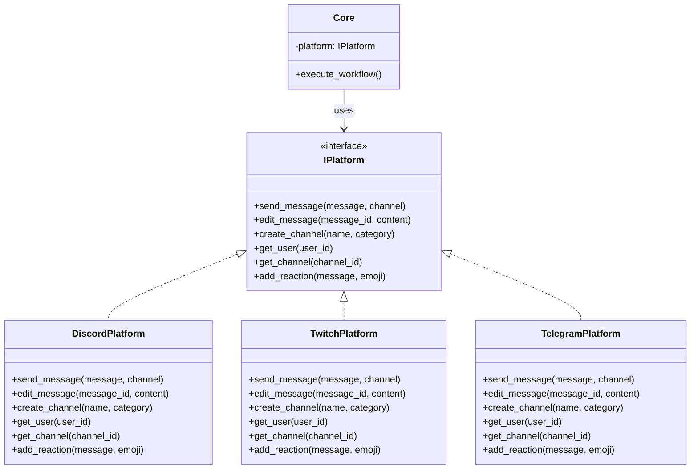

# ADR-0001: Multi-platform architecture

**Status:** Accepted
**Date:** 2026-09-18
**Reference:** kingdoms#2, kingdoms#6

## Context

We need to support Discord now, but want to add Twitch, Telegram, and
potentially other platforms in the future. Building platform-specific code for
each would lead to:

- Code duplication
- Inconsistent behavior across platforms
- High maintenance overhead
- Difficulty adding new platforms

## Decision

Implement an **abstract `IPlatform` interface** that defines platform-agnostic
operations (messaging, channel management, roles, DMs). Each platform
(Discord, Twitch, ...) has its own implementation of this interface, plus
adapters that convert platform objects to core models (`IMessage`, `IChannel`,
`IUser`) and back.

Mods and workflows are expressed only against the core interfaces; they never
import platform-specific code.

## Alternatives Considered

1. **Direct platform-specific code:** simple but not scalable, leads to
   duplication
2. **Adapter pattern only:** more complex, less clear abstraction
3. **Plugin system:** overkill for our needs, adds unnecessary complexity

## Consequences

### Positive

- Easy to add new platforms (implement `IPlatform`)
- Consistent API across all platforms
- Core logic remains platform-agnostic
- Easier testing (can mock `IPlatform`, see kingdoms-services#2 MockDiscord)
- Better separation of concerns

### Negative

- Slight performance overhead (abstraction layer)
- More initial setup work
- Need to maintain multiple implementations

## Diagram

## References

- [ARCHITECTURE.md](../ARCHITECTURE.md) — core interfaces
- kingdoms-services#3 (IPlatform), kingdoms-services#11 (DiscordPlatform)
