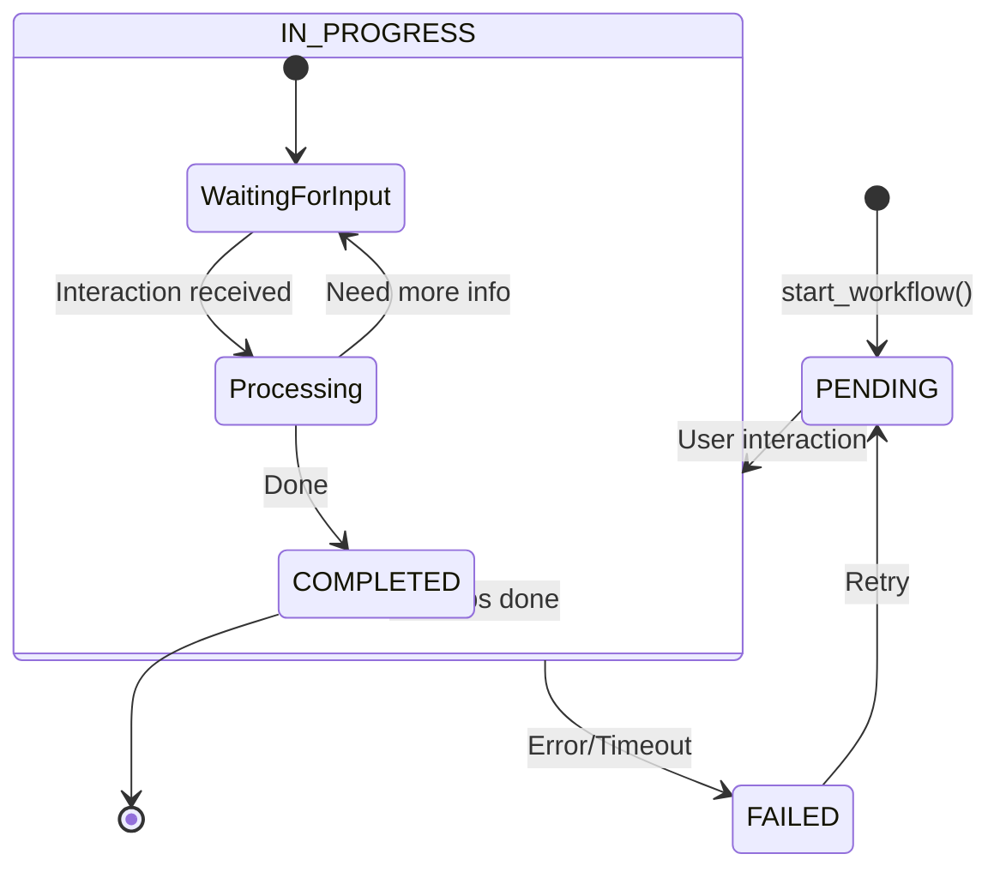

# ADR-0002: Workflow engine

**Status:** Accepted
**Date:** 2026-09-18
**Reference:** kingdoms#2, kingdoms#6

## Context

Kingdoms has many multi-step user interactions (registration, ladder setup,
match reporting, moderation). Without a workflow engine:

- Each workflow would have duplicated code
- State management would be inconsistent
- Error handling would be scattered
- Testing would be difficult

## Decision

Implement a **WorkflowEngine** class that:

- Manages workflow state (`PENDING`, `IN_PROGRESS`, `COMPLETED`, `FAILED`,
  `CANCELLED`, `TIMED_OUT`)
- Handles user interactions and transitions between states
- Persists state durably (MongoDB `WorkflowState`) with hot state in Redis
  for resilience, so flows survive restarts and can resume
- Provides a consistent API for all workflows (`IWorkflow`)

## Alternatives Considered

1. **Custom code per workflow:** simple but leads to duplication
2. **State machine library:** good but adds external dependency
3. **Database-only state:** slower, less flexible for complex workflows

## Consequences

### Positive

- Consistent workflow handling
- Easy to add new workflows
- Centralized state management
- Better error handling
- Built-in timeout handling

### Negative

- Learning curve for workflow definition
- More abstraction to understand
- Need to maintain the workflow engine

## Diagram

## References

- [WORKFLOWS.md](../WORKFLOWS.md) — workflow state lifecycle
- kingdoms-services#6 (WorkflowEngine), kingdoms-services#9 (StateService)
