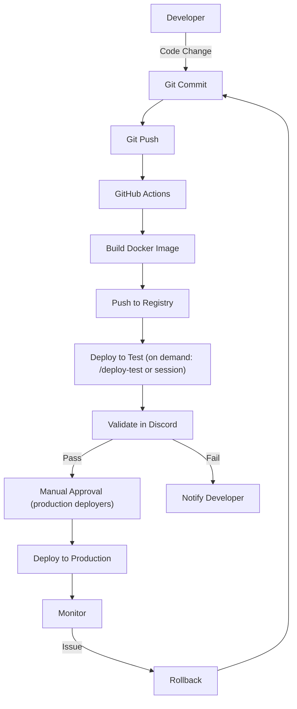

# ADR-0007: GitOps deployment

**Status:** Accepted
**Date:** 2026-09-18
**Reference:** kingdoms#6

## Context

We need a reliable, auditable deployment process that:

- Is reproducible
- Can be rolled back
- Has a clear audit trail
- Minimizes human error

## Decision

Implement a **GitOps** workflow:

- All infrastructure as code in Git
- Deployment triggered by Git pushes (merge to `main` → test, tags → prod)
- Git history = deployment audit trail
- Manual approval for production
- Automated testing before deployment

Environment policy: `test` deploys **on demand** — by the
`/deploy-test` PR comment (posted by a vibe-coding session or any
authorized user), with the PR-built image tagged by its commit SHA;
test-config changes on `main` also redeploy. The cross-repo dispatch
(the comment lives on `kingdoms-services`, the deploy workflow on
`kingdoms-infra`) uses the **kingdoms-deployer GitHub App**: installed
on `kingdoms-infra` only, single `Actions: write` permission,
ephemeral tokens minted per run — chosen over a permanent PAT (no
long-lived credential, centrally revocable, unable to touch the
non-dispatchable prod workflow); a workflow execution ruleset further
restricts the dispatch to that app alone (setup:
kingdoms-infra docs/DEPLOY-TEST-APP.md). `prod` deploys only from **released tags** (`vX.Y.Z`,
pinned image), run manually by identified production deployers gated by
GitHub rulesets (see [VIBEWORKFLOW.md](../VIBEWORKFLOW.md)). The former
`dev` environment is renamed `test`: it is a validation environment on
the VPS, not a developer machine. The `staging` environment is dropped:
two environments cover the workflow (on-demand validation, released
production).

**Deployment mechanism (2026 revision, kingdoms-infra#2):** CD jobs run
on a **GitHub Actions self-hosted runner installed on the VPS** (chosen
over SSH-from-Actions and cron-pull: it injects secrets from the GitHub
environment secrets at deploy time instead of storing them on the VPS,
attaches deployment to the merge event, and needs no inbound SSH
exposure). The runner carries the labels `self-hosted, kingdoms, env-test`
(one runner — one VPS — per environment; each future environment VPS
gets its own `env-*` label, and the CD jobs target the matching label).
Full installation procedure:
[kingdoms-infra docs/VPS-SETUP.md](https://github.com/merlin-pinpin/kingdoms-infra/blob/main/docs/VPS-SETUP.md).

## Alternatives Considered

1. **Manual deployment:** error-prone, not auditable
2. **CI/CD only:** no version control for infrastructure
3. **Custom scripts:** hard to maintain, not standardized

## Consequences

### Positive

- Full audit trail
- Reproducible deployments
- Easy rollback (git revert)
- Consistent across environments
- Better collaboration

### Negative

- Learning curve
- More files to maintain
- Need Git access for deployments

## Diagram

## References

- [VIBEWORKFLOW.md](../VIBEWORKFLOW.md) — release and environment flow
- kingdoms-infra#2 (CI/CD)
