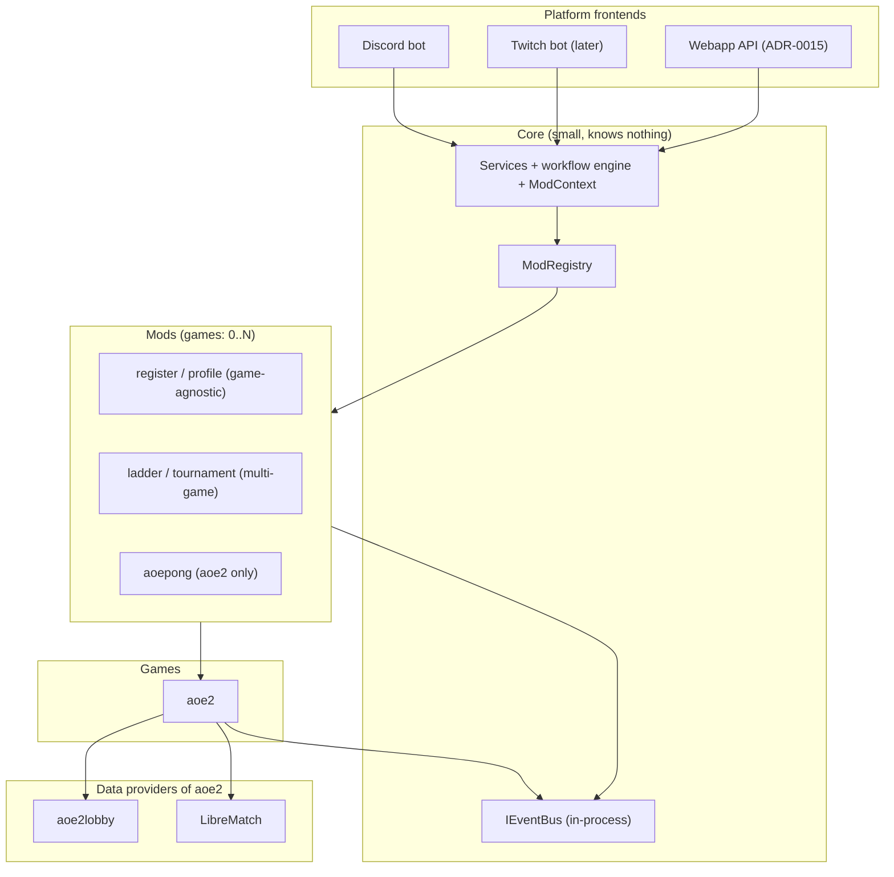

# ADR-0012: Taxonomy of building blocks, boundaries and repo strategy

**Status:** Accepted

**Accepted with:** co-built with the developer across agent sessions (challenged and revised together)

**Date:** 2026-09-21

**Reference:** kingdoms#59

## Context

Kingdoms today is one Discord bot (`kingdoms-services`). The roadmap adds
more: a Twitch bot, a webapp, an AoE2 game with external data sources
(aoe2lobby, LibreMatch), and many mods (clans, team-maker, tournament,
valnoria, aoepong, ladder, ...). Early planning discussions named these
after future repositories (`mod-clans`, `game-aoe2-aoe2lobby`), which mixes
fundamentally different kinds of software and suggests one repo per
feature before any need exists.

Two additional forces shape the decision. First, mods are **not uniformly
game-bound**: `register` or `profile` are game-agnostic, `ladder` is a
generic mod with per-game strategies, `aoepong` targets exactly one game.
Second, what runs in an environment (which mods, which games) must be an
**environment-level parametrage** owned by the infra repository, not a
code-level constant.

## Decision

### 1. Four natures of building blocks

| Nature | Description | Examples | Lives in |
| ------ | ----------- | -------- | -------- |
| **Platform frontend** | An entrypoint that talks to humans: implements `IPlatform` (or an equivalent contract), owns no game logic | Discord bot, Twitch bot, webapp API (see [ADR-0015](015-webapp-api-boundary.md)) | `kingdoms-services/src/kingdoms/<platform>/` |
| **Game** | Knows one game: rules, team formats, match data, ranking strategies | `aoe2` | `kingdoms-services/src/kingdoms/games/<game>/` |
| **Data provider** | A data source for a game: HTTP/WS client behind a protocol interface, owned by its game. Neither a mod nor a game | aoe2lobby, LibreMatch (for `aoe2`) | `src/kingdoms/games/<game>/providers/` |
| **Mod** | A self-contained game feature built only on core + games, declared in YAML (see [architecture/mods.md](../architecture/mods.md)) | register, profile, ladder, clans, team-maker, tournament, valnoria, aoepong | `kingdoms-services/src/kingdoms/mods/` + `config/mods/` |

### 2. Repository strategy

The three repositories stay as-is: `kingdoms` (docs), `kingdoms-services`
(all Python), `kingdoms-infra` (deployment). No `mod-*` or `game-*`
repositories. A mod, game, or data provider leaves the monorepo only when
at least one of: independent release cadence, external contributors,
separate runtime/scaling need, or isolated secrets. Each extraction gets
an ADR and an interface contract.

### 3. Dependency matrix (enforced in CI)

Import rules are checked by a CI step (AST/import analysis), not by
convention:

| Component ↓ imports → | core | games | data providers | mods | platforms |
| --------------------- | ---- | ----- | -------------- | ---- | --------- |
| **Platform frontend** | yes | no | no | registry only | no |
| **Mod** | yes | declared games only | no | declared mods only (YAML) | no |
| **Game** | yes | no | own providers only | no | no |
| **Data provider** | yes | no | no | no | no |
| **Core** | itself | no | no | no | no |

- Mods never import a data provider: they go through their game's service
  and query interfaces.
- Platform frontends load mods only through `ModRegistry`, never by
  direct import.
- Mod-to-mod dependencies must be declared in YAML and stay acyclic.

### 4. Cross-game mods

A mod declares the games it targets (0..N) in its YAML:

```yaml
id: ladder
games: []      # 0 = game-agnostic; N = listed games only
```

- A mod with `games: []` is game-agnostic (register, profile).
- A mod listing games is enabled only where those games are enabled.
- Game-specific behavior (team size, scoring) is resolved through game
  interfaces at runtime, not by branching on game ids in mod code.

### 5. Data ownership

Every MongoDB collection and Redis key scope has exactly one owner
(core, a mod, a game, a provider). Other components read through the
owner's service or query interface, never by direct access. Mod
declarations already list their collections and key scopes; games and
providers declare theirs the same way.

### 6. Failure containment

A data provider failure is contained to its **declared dependents** — the
blast radius is known from the declarations, not discovered at runtime.
Providers carry timeouts, bounded retries, and circuit breaking. Each
consumer declares its degradation policy (serve cached data, refuse the
feature cleanly); a mod consuming live aoe2 data degrades when aoe2lobby
is down, while a mod with no aoe2 dependency is unaffected. No consumer
may block indefinitely on a provider.

### 7. Event bus

Components communicate decoupled changes through an `IEventBus` contract
(`MatchReported`, `PlayerRegistered`, ...). The first implementation is
in-process (no broker). When a component is extracted to its own process,
the transport becomes **Redis Streams** (persistent, consumer groups,
reuses the existing Redis of [ADR-0005](005-redis-state-management.md)).
Plain Redis pub/sub is rejected (messages are lost if a consumer is
disconnected); RabbitMQ is rejected for now (new infrastructure to
operate, no advanced routing need identified).

### 8. Environment activation (infra parametrage)

- `kingdoms-services` config declares what **exists** (all mods, games,
  providers, with defaults and validation schema).
- `kingdoms-infra` provides, per environment, an **activation manifest**:
  which mods and games run in test/staging/prod, versioned in the deploy
  manifests (GitOps).
- The bot resolves the intersection at startup and **fails fast** on an
  invalid combination (mod enabled whose game is not); the existing
  `--preflight` mode validates this without a Discord connection.

### 9. Core minimalism

- The core knows nothing: no game, no platform, no mod, no provider.
- **Rule of two consumers**: nothing enters the core unless two
  independent components need it. Single-consumer abstractions live in
  the consumer.
- Mods receive a single `ModContext` facade (services, i18n, events,
  config) instead of importing many core services; the public core
  surface stays small and frozen by ADR.
- Naming in code and config carries no `mod-`/`game-` prefix
  (`mods/ladder`, `games/aoe2`); prefixes appear only in conversation.

## Alternatives Considered

1. **One repository per mod/game/provider**: maximizes isolation on
   paper but multiplies CI pipelines, version matrices, doc-sync work,
   and makes vibe-coded feature branches harder for the game designer.
   Independence is achieved by the CI-enforced matrix instead.
2. **Free-form imports with review discipline**: no tooling cost, but the
   matrix above would erode over time; every future session would have to
   rediscover the rules. Rejected: the matrix must be mechanical.
3. **Plugin/package system with runtime installation**: elegant but
   heavy; the YAML `ModRegistry` already covers declaration, enablement,
   and dependencies. Rejected for now.
4. **RabbitMQ as the event transport from day one**: durable and rich,
   but adds a broker to operate before any process split exists. Deferred
   until a routing need Redis Streams cannot meet.

## Consequences

### Positive

- A stable vocabulary: every future idea is classified into one of four
  natures before implementation planning.
- The webapp and the Twitch bot reuse every mod and game as-is.
- Failure blast radius is computable from declarations.
- Per-environment activation is GitOps-versioned and validated at
  startup, by the team that owns environments.
- Extraction to separate services stays cheap: every boundary already
  sits behind an interface or the event bus.

### Negative

- A CI import-rules check must be written and maintained.
- The monorepo grows large; the dependency graph needs continuous
  discipline (CI-enforced, not convention-only).
- The activation manifest adds one artifact to keep in sync between the
  two repositories.
- Redis Streams as future transport requires consumer-group design when
  the split happens.

## Diagrams



## References

- [ADR-0001](001-multi-platform-architecture.md) — multi-platform core
- [ADR-0005](005-redis-state-management.md) — Redis state (future
  Streams transport)
- [ADR-0013](013-cross-platform-identity.md) — cross-platform identity
- [ADR-0015](015-webapp-api-boundary.md) — webapp API boundary
- [architecture/mods.md](../architecture/mods.md) — mod system design
