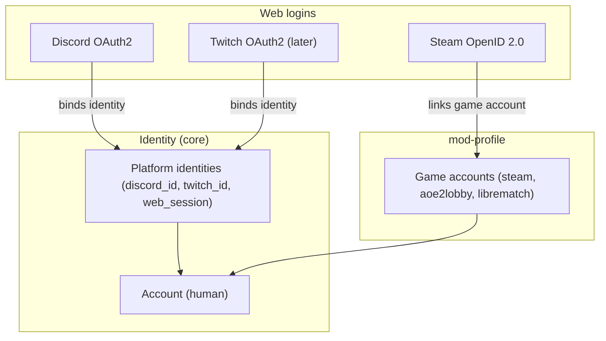
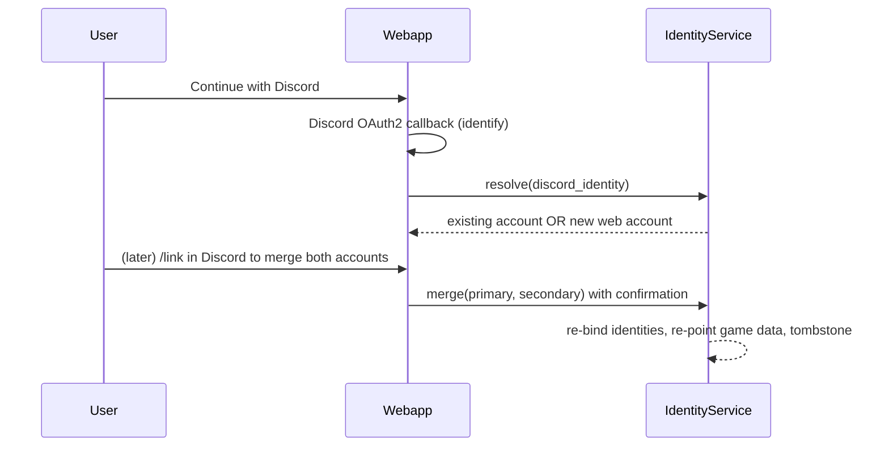

# ADR-0013: Cross-platform identity, OAuth providers and account merge

**Status:** Accepted

**Accepted with:** co-built with the developer across agent sessions (challenged and revised together)

**Date:** 2026-09-21

**Reference:** kingdoms#60

## Context

`UserModel` today is a platform identity: a Discord user with registration
data and per-game profiles. The roadmap adds a Twitch bot and a webapp;
players will exist on Discord, Twitch, the webapp, and will link game
accounts (Steam, aoe2lobby, LibreMatch) to their identity. Two failure
modes must be avoided:

- Identity drift: the same human has separate, unlinkable player records
  per platform ("Pseudo#1234 on Discord" and "Pseudo on the webapp" are
  two players in the data).
- Credential sprawl: passwords and custom auth flows for the webapp.

The webapp login was decided: OAuth with the platform providers (Discord
now, Twitch later, Steam for game-account linking).

## Decision

### 1. Separate the account from the platform identity

| Concept | Nature | Examples |
| ------- | ------ | -------- |
| **Account** | The human, game-facing: profile, stats, memberships | `accounts` collection |
| **Platform identity** | A login on one platform, bound to an account | Discord user id, Twitch user id, web session user id |
| **Game account** | An in-game account owned by an account, linked by `mod-profile` | Steam (SteamID64), aoe2lobby id, LibreMatch id |

Rules:

- One account, N platform identities, M game accounts (0..N each).
- Game logic (mods, games, stats) always resolves an **account**, never a
  Discord id. Platform ids appear only at the platform boundary and in the
  identity bindings.
- A player can exist with only a Discord identity (today), only a web
  session identity (a webapp-created account), or any combination.
- `UserModel` remains the Discord-side identity document; the new
  `accounts` collection is the game-facing truth, and the existing
  registration flow creates both.

### 2. Web authentication: OAuth providers

- **Discord OAuth2** (`identify`, `guilds` scopes): primary web login.
  Resolves the existing Discord identity; the account is linked, not
  recreated.
- **Twitch OAuth2** (later, `user:read:email` minimum): same flow, Twitch
  identity binds to an account.
- **Steam OpenID 2.0** (not OAuth2): "Sign in through Steam" proves a
  SteamID64; the claimed SteamID must be verified against Steam's fixed
  endpoint (never the one supplied by the incoming request). Steam login
  is treated as a **game-account link** owned by `mod-profile`, not as a
  standalone web identity: knowing a SteamID must never grant control of
  an account.
- Web sessions: short-lived signed token (JWT) + refresh, session state
  in Redis (consistent with [ADR-0005](005-redis-state-management.md)).

### 3. Account merge (first-class operation)

The same human may end up with two accounts (one created via Discord
registration, one created via the webapp). Merge is an explicit,
permissioned operation:

- Triggered from either side (a `/link-web`-style command or a webapp
  "connect your Discord" action); the other side must confirm.
- **Primary account wins**: the account created first (or explicitly
  chosen) is the surviving identity; platform identities and game
  accounts of the secondary are re-bound to it.
- All game data (ladder results, clan memberships, stats) is re-pointed
  via the owning services' interfaces (data ownership rules of
  [ADR-0012](012-taxonomy-repo-strategy.md)), not by raw collection
  updates.
- Merges are logged (who, what, when) and reversible within a retention
  window: the secondary account document is kept as a tombstone pointing
  to the survivor, so the merge can be undone.

### 4. Responsibility split

- **Core `IdentityService`**: accounts, platform-identity bindings, merge
  mechanics, session token validation. Platform-agnostic.
- **`mod-profile`** (mod): links **game accounts** (Steam, aoe2lobby,
  LibreMatch ids) to accounts; exposes `/profile` and `/link` commands and
  the webapp equivalent.
- **Platform frontends**: OAuth redirect flows and webhook/session glue
  only; they hand verified identities to `IdentityService`.

## Alternatives Considered

1. **Discord id as the universal player id** (status quo): zero work
   today, but the webapp and Twitch then create shadow players; merge
   becomes impossible after data accumulates. Rejected.
2. **Local username/password for the webapp**: full control, but
   password storage, resets, and abuse handling for no benefit; OAuth
   providers cover the need. Rejected.
3. **Steam as a standalone web identity**: convenient for AoE2 players,
   but Steam OpenID proves only a SteamID64 — anyone knowing the id could
   claim it. Steam stays a game-account link via `mod-profile`.
4. **Automatic merge on email match**: tempting for Discord+webapp
   duplicates, but emails are unverified and changing; merges must be
   explicit and confirmed on both sides. Rejected.

## Consequences

### Positive

- One player, one history, across all platforms; stats and ladder results
  survive a platform change.
- The webapp needs no password infrastructure.
- Merge handles the guaranteed Discord/webapp duplicate case cleanly and
  reversibly.
- Twitch onboarding is the same flow as Discord, later.

### Negative

- A migration is required: existing `UserModel` records get backfilled
  accounts (one account per existing Discord user).
- Two new concepts (account vs identity) must be taught to contributors;
  `mod-profile` scope grows.
- OAuth client credentials and redirect URIs must be provisioned per
  environment (GitHub secrets, `.env`).
- Merge touches data owned by several mods; each owning service must
  provide a re-pointing path.

## Diagrams

## References

- [ADR-0004](004-mongodb-schema-design.md) — MongoDB schema (`accounts`
  collection extends it)
- [ADR-0005](005-redis-state-management.md) — Redis (web sessions)
- [ADR-0012](012-taxonomy-repo-strategy.md) — taxonomy and data ownership
- [ADR-0014](014-rbac-permissions.md) — permissions resolve accounts
- [ADR-0015](015-webapp-api-boundary.md) — webapp API boundary
