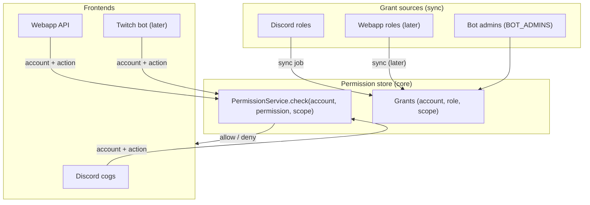

# ADR-0014: RBAC: application roles, grants and permission enforcement

**Status:** Accepted

**Accepted with:** co-built with the developer across agent sessions (challenged and revised together)

**Date:** 2026-09-21

**Reference:** kingdoms#61

## Context

Roles today are Discord-centric: mods declare logical role keys
(`ladder_admin`) resolved to Discord roles by `RoleService`, and
`AdminService` (kingdoms-services#35) distinguishes bot admins from guild
admins. This cannot survive a second frontend. A Discord role does not
exist on the webapp; a Twitch viewer has no roles at all. If each frontend
re-implements access control, the same player will have different rights
depending on where they act — and the webapp would need its own parallel
role model.

The webapp requirement is explicit: interactions, data access, stats —
with roles and access rights. One permission model is needed, enforced in
one place, consumed by every frontend.

## Decision

### 1. Three application-level concepts

| Concept | Nature | Example |
| ------- | ------ | ------- |
| **Permission** | An atomic, mod-scoped capability key | `clans:kick`, `ladder:manage`, `profile:read:other` |
| **App role** | A named bundle of permissions | `clan_leader` = {`clans:invite`, `clans:kick`} |
| **Grant** | Account → app role, in a scope (guild/community) | Alice has `clan_leader` in Valnoria |

- Permissions are **declared by mods** in their YAML alongside channels
  and roles; the naming convention is `<mod>:<action>[:<qualifier>]`.
- App roles and their permission bundles are declared in a core-level
  catalog; mods may ship role templates.
- Grants are scoped: a role in one guild never leaks to another (the
  `GuildModel` scope pattern extends to all frontends).

### 2. Platform roles are sources of grants, not the truth

The Discord role `Clan Leader` (declared by the clans mod) is a **grant
source**: a sync job reads platform roles and writes grants into the
permission store. Consequences:

- Enforcement never reads Discord roles directly; it reads grants.
- The same mod command, the same webapp page, and (later) the same Twitch
  action check the **same permission** for the **same account**.
- The webapp can also become a grant source (roles managed in the web UI
  re-sync to Discord), but the grant store stays the single truth.

### 3. One enforcement point: the application layer

Permission checks happen in application services (and in the workflow
engine's step guards), **not** in Discord cogs or FastAPI handlers:

- Frontends authenticate (identity, [ADR-0013](013-cross-platform-identity.md))
  and pass the account id; services resolve grants and decide.
- A handler that bypasses the service to touch data directly is a bug —
  this is also the data-ownership rule of [ADR-0012](012-taxonomy-repo-strategy.md).
- `AdminService` levels (bot admin / guild admin) become the top tiers of
  the same model: bot admin > guild admin > mod roles > member.

### 4. Staleness and sync

- Discord role sync is **eventual**: the sync job runs at startup, on
  member updates, and on a short interval. Grants are cached in Redis
  (short TTL) with an explicit invalidation on sync.
- If a platform source is unreachable, enforcement falls back to the last
  known grants (fail-closed for sensitive permissions: if no grant data
  exists at all, deny).

## Alternatives Considered

1. **Discord roles as the only role model** (status quo): zero work, but
   the webapp has no roles and Twitch is impossible; per-frontend checks
   would drift. Rejected.
2. **Per-frontend access control** (Discord checks in cogs, webapp checks
   in handlers): fast to start, but rights diverge by surface and every
   new frontend re-implements policy. Rejected: policy must live in one
   layer.
3. **Full ABAC (attribute-based) policy engine** (OPA-style): maximal
   flexibility, but heavy for a game platform whose rules are defined by
   the game designer; RBAC with mod-declared permissions covers the
   identified needs. Rejected for now; permission keys leave room for
   qualifiers (`profile:read:other`).

## Consequences

### Positive

- One permission model for all frontends; identical rights everywhere for
  the same account.
- Mods declare permissions exactly like channels and roles — the same
  YAML surface the game designer already uses.
- Discord keeps working unchanged from the user's viewpoint: platform
  roles sync into grants.
- Prepares bot commands usable from the webapp (same permission, same
  workflow) without rework.

### Negative

- A sync job and a grant store (MongoDB collection + Redis cache) to
  build and operate.
- Eventual consistency: a Discord role change may take effect after a
  short delay on all frontends.
- All existing checks (cogs calling `AdminService`) must migrate to the
  service-level enforcement over time.

## Diagrams

## References

- [ADR-0013](013-cross-platform-identity.md) — accounts resolved before
  permission checks
- [ADR-0012](012-taxonomy-repo-strategy.md) — data ownership and
  application-layer enforcement
- [ADR-0015](015-webapp-api-boundary.md) — webapp API boundary
- kingdoms-services#35 — `AdminService` (bot vs guild admins)
