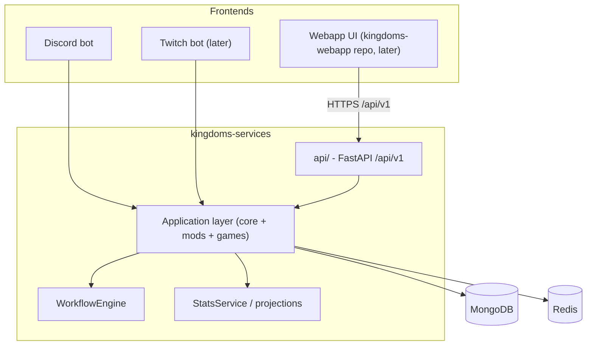

# ADR-0015: Webapp frontend and API boundary

**Status:** Accepted

**Accepted with:** co-built with the developer across agent sessions (challenged and revised together)

**Date:** 2026-09-21

**Reference:** kingdoms#62

## Context

A webapp is planned: interactions (the same actions as Discord commands),
data access, stats, with roles and access rights. Two tempting designs are
wrong. First, forcing the webapp into `IPlatform`: that contract is
chat-centric (push messaging, DMs, channels, roles) while a webapp is
request/response with sessions and pages — the abstraction would bend and
break both sides. Second, giving the webapp direct database access: it
would bypass permissions and data ownership, and later block any service
extraction ([ADR-0012](012-taxonomy-repo-strategy.md)).

FastAPI is already a dependency (the `/healthz` endpoint).

## Decision

### 1. The webapp is a frontend over the application layer

```text
Discord bot ─┐
Twitch bot  ─┼─→ application layer (core services + mods + games) ─→ MongoDB / Redis
Webapp API  ─┘
```

- The application layer is the **only** business surface: frontends
  authenticate ([ADR-0013](013-cross-platform-identity.md)) and translate
  their native interactions into the same application calls and workflows
  the Discord bot uses.
- `IPlatform` stays chat-scoped (Discord, Twitch). The webapp is a
  **request/response frontend**: it does not implement `IPlatform`.

### 2. One action, one workflow, every frontend

- A user action (register, report a match, join a tournament) is an
  application-level command or workflow, started from any frontend.
- `WorkflowEngine` events are platform-agnostic: a web form submit and a
  Discord button click feed the same `handle_interaction` with the same
  `WorkflowState`, timeouts and persistence.
- No web-only logic: if the webapp needs a behavior Discord lacks, it is
  an application feature exposed (or not) per frontend — never a
  webapp-side reimplementation.

### 3. Versioned API, read models for stats

- The webapp consumes a versioned HTTP API: `src/kingdoms/api/`
  (FastAPI), mounted under `/api/v1/`, in `kingdoms-services`. It calls
  application services only.
- **Write side**: application services (same code path as the bot).
- **Read side**: a `StatsService`/query layer over MongoDB aggregation
  pipelines; if a view gets hot, projections (precomputed read models)
  maintained after domain events (via the `IEventBus` of
  [ADR-0012](012-taxonomy-repo-strategy.md)). No frontend computes stats
  directly over business collections.
- The webapp holds **no local copy** of the data: one source of truth,
  no sync problem. Real sync between processes only appears if a service
  is extracted (then Redis Streams events).

### 4. Deployment boundary

- The API ships as one more service in the same `kingdoms-services`
  deployment (its own container in the compose manifests,
  `kingdoms-infra`), behind a reverse proxy with HTTPS.
- The frontend (SPA or server-rendered) lives in a separate repository
  `kingdoms-webapp`, created only when the API contract stabilizes.
- OAuth redirect URIs and client credentials are provisioned per
  environment (GitHub secrets, host `.env`), like existing tokens.

### 5. i18n and UI parity

- Webapp strings come from the same YAML catalogs
  ([ADR-0008](008-i18n-system.md)); mod strings arrive with their mods.
- The webapp reuses per-frontend exposure: some workflows render as
  Discord components (views, modals) and as web forms, from the same
  workflow definitions.

## Alternatives Considered

1. **Webapp implements `IPlatform`**: reuses the platform abstraction, but
   the contract (push messages, DMs, channels, roles) does not fit
   request/response; `IPlatform` would bloat for all platforms. Rejected.
2. **Direct database access for the webapp**: simplest queries, but
   bypasses permissions ([ADR-0014](014-rbac-permissions.md)) and data
   ownership; blocks extraction. Rejected.
3. **Separate webapp backend from day one**: clean split, but the
   application layer is the backend; duplicating it would create a second
   truth. Rejected: the API is a thin adapter over the same services.
4. **GraphQL API**: flexible reads, but a larger surface to secure and
   version for a single consumer. Rejected; revisit if multiple external
   consumers appear.

## Consequences

### Positive

- One business logic path for all frontends; the webapp cannot drift
  from the bot.
- Workflows started on Discord can continue on the webapp (same state).
- The API is testable without any frontend (service-level tests).
- Extraction of any component (mod, game) stays possible without touching
  the webapp.

### Negative

- The API layer must be designed, versioned and secured (auth via
  [ADR-0013](013-cross-platform-identity.md), rate limiting, CORS).
- One more container in every environment's compose manifest.
- Per-frontend rendering of workflows means each workflow definition
  needs both Discord and web presentations over time.

## Diagrams



## References

- [ADR-0001](001-multi-platform-architecture.md) — `IPlatform` scope
  (stays chat-scoped)
- [ADR-0008](008-i18n-system.md) — shared i18n catalogs
- [ADR-0012](012-taxonomy-repo-strategy.md) — taxonomy, event bus
- [ADR-0013](013-cross-platform-identity.md) — authentication
- [ADR-0014](014-rbac-permissions.md) — permission enforcement
