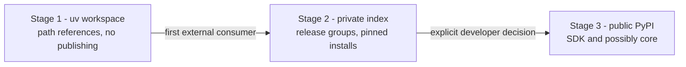

# ADR-0017: Packaging and distribution strategy

**Status:** Proposed

**Date:** 2026-09-21

**Reference:** kingdoms#65

## Context

The plan is to grow several Python components (core, platform frontends,
mods, games, a future SDK for mod authors) and, eventually, extracted
services. A natural question is whether to publish these as Python
libraries — first to simplify Docker images, later for reuse by
microservices and external consumers.

Publishing to a public index is almost irreversible: uploaded versions
stay downloadable forever, which turns every release into a public
compatibility commitment. Meanwhile the codebase today has exactly one
consumer (`kingdoms-services` itself), and the vibe-coding workflow builds
feature branches that can never rely on a published index (PRs must not
publish). The dependency boundaries of
[ADR-0012](012-taxonomy-repo-strategy.md) are currently checked by an
import-rules CI step only.

## Decision

A **three-stage packaging trajectory**. Stage boundaries are triggered by
consumers, not by dates.

### Stage 1 (now): internal uv workspace packages

- `kingdoms-services` becomes a **uv workspace**: each component is an
  installable package with its own `pyproject.toml` and declared
  dependencies — `kingdoms-core`, `kingdoms-discord`, per-mod packages,
  `kingdoms-games-aoe2`, and later `kingdoms-sdk` (the mod-author surface:
  `ModContext`, protocols, templates).
- Packages are consumed by **path/workspace references**, never published.
- The Docker image is still built from the local source (multi-stage,
  dependency layer cached from the workspace lock), so feature branches
  build without any publishing step.
- **Enforcement upgrade**: the ADR-0012 dependency matrix is verified from
  package metadata (declared dependencies), not only from import analysis.
  An illegal import is also an illegal package dependency.

### Stage 2 (trigger: first external consumer): private package index

- Triggered when a component outside this workspace consumes the packages
  (the `kingdoms-webapp` repository, an extracted service, or a
  third-party mod author).
- Publish to a **private index** (GitHub Packages or an equivalent private
  PyPI index), with credentials in GitHub secrets. Never to public PyPI.
- **Release groups**: all packages publish together per release with one
  version number (uv-managed), so there is no cross-package version matrix
  to resolve.
- Docker images then install pinned packages
  (`pip install kingdoms-core==x.y.z --index-url ...`); feature branches
  keep building from source.

### Stage 3 (trigger: explicit developer decision): public PyPI

- Publishing the core/SDK as public AGPL-licensed libraries is a **product
  decision by the developer**, not a technical simplification: it makes
  the platform reusable by anyone, including competitors, and commits to
  public semantic versioning and issue handling.
- If taken, `kingdoms-sdk` (and possibly `kingdoms-core`) are the public
  surface; mods and games stay private until individually decided.

## Alternatives Considered

1. **Publish everything to public PyPI now**: simplest Dockerfile and the
   requested developer experience, but there is no external consumer yet,
   feature branches cannot use it, and it creates an immediate, permanent
   public compatibility and license exposure. Rejected as premature.
2. **Keep one flat `kingdoms-services` package**: no packaging work, but
   the ADR-0012 matrix stays import-convention-checked only, and every
   future extraction starts with a risky restructure. Rejected: Stage 1
   is cheap and makes the boundaries physical.
3. **Git dependencies (`pip install git+https://...`)**: avoids an index,
   but pins by commit, caches poorly, and gives no version semantics.
   Rejected except for feature-branch builds, where building from source
   is simpler anyway.
4. **A monorepo build plugin instead of real packages** (setuptools
   namespaces without `pyproject.toml` per component): fewer files, but
   no per-component dependency metadata, so no matrix enforcement.
   Rejected.

## Consequences

### Positive

- Dependency boundaries become physically enforced (package metadata),
  completing the ADR-0012 matrix.
- The future SDK is already the natural seam for external mod authors.
- Docker images can move to pinned package installs with zero code
  change once Stage 2 triggers.
- Version discipline (release groups) is designed before, not after,
  cross-package drift appears.

### Negative

- Stage 1 is a restructuring of `kingdoms-services` (workspace layout,
  per-package `pyproject.toml`, CI updates); it must be scheduled as its
  own issue and keep the tests green throughout.
- Two build modes coexist after Stage 2 (source builds for feature
  branches, package installs for releases); the Dockerfile must keep both
  paths working.
- Public publication, if ever taken, adds release and support duties.

## Diagrams

## References

- [ADR-0012](012-taxonomy-repo-strategy.md) — taxonomy, dependency
  matrix, extraction criteria (this ADR is the package-form sibling)
- [ADR-0015](015-webapp-api-boundary.md) — the first likely Stage 2
  consumer
- kingdoms-services packaging and Docker workflow (multi-stage build)
