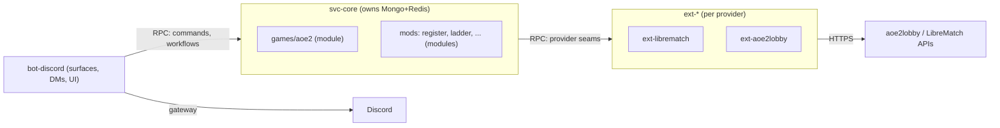

# ADR-0020: Process split — bot-discord, svc-core, external providers

**Status:** Accepted (developer decision, 2026-09-28 vibe-coding session)

**Date:** 2026-09-28

**Supersedes:** ADR-0019 (modular monolith), for the three processes named
below. ADR-0019's contract rules (serializable payloads, no shared state,
typed error taxonomy, async idempotent seams) remain fully in force — they
are what makes this split mechanical rather than a rewrite.

## Context

ADR-0019 kept Kingdoms as one runtime until extraction triggers fire
(ADR-0012). The v0.4.0 milestone introduces a first game (AoE2) with external
data providers (aoe2lobby, LibreMatch). The developer has decided that two
risks must not share a process with the Discord bot:

1. **External API dependency.** aoe2lobby / LibreMatch have their own rate
   limits, latency and downtime. A hung provider call must never block the
   bot's event loop or take the player-facing surface down with it.
2. **Core domain integrity.** The bot is a *delivery surface*, not the domain.
   Keeping the domain (seasons, ladders, matches, ELO) out of the bot process
   means a bot crash/redeploy never corrupts or freezes domain state, and
   several delivery surfaces (Discord today, webapp per ADR-0015 later) can
   talk to one core.

The timing argument also matters: v0.4.0 is the first milestone with a real
game and real external providers — doing the split now means every future
game/mod lands on the final shape instead of migrating mid-scaling.

## Decision

Kingdoms runs as **three process families**, deployed as separate
containers:

| Process | Contents | Talks to |
|---------|----------|----------|
| `bot-discord` | DiscordPlatform (ADR-0016), UI components, mod command surfaces, DM workflows. No domain logic, no provider code. | `svc-core` (RPC), Discord |
| `svc-core` | Domain: seasons, registrations, ladders, matches, ELO, mods' business logic, `games/<game>/` domain code. Owns MongoDB/Redis. | `bot-discord` (RPC), providers (RPC) |
| `ext-<provider>` (one per provider: `ext-librematch`, `ext-aoe2lobby`) | External API adapters (ADR-0011 `IGameProvider`-family seams), polling, rate limiting, caching. Own secrets. | `svc-core` (RPC), external APIs |

Rules:

1. **RPC contracts, not imports.** The seams between the three families are
   the existing Protocol interfaces, made network-exposed: JSON-serializable
   payloads only, the typed exception taxonomy (kingdoms-services#10) mapped
   onto transport errors, async and idempotent-friendly calls. Adding RPC is
   an implementation detail of the seam, not a new abstraction layer.
2. **Logical modules stay.** `games/aoe2`, `mods/ladder`, `mods/register`, ...
   remain code modules with CI-enforced dependency boundaries (ADR-0012).
   Process split ≠ module split: a mod is a *module* in `svc-core` plus a
   *surface* in `bot-discord`. Mods are never split across processes by
   themselves.
3. **State ownership is unchanged.** `svc-core` owns MongoDB and Redis
   exclusively; `bot-discord` holds no durable state (hot UI state at most,
   e.g. persistent views, with the usual TTL). Providers hold only their own
   cache.
4. **Deployment.** One repo (`kingdoms-services`), one image per process
   (or one image, multiple entrypoints — decided at implementation), one
   compose/GitOps service each (kingdoms-infra). Versioning and release
   remain repo-level (conventional changelog); deploying bot without core
   (or vice versa) must be safe thanks to (1).
5. **The monolith-remnant question** (webapp later, extraction triggers for
   *other* seams) stays governed by ADR-0012 triggers; ADR-0019 remains the
   reference for any seam still in-process.

## Alternatives Considered

- **Full six-way split as proposed by the game designer**
  (`bot-discord`, `game-aoe2`, `svc-core`, `mod-ladder`, `ext-librematch`,
  `ext-aoe2lobby`). Rejected: `game-aoe2` and `mod-ladder` have no
  independent failure mode, no distinct secrets, no distinct scaling and no
  independent release cadence — splitting them multiplies deployment and
  debugging surface (which non-dev game designers must then reason about)
  for zero isolation benefit. They are modules, not processes.
- **Stay monolithic (ADR-0019).** Rejected by the developer: the external
  provider risk and the bot/domain coupling are concrete now (v0.4.0),
  and the split cost is lowest before games/mods accumulate.
- **Partial split (providers only).** Rejected: solves (1) but not (2), and
  forces a second disruptive split later anyway.

## Consequences

### Positive

- Bot crash/redeploy is player-visible but domain-safe; core redeploy is
  invisible to Discord.
- Provider downtime/rate limits can never freeze the bot.
- The platform lands its "final shape" before the game-designer handover:
  new games/mods = new modules in the right process, no architecture
  chantier mid-scaling.
- Each provider keeps its own secrets and can be redeployed independently.

### Negative

- RPC layer to design, implement and monitor (transport, timeouts, retries,
  version skew between bot and core) — this is real v0.4.0 work.
- Cross-process debugging needs request ids/logging correlation; the
  post-deploy battery (kingdoms-infra#78) must cover all processes.
- One more container to run locally (mitigated by compose profiles).

## Diagrams

## References

- Supersedes: [ADR-0019](019-modular-monolith-extraction-contracts.md)
- [ADR-0012 taxonomy & repo strategy](012-taxonomy-repo-strategy.md)
- [ADR-0011 Protocol interfaces](011-protocol-interfaces.md)
- [ADR-0010 Redis hosting](010-redis-hosting.md)
- Milestone: kingdoms-services milestone 3 (v0.4.0)

---

## Annex — RPC transport (decided 2026-09-28, delegated to the developer)

**gRPC over protobuf** is the transport for both seams
(`bot-discord ↔ svc-core`, `svc-core ↔ ext-*`).

Rationale:

1. **Contracts as artifacts.** The `.proto` files are the executable
   version of the ADR-0011 seams; CI can check wire-compatibility
   between process versions, extending the existing dependency-matrix
   enforcement to the network boundary.
2. **Streaming matches the domain.** Provider lifecycle events
   (`lobby_opened`, `game_started`, `game_ended`) are server streams;
   matchmaking/queue updates to the bot are server streams. Request/
   response alone would force polling.
3. **Error taxonomy mapping.** The typed exception hierarchy
   (kingdoms-services#10) maps onto gRPC status codes + structured
   `details`; each seam method documents its error surface, and a
   transport failure never bypasses the taxonomy (rule 3 above).
4. **Deadline/timeout semantics** are first-class per call, which the
   provider calls (external APIs) need.

Mitigations for the costs: proto codegen is confined to a
`contracts/` package owned by the developer; pydantic models remain the
in-process source of truth and are converted at the seam (no business
code touches protobuf types); game designers never see proto files —
they interact only with YAML mod configs and Discord surfaces.

Process-level notes: all four processes are Python asyncio; each
process serves its gRPC server and holds clients with retry/jitter
policies configured per seam; message-size limits and reflection are
enabled in dev only.
