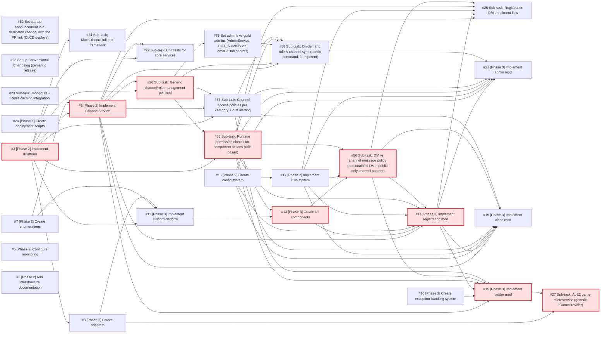

# Dependencies

> Auto-generated by `scripts/sync_dependencies.py`. Do not edit manually:
> edit the `## Dependencies` sections of the issues instead, then
> regenerate this page (see the [Update dependencies](SKILLS/update-dependencies.md) skill).

Source: open issues in [kingdoms-services](https://github.com/merlin-pinpin-org/kingdoms-services/issues) and [kingdoms-infra](https://github.com/merlin-pinpin-org/kingdoms-infra/issues).

Priority labels come from critical-path analysis (CPM):

| Label | Meaning |
| ----- | ------- |
| `priority/P0` | zero slack — on the critical path, any delay delays the project |
| `priority/P1` | slack ≤ 4 pts — near-critical |
| `priority/P2` | slack ≤ 12 pts |
| `priority/P3` | large slack — can be deferred without impact |

Sizes (`size/XS..XL`) map to points (1, 3, 5, 8, 13).

## Critical path

Total: **52 pts**. Critical path:

[kingdoms-services#3](https://github.com/merlin-pinpin-org/kingdoms-services/issues/3) -> [kingdoms-services#5](https://github.com/merlin-pinpin-org/kingdoms-services/issues/5) -> [kingdoms-services#26](https://github.com/merlin-pinpin-org/kingdoms-services/issues/26) -> [kingdoms-services#55](https://github.com/merlin-pinpin-org/kingdoms-services/issues/55) -> [kingdoms-services#13](https://github.com/merlin-pinpin-org/kingdoms-services/issues/13) -> [kingdoms-services#56](https://github.com/merlin-pinpin-org/kingdoms-services/issues/56) -> [kingdoms-services#14](https://github.com/merlin-pinpin-org/kingdoms-services/issues/14) -> [kingdoms-services#15](https://github.com/merlin-pinpin-org/kingdoms-services/issues/15) -> [kingdoms-services#27](https://github.com/merlin-pinpin-org/kingdoms-services/issues/27)

## Dependency graph

## Waves (parallelisable batches)

Issues in the same wave have no dependency on each other and can be
worked on in parallel.

**Wave 0**

| Issue | Size | Priority | Slack |
| ----- | ---- | -------- | ----- |
| [kingdoms-infra#5](https://github.com/merlin-pinpin-org/kingdoms-infra/issues/5) — [Phase 2] Configure monitoring | `M` (5) | `P3` | 47 |
| [kingdoms-services#23](https://github.com/merlin-pinpin-org/kingdoms-services/issues/23) — Sub-task: MongoDB + Redis caching integration | `M` (5) | `P3` | 47 |
| [kingdoms-services#10](https://github.com/merlin-pinpin-org/kingdoms-services/issues/10) — [Phase 2] Create exception handling system | `S` (3) | `P3` | 33 |
| [kingdoms-services#16](https://github.com/merlin-pinpin-org/kingdoms-services/issues/16) — [Phase 2] Create config system | `S` (3) | `P3` | 17 |
| [kingdoms-services#20](https://github.com/merlin-pinpin-org/kingdoms-services/issues/20) — [Phase 1] Create deployment scripts | `S` (3) | `P3` | 49 |
| [kingdoms-services#28](https://github.com/merlin-pinpin-org/kingdoms-services/issues/28) — Set up Conventional Changelog (semantic release) | `S` (3) | `P3` | 49 |
| [kingdoms-services#3](https://github.com/merlin-pinpin-org/kingdoms-services/issues/3) — [Phase 2] Implement IPlatform | `S` (3) | `P0` | 0 |
| [kingdoms-services#52](https://github.com/merlin-pinpin-org/kingdoms-services/issues/52) — Bot startup announcement in a dedicated channel with the PR link (CI/CD deploys) | `S` (3) | `P3` | 49 |
| [kingdoms-infra#3](https://github.com/merlin-pinpin-org/kingdoms-infra/issues/3) — [Phase 2] Add infrastructure documentation | `XS` (1) | `P3` | 51 |
| [kingdoms-services#7](https://github.com/merlin-pinpin-org/kingdoms-services/issues/7) — [Phase 2] Create enumerations | `XS` (1) | `P1` | 2 |

**Wave 1**

| Issue | Size | Priority | Slack |
| ----- | ---- | -------- | ----- |
| [kingdoms-services#5](https://github.com/merlin-pinpin-org/kingdoms-services/issues/5) — [Phase 2] Implement ChannelService | `M` (5) | `P0` | 0 |
| [kingdoms-services#8](https://github.com/merlin-pinpin-org/kingdoms-services/issues/8) — [Phase 3] Create adapters | `M` (5) | `P2` | 5 |
| [kingdoms-services#17](https://github.com/merlin-pinpin-org/kingdoms-services/issues/17) — [Phase 2] Implement i18n system | `S` (3) | `P3` | 17 |
| [kingdoms-services#24](https://github.com/merlin-pinpin-org/kingdoms-services/issues/24) — Sub-task: MockDiscord full test framework | `S` (3) | `P3` | 46 |

**Wave 2**

| Issue | Size | Priority | Slack |
| ----- | ---- | -------- | ----- |
| [kingdoms-services#11](https://github.com/merlin-pinpin-org/kingdoms-services/issues/11) — [Phase 3] Implement DiscordPlatform | `M` (5) | `P2` | 5 |
| [kingdoms-services#22](https://github.com/merlin-pinpin-org/kingdoms-services/issues/22) — Sub-task: Unit tests for core services | `M` (5) | `P3` | 39 |
| [kingdoms-services#26](https://github.com/merlin-pinpin-org/kingdoms-services/issues/26) — Sub-task: Generic channel/role management per mod | `M` (5) | `P0` | 0 |

**Wave 3**

| Issue | Size | Priority | Slack |
| ----- | ---- | -------- | ----- |
| [kingdoms-services#55](https://github.com/merlin-pinpin-org/kingdoms-services/issues/55) — Sub-task: Runtime permission checks for component actions (role-based) | `M` (5) | `P0` | 0 |
| [kingdoms-services#57](https://github.com/merlin-pinpin-org/kingdoms-services/issues/57) — Sub-task: Channel access policies per category + drift alerting | `M` (5) | `P3` | 18 |
| [kingdoms-services#35](https://github.com/merlin-pinpin-org/kingdoms-services/issues/35) — Bot admins vs guild admins (AdminService, BOT_ADMINS via env/GitHub secrets) | `S` (3) | `P3` | 26 |

**Wave 4**

| Issue | Size | Priority | Slack |
| ----- | ---- | -------- | ----- |
| [kingdoms-services#13](https://github.com/merlin-pinpin-org/kingdoms-services/issues/13) — [Phase 3] Create UI components | `M` (5) | `P0` | 0 |
| [kingdoms-services#58](https://github.com/merlin-pinpin-org/kingdoms-services/issues/58) — Sub-task: On-demand role & channel sync (admin command, idempotent) | `M` (5) | `P3` | 24 |

**Wave 5**

| Issue | Size | Priority | Slack |
| ----- | ---- | -------- | ----- |
| [kingdoms-services#56](https://github.com/merlin-pinpin-org/kingdoms-services/issues/56) — Sub-task: DM vs channel message policy (personalized DMs, public-only channel content) | `M` (5) | `P0` | 0 |

**Wave 6**

| Issue | Size | Priority | Slack |
| ----- | ---- | -------- | ----- |
| [kingdoms-services#14](https://github.com/merlin-pinpin-org/kingdoms-services/issues/14) — [Phase 3] Implement registration mod | `L` (8) | `P0` | 0 |

**Wave 7**

| Issue | Size | Priority | Slack |
| ----- | ---- | -------- | ----- |
| [kingdoms-services#15](https://github.com/merlin-pinpin-org/kingdoms-services/issues/15) — [Phase 3] Implement ladder mod | `L` (8) | `P0` | 0 |
| [kingdoms-services#19](https://github.com/merlin-pinpin-org/kingdoms-services/issues/19) — [Phase 3] Implement clans mod | `M` (5) | `P2` | 11 |
| [kingdoms-services#21](https://github.com/merlin-pinpin-org/kingdoms-services/issues/21) — [Phase 3] Implement admin mod | `M` (5) | `P2` | 11 |
| [kingdoms-services#25](https://github.com/merlin-pinpin-org/kingdoms-services/issues/25) — Sub-task: Registration DM enrollment flow | `M` (5) | `P2` | 11 |

**Wave 8**

| Issue | Size | Priority | Slack |
| ----- | ---- | -------- | ----- |
| [kingdoms-services#27](https://github.com/merlin-pinpin-org/kingdoms-services/issues/27) — Sub-task: AoE2 game microservice (generic IGameProvider) | `L` (8) | `P0` | 0 |

## All issues

| Issue | Phase | Size | Priority | Slack | Depends on |
| ----- | ----- | ---- | -------- | ----- | ---------- |
| [kingdoms-infra#3](https://github.com/merlin-pinpin-org/kingdoms-infra/issues/3) — [Phase 2] Add infrastructure documentation | 2 | `XS` | `P3` | 51 | — |
| [kingdoms-infra#5](https://github.com/merlin-pinpin-org/kingdoms-infra/issues/5) — [Phase 2] Configure monitoring | 2 | `M` | `P3` | 47 | — |
| [kingdoms-services#3](https://github.com/merlin-pinpin-org/kingdoms-services/issues/3) — [Phase 2] Implement IPlatform | 2 | `S` | `P0` | 0 | ~~[kingdoms-services#1](https://github.com/merlin-pinpin-org/kingdoms-services/issues/1)~~ ✅ |
| [kingdoms-services#5](https://github.com/merlin-pinpin-org/kingdoms-services/issues/5) — [Phase 2] Implement ChannelService | 2 | `M` | `P0` | 0 | [kingdoms-services#3](https://github.com/merlin-pinpin-org/kingdoms-services/issues/3), [kingdoms-services#7](https://github.com/merlin-pinpin-org/kingdoms-services/issues/7), ~~[kingdoms-services#4](https://github.com/merlin-pinpin-org/kingdoms-services/issues/4)~~ ✅ |
| [kingdoms-services#7](https://github.com/merlin-pinpin-org/kingdoms-services/issues/7) — [Phase 2] Create enumerations | 2 | `XS` | `P1` | 2 | ~~[kingdoms-services#1](https://github.com/merlin-pinpin-org/kingdoms-services/issues/1)~~ ✅ |
| [kingdoms-services#8](https://github.com/merlin-pinpin-org/kingdoms-services/issues/8) — [Phase 3] Create adapters | 3 | `M` | `P2` | 5 | [kingdoms-services#3](https://github.com/merlin-pinpin-org/kingdoms-services/issues/3) |
| [kingdoms-services#10](https://github.com/merlin-pinpin-org/kingdoms-services/issues/10) — [Phase 2] Create exception handling system | 2 | `S` | `P3` | 33 | ~~[kingdoms-services#1](https://github.com/merlin-pinpin-org/kingdoms-services/issues/1)~~ ✅ |
| [kingdoms-services#11](https://github.com/merlin-pinpin-org/kingdoms-services/issues/11) — [Phase 3] Implement DiscordPlatform | 3 | `M` | `P2` | 5 | [kingdoms-services#3](https://github.com/merlin-pinpin-org/kingdoms-services/issues/3), [kingdoms-services#7](https://github.com/merlin-pinpin-org/kingdoms-services/issues/7), [kingdoms-services#8](https://github.com/merlin-pinpin-org/kingdoms-services/issues/8), ~~[kingdoms-services#4](https://github.com/merlin-pinpin-org/kingdoms-services/issues/4)~~ ✅ |
| [kingdoms-services#13](https://github.com/merlin-pinpin-org/kingdoms-services/issues/13) — [Phase 3] Create UI components | 3 | `M` | `P0` | 0 | [kingdoms-services#11](https://github.com/merlin-pinpin-org/kingdoms-services/issues/11), [kingdoms-services#55](https://github.com/merlin-pinpin-org/kingdoms-services/issues/55) |
| [kingdoms-services#14](https://github.com/merlin-pinpin-org/kingdoms-services/issues/14) — [Phase 3] Implement registration mod | 3 | `L` | `P0` | 0 | [kingdoms-services#5](https://github.com/merlin-pinpin-org/kingdoms-services/issues/5), [kingdoms-services#13](https://github.com/merlin-pinpin-org/kingdoms-services/issues/13), [kingdoms-services#16](https://github.com/merlin-pinpin-org/kingdoms-services/issues/16), [kingdoms-services#17](https://github.com/merlin-pinpin-org/kingdoms-services/issues/17), [kingdoms-services#55](https://github.com/merlin-pinpin-org/kingdoms-services/issues/55), [kingdoms-services#56](https://github.com/merlin-pinpin-org/kingdoms-services/issues/56), ~~[kingdoms-services#6](https://github.com/merlin-pinpin-org/kingdoms-services/issues/6)~~ ✅, ~~[kingdoms-services#9](https://github.com/merlin-pinpin-org/kingdoms-services/issues/9)~~ ✅, ~~[kingdoms-services#12](https://github.com/merlin-pinpin-org/kingdoms-services/issues/12)~~ ✅ |
| [kingdoms-services#15](https://github.com/merlin-pinpin-org/kingdoms-services/issues/15) — [Phase 3] Implement ladder mod | 3 | `L` | `P0` | 0 | [kingdoms-services#5](https://github.com/merlin-pinpin-org/kingdoms-services/issues/5), [kingdoms-services#10](https://github.com/merlin-pinpin-org/kingdoms-services/issues/10), [kingdoms-services#14](https://github.com/merlin-pinpin-org/kingdoms-services/issues/14), [kingdoms-services#55](https://github.com/merlin-pinpin-org/kingdoms-services/issues/55), [kingdoms-services#56](https://github.com/merlin-pinpin-org/kingdoms-services/issues/56), [kingdoms-services#57](https://github.com/merlin-pinpin-org/kingdoms-services/issues/57), ~~[kingdoms-services#4](https://github.com/merlin-pinpin-org/kingdoms-services/issues/4)~~ ✅, ~~[kingdoms-services#6](https://github.com/merlin-pinpin-org/kingdoms-services/issues/6)~~ ✅, ~~[kingdoms-services#9](https://github.com/merlin-pinpin-org/kingdoms-services/issues/9)~~ ✅, ~~[kingdoms-services#12](https://github.com/merlin-pinpin-org/kingdoms-services/issues/12)~~ ✅ |
| [kingdoms-services#16](https://github.com/merlin-pinpin-org/kingdoms-services/issues/16) — [Phase 2] Create config system | 2 | `S` | `P3` | 17 | ~~[kingdoms-services#1](https://github.com/merlin-pinpin-org/kingdoms-services/issues/1)~~ ✅ |
| [kingdoms-services#17](https://github.com/merlin-pinpin-org/kingdoms-services/issues/17) — [Phase 2] Implement i18n system | 2 | `S` | `P3` | 17 | [kingdoms-services#16](https://github.com/merlin-pinpin-org/kingdoms-services/issues/16), ~~[kingdoms-services#1](https://github.com/merlin-pinpin-org/kingdoms-services/issues/1)~~ ✅ |
| [kingdoms-services#19](https://github.com/merlin-pinpin-org/kingdoms-services/issues/19) — [Phase 3] Implement clans mod | 3 | `M` | `P2` | 11 | [kingdoms-services#5](https://github.com/merlin-pinpin-org/kingdoms-services/issues/5), [kingdoms-services#14](https://github.com/merlin-pinpin-org/kingdoms-services/issues/14), [kingdoms-services#16](https://github.com/merlin-pinpin-org/kingdoms-services/issues/16), [kingdoms-services#17](https://github.com/merlin-pinpin-org/kingdoms-services/issues/17), [kingdoms-services#55](https://github.com/merlin-pinpin-org/kingdoms-services/issues/55), [kingdoms-services#56](https://github.com/merlin-pinpin-org/kingdoms-services/issues/56), [kingdoms-services#57](https://github.com/merlin-pinpin-org/kingdoms-services/issues/57), ~~[kingdoms-services#4](https://github.com/merlin-pinpin-org/kingdoms-services/issues/4)~~ ✅, ~~[kingdoms-services#6](https://github.com/merlin-pinpin-org/kingdoms-services/issues/6)~~ ✅, ~~[kingdoms-services#12](https://github.com/merlin-pinpin-org/kingdoms-services/issues/12)~~ ✅ |
| [kingdoms-services#20](https://github.com/merlin-pinpin-org/kingdoms-services/issues/20) — [Phase 1] Create deployment scripts | 1 | `S` | `P3` | 49 | ~~[kingdoms-services#12](https://github.com/merlin-pinpin-org/kingdoms-services/issues/12)~~ ✅ |
| [kingdoms-services#21](https://github.com/merlin-pinpin-org/kingdoms-services/issues/21) — [Phase 3] Implement admin mod | 3 | `M` | `P2` | 11 | [kingdoms-services#14](https://github.com/merlin-pinpin-org/kingdoms-services/issues/14), [kingdoms-services#16](https://github.com/merlin-pinpin-org/kingdoms-services/issues/16), [kingdoms-services#17](https://github.com/merlin-pinpin-org/kingdoms-services/issues/17), [kingdoms-services#55](https://github.com/merlin-pinpin-org/kingdoms-services/issues/55), [kingdoms-services#57](https://github.com/merlin-pinpin-org/kingdoms-services/issues/57), [kingdoms-services#58](https://github.com/merlin-pinpin-org/kingdoms-services/issues/58), ~~[kingdoms-services#12](https://github.com/merlin-pinpin-org/kingdoms-services/issues/12)~~ ✅ |
| [kingdoms-services#22](https://github.com/merlin-pinpin-org/kingdoms-services/issues/22) — Sub-task: Unit tests for core services | 2 | `M` | `P3` | 39 | [kingdoms-services#3](https://github.com/merlin-pinpin-org/kingdoms-services/issues/3), [kingdoms-services#5](https://github.com/merlin-pinpin-org/kingdoms-services/issues/5), ~~[kingdoms-services#2](https://github.com/merlin-pinpin-org/kingdoms-services/issues/2)~~ ✅, ~~[kingdoms-services#4](https://github.com/merlin-pinpin-org/kingdoms-services/issues/4)~~ ✅, ~~[kingdoms-services#6](https://github.com/merlin-pinpin-org/kingdoms-services/issues/6)~~ ✅, ~~[kingdoms-services#9](https://github.com/merlin-pinpin-org/kingdoms-services/issues/9)~~ ✅ |
| [kingdoms-services#23](https://github.com/merlin-pinpin-org/kingdoms-services/issues/23) — Sub-task: MongoDB + Redis caching integration | 2 | `M` | `P3` | 47 | ~~[kingdoms-services#4](https://github.com/merlin-pinpin-org/kingdoms-services/issues/4)~~ ✅, ~~[kingdoms-services#9](https://github.com/merlin-pinpin-org/kingdoms-services/issues/9)~~ ✅ |
| [kingdoms-services#24](https://github.com/merlin-pinpin-org/kingdoms-services/issues/24) — Sub-task: MockDiscord full test framework | 3 | `S` | `P3` | 46 | [kingdoms-services#3](https://github.com/merlin-pinpin-org/kingdoms-services/issues/3), ~~[kingdoms-services#2](https://github.com/merlin-pinpin-org/kingdoms-services/issues/2)~~ ✅, ~~[kingdoms-services#6](https://github.com/merlin-pinpin-org/kingdoms-services/issues/6)~~ ✅ |
| [kingdoms-services#25](https://github.com/merlin-pinpin-org/kingdoms-services/issues/25) — Sub-task: Registration DM enrollment flow | 3 | `M` | `P2` | 11 | [kingdoms-services#5](https://github.com/merlin-pinpin-org/kingdoms-services/issues/5), [kingdoms-services#14](https://github.com/merlin-pinpin-org/kingdoms-services/issues/14), [kingdoms-services#17](https://github.com/merlin-pinpin-org/kingdoms-services/issues/17), [kingdoms-services#55](https://github.com/merlin-pinpin-org/kingdoms-services/issues/55), [kingdoms-services#56](https://github.com/merlin-pinpin-org/kingdoms-services/issues/56), ~~[kingdoms-services#6](https://github.com/merlin-pinpin-org/kingdoms-services/issues/6)~~ ✅ |
| [kingdoms-services#26](https://github.com/merlin-pinpin-org/kingdoms-services/issues/26) — Sub-task: Generic channel/role management per mod | 3 | `M` | `P0` | 0 | [kingdoms-services#3](https://github.com/merlin-pinpin-org/kingdoms-services/issues/3), [kingdoms-services#5](https://github.com/merlin-pinpin-org/kingdoms-services/issues/5), ~~[kingdoms-services#4](https://github.com/merlin-pinpin-org/kingdoms-services/issues/4)~~ ✅, ~~[kingdoms-services#12](https://github.com/merlin-pinpin-org/kingdoms-services/issues/12)~~ ✅ |
| [kingdoms-services#27](https://github.com/merlin-pinpin-org/kingdoms-services/issues/27) — Sub-task: AoE2 game microservice (generic IGameProvider) | 3 | `L` | `P0` | 0 | [kingdoms-services#8](https://github.com/merlin-pinpin-org/kingdoms-services/issues/8), [kingdoms-services#15](https://github.com/merlin-pinpin-org/kingdoms-services/issues/15) |
| [kingdoms-services#28](https://github.com/merlin-pinpin-org/kingdoms-services/issues/28) — Set up Conventional Changelog (semantic release) | 2 | `S` | `P3` | 49 | — |
| [kingdoms-services#35](https://github.com/merlin-pinpin-org/kingdoms-services/issues/35) — Bot admins vs guild admins (AdminService, BOT_ADMINS via env/GitHub secrets) | 3 | `S` | `P3` | 26 | [kingdoms-services#26](https://github.com/merlin-pinpin-org/kingdoms-services/issues/26), ~~[kingdoms-services#12](https://github.com/merlin-pinpin-org/kingdoms-services/issues/12)~~ ✅ |
| [kingdoms-services#52](https://github.com/merlin-pinpin-org/kingdoms-services/issues/52) — Bot startup announcement in a dedicated channel with the PR link (CI/CD deploys) | 3 | `S` | `P3` | 49 | ~~[kingdoms-services#12](https://github.com/merlin-pinpin-org/kingdoms-services/issues/12)~~ ✅, ~~[kingdoms-services#34](https://github.com/merlin-pinpin-org/kingdoms-services/issues/34)~~ ✅ |
| [kingdoms-services#55](https://github.com/merlin-pinpin-org/kingdoms-services/issues/55) — Sub-task: Runtime permission checks for component actions (role-based) | 3 | `M` | `P0` | 0 | [kingdoms-services#3](https://github.com/merlin-pinpin-org/kingdoms-services/issues/3), [kingdoms-services#26](https://github.com/merlin-pinpin-org/kingdoms-services/issues/26) |
| [kingdoms-services#56](https://github.com/merlin-pinpin-org/kingdoms-services/issues/56) — Sub-task: DM vs channel message policy (personalized DMs, public-only channel content) | 3 | `M` | `P0` | 0 | [kingdoms-services#13](https://github.com/merlin-pinpin-org/kingdoms-services/issues/13), [kingdoms-services#17](https://github.com/merlin-pinpin-org/kingdoms-services/issues/17), [kingdoms-services#55](https://github.com/merlin-pinpin-org/kingdoms-services/issues/55) |
| [kingdoms-services#57](https://github.com/merlin-pinpin-org/kingdoms-services/issues/57) — Sub-task: Channel access policies per category + drift alerting | 3 | `M` | `P3` | 18 | [kingdoms-services#3](https://github.com/merlin-pinpin-org/kingdoms-services/issues/3), [kingdoms-services#5](https://github.com/merlin-pinpin-org/kingdoms-services/issues/5), [kingdoms-services#26](https://github.com/merlin-pinpin-org/kingdoms-services/issues/26) |
| [kingdoms-services#58](https://github.com/merlin-pinpin-org/kingdoms-services/issues/58) — Sub-task: On-demand role & channel sync (admin command, idempotent) | 3 | `M` | `P3` | 24 | [kingdoms-services#5](https://github.com/merlin-pinpin-org/kingdoms-services/issues/5), [kingdoms-services#26](https://github.com/merlin-pinpin-org/kingdoms-services/issues/26), [kingdoms-services#35](https://github.com/merlin-pinpin-org/kingdoms-services/issues/35), [kingdoms-services#55](https://github.com/merlin-pinpin-org/kingdoms-services/issues/55), [kingdoms-services#57](https://github.com/merlin-pinpin-org/kingdoms-services/issues/57) |
