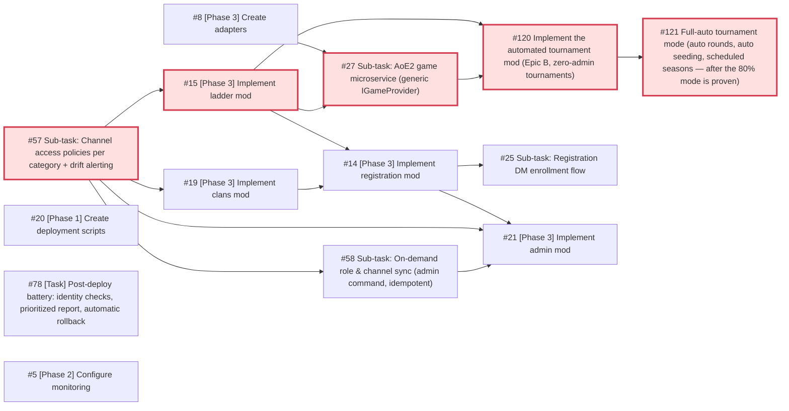

# Dependencies

> Auto-generated by `scripts/sync_dependencies.py`. Do not edit manually:
> edit the `## Dependencies` sections of the issues instead, then
> regenerate this page (see the [Update dependencies](../../.agents/skills/update-dependencies/SKILL.md) skill).

Source: open issues in [kingdoms-services](https://github.com/merlin-pinpin-org/kingdoms-services/issues) and [kingdoms-infra](https://github.com/merlin-pinpin-org/kingdoms-infra/issues).

Priority labels come from critical-path analysis (CPM):

| Label | Meaning |
| ----- | ------- |
| `priority/P0` | zero slack — on the critical path, any delay delays the project |
| `priority/P1` | slack ≤ 4 pts — near-critical |
| `priority/P2` | slack ≤ 12 pts |
| `priority/P3` | large slack — can be deferred without impact |

Sizes (`size/XS..XL`) map to points (1, 3, 5, 8, 13).

## Critical path

Total: **37 pts**. Critical path:

[kingdoms-services#57](https://github.com/merlin-pinpin-org/kingdoms-services/issues/57) -> [kingdoms-services#15](https://github.com/merlin-pinpin-org/kingdoms-services/issues/15) -> [kingdoms-services#27](https://github.com/merlin-pinpin-org/kingdoms-services/issues/27) -> [kingdoms-services#120](https://github.com/merlin-pinpin-org/kingdoms-services/issues/120) -> [kingdoms-services#121](https://github.com/merlin-pinpin-org/kingdoms-services/issues/121)

## Dependency graph

```mermaid
flowchart LR
    ks_121["#121 Full-auto tournament mode (auto rounds, auto seeding, scheduled seasons — after the 80% mode is proven)"]
    ks_120["#120 Implement the automated tournament mod (Epic B, zero-admin tournaments)"]
    ks_58["#58 Sub-task: On-demand role & channel sync (admin command, idempotent)"]
    ks_57["#57 Sub-task: Channel access policies per category + drift alerting"]
    ks_27["#27 Sub-task: AoE2 game microservice (generic IGameProvider)"]
    ks_25["#25 Sub-task: Registration DM enrollment flow"]
    ks_21["#21 [Phase 3] Implement admin mod"]
    ks_20["#20 [Phase 1] Create deployment scripts"]
    ks_19["#19 [Phase 3] Implement clans mod"]
    ks_15["#15 [Phase 3] Implement ladder mod"]
    ks_14["#14 [Phase 3] Implement registration mod"]
    ks_8["#8 [Phase 3] Create adapters"]
    ki_78["#78 [Task] Post-deploy battery: identity checks, prioritized report, automatic rollback"]
    ki_5["#5 [Phase 2] Configure monitoring"]
    ks_120 --> ks_121
    ks_15 --> ks_120
    ks_27 --> ks_120
    ks_57 --> ks_58
    ks_8 --> ks_27
    ks_15 --> ks_27
    ks_14 --> ks_25
    ks_14 --> ks_21
    ks_57 --> ks_21
    ks_58 --> ks_21
    ks_57 --> ks_19
    ks_57 --> ks_15
    ks_15 --> ks_14
    ks_19 --> ks_14
    classDef critical fill:#ffe0e0,stroke:#d43d51,stroke-width:3px;
    class ks_57,ks_15,ks_27,ks_120,ks_121 critical
```

## Waves (parallelisable batches)

Issues in the same wave have no dependency on each other and can be
worked on in parallel.

**Wave 0**

| Issue | Size | Priority | Slack |
| ----- | ---- | -------- | ----- |
| [kingdoms-infra#5](https://github.com/merlin-pinpin-org/kingdoms-infra/issues/5) — [Phase 2] Configure monitoring | `M` (5) | `P3` | 32 |
| [kingdoms-infra#78](https://github.com/merlin-pinpin-org/kingdoms-infra/issues/78) — [Task] Post-deploy battery: identity checks, prioritized report, automatic rollback | `M` (5) | `P2` | 32 |
| [kingdoms-services#57](https://github.com/merlin-pinpin-org/kingdoms-services/issues/57) — Sub-task: Channel access policies per category + drift alerting | `M` (5) | `P1` | 0 |
| [kingdoms-services#8](https://github.com/merlin-pinpin-org/kingdoms-services/issues/8) — [Phase 3] Create adapters | `M` (5) | `P2` | 8 |
| [kingdoms-services#20](https://github.com/merlin-pinpin-org/kingdoms-services/issues/20) — [Phase 1] Create deployment scripts | `S` (3) | `P3` | 34 |

**Wave 1**

| Issue | Size | Priority | Slack |
| ----- | ---- | -------- | ----- |
| [kingdoms-services#15](https://github.com/merlin-pinpin-org/kingdoms-services/issues/15) — [Phase 3] Implement ladder mod | `L` (8) | `P0` | 0 |
| [kingdoms-services#19](https://github.com/merlin-pinpin-org/kingdoms-services/issues/19) — [Phase 3] Implement clans mod | `M` (5) | `P2` | 14 |
| [kingdoms-services#58](https://github.com/merlin-pinpin-org/kingdoms-services/issues/58) — Sub-task: On-demand role & channel sync (admin command, idempotent) | `M` (5) | `P3` | 22 |

**Wave 2**

| Issue | Size | Priority | Slack |
| ----- | ---- | -------- | ----- |
| [kingdoms-services#14](https://github.com/merlin-pinpin-org/kingdoms-services/issues/14) — [Phase 3] Implement registration mod | `L` (8) | `P0` | 11 |
| [kingdoms-services#27](https://github.com/merlin-pinpin-org/kingdoms-services/issues/27) — Sub-task: AoE2 game microservice (generic IGameProvider) | `L` (8) | `P0` | 0 |

**Wave 3**

| Issue | Size | Priority | Slack |
| ----- | ---- | -------- | ----- |
| [kingdoms-services#120](https://github.com/merlin-pinpin-org/kingdoms-services/issues/120) — Implement the automated tournament mod (Epic B, zero-admin tournaments) | `L` (8) | `P0` | 0 |
| [kingdoms-services#21](https://github.com/merlin-pinpin-org/kingdoms-services/issues/21) — [Phase 3] Implement admin mod | `M` (5) | `P2` | 11 |
| [kingdoms-services#25](https://github.com/merlin-pinpin-org/kingdoms-services/issues/25) — Sub-task: Registration DM enrollment flow | `M` (5) | `P2` | 11 |

**Wave 4**

| Issue | Size | Priority | Slack |
| ----- | ---- | -------- | ----- |
| [kingdoms-services#121](https://github.com/merlin-pinpin-org/kingdoms-services/issues/121) — Full-auto tournament mode (auto rounds, auto seeding, scheduled seasons — after the 80% mode is proven) | `L` (8) | `P3` | 0 |

## All issues

| Issue | Phase | Size | Priority | Slack | Depends on |
| ----- | ----- | ---- | -------- | ----- | ---------- |
| [kingdoms-infra#5](https://github.com/merlin-pinpin-org/kingdoms-infra/issues/5) — [Phase 2] Configure monitoring | 2 | `M` | `P3` | 32 | ~~[kingdoms-infra#1](https://github.com/merlin-pinpin-org/kingdoms-infra/issues/1)~~ ✅, ~~[kingdoms-infra#2](https://github.com/merlin-pinpin-org/kingdoms-infra/issues/2)~~ ✅ |
| [kingdoms-infra#78](https://github.com/merlin-pinpin-org/kingdoms-infra/issues/78) — [Task] Post-deploy battery: identity checks, prioritized report, automatic rollback | 2 | `M` | `P2` | 32 | — |
| [kingdoms-services#8](https://github.com/merlin-pinpin-org/kingdoms-services/issues/8) — [Phase 3] Create adapters | 3 | `M` | `P2` | 8 | ~~[kingdoms-services#3](https://github.com/merlin-pinpin-org/kingdoms-services/issues/3)~~ ✅ |
| [kingdoms-services#14](https://github.com/merlin-pinpin-org/kingdoms-services/issues/14) — [Phase 3] Implement registration mod | 3 | `L` | `P0` | 11 | [kingdoms-services#15](https://github.com/merlin-pinpin-org/kingdoms-services/issues/15), [kingdoms-services#19](https://github.com/merlin-pinpin-org/kingdoms-services/issues/19), ~~[kingdoms-services#5](https://github.com/merlin-pinpin-org/kingdoms-services/issues/5)~~ ✅, ~~[kingdoms-services#6](https://github.com/merlin-pinpin-org/kingdoms-services/issues/6)~~ ✅, ~~[kingdoms-services#9](https://github.com/merlin-pinpin-org/kingdoms-services/issues/9)~~ ✅, ~~[kingdoms-services#12](https://github.com/merlin-pinpin-org/kingdoms-services/issues/12)~~ ✅, ~~[kingdoms-services#13](https://github.com/merlin-pinpin-org/kingdoms-services/issues/13)~~ ✅, ~~[kingdoms-services#16](https://github.com/merlin-pinpin-org/kingdoms-services/issues/16)~~ ✅, ~~[kingdoms-services#17](https://github.com/merlin-pinpin-org/kingdoms-services/issues/17)~~ ✅, ~~[kingdoms-services#55](https://github.com/merlin-pinpin-org/kingdoms-services/issues/55)~~ ✅, ~~[kingdoms-services#56](https://github.com/merlin-pinpin-org/kingdoms-services/issues/56)~~ ✅ |
| [kingdoms-services#15](https://github.com/merlin-pinpin-org/kingdoms-services/issues/15) — [Phase 3] Implement ladder mod | 3 | `L` | `P0` | 0 | [kingdoms-services#57](https://github.com/merlin-pinpin-org/kingdoms-services/issues/57), ~~[kingdoms-services#4](https://github.com/merlin-pinpin-org/kingdoms-services/issues/4)~~ ✅, ~~[kingdoms-services#5](https://github.com/merlin-pinpin-org/kingdoms-services/issues/5)~~ ✅, ~~[kingdoms-services#6](https://github.com/merlin-pinpin-org/kingdoms-services/issues/6)~~ ✅, ~~[kingdoms-services#9](https://github.com/merlin-pinpin-org/kingdoms-services/issues/9)~~ ✅, ~~[kingdoms-services#10](https://github.com/merlin-pinpin-org/kingdoms-services/issues/10)~~ ✅, ~~[kingdoms-services#12](https://github.com/merlin-pinpin-org/kingdoms-services/issues/12)~~ ✅, ~~[kingdoms-services#55](https://github.com/merlin-pinpin-org/kingdoms-services/issues/55)~~ ✅, ~~[kingdoms-services#56](https://github.com/merlin-pinpin-org/kingdoms-services/issues/56)~~ ✅ |
| [kingdoms-services#19](https://github.com/merlin-pinpin-org/kingdoms-services/issues/19) — [Phase 3] Implement clans mod | 3 | `M` | `P2` | 14 | [kingdoms-services#57](https://github.com/merlin-pinpin-org/kingdoms-services/issues/57), ~~[kingdoms-services#4](https://github.com/merlin-pinpin-org/kingdoms-services/issues/4)~~ ✅, ~~[kingdoms-services#5](https://github.com/merlin-pinpin-org/kingdoms-services/issues/5)~~ ✅, ~~[kingdoms-services#6](https://github.com/merlin-pinpin-org/kingdoms-services/issues/6)~~ ✅, ~~[kingdoms-services#12](https://github.com/merlin-pinpin-org/kingdoms-services/issues/12)~~ ✅, ~~[kingdoms-services#16](https://github.com/merlin-pinpin-org/kingdoms-services/issues/16)~~ ✅, ~~[kingdoms-services#17](https://github.com/merlin-pinpin-org/kingdoms-services/issues/17)~~ ✅, ~~[kingdoms-services#55](https://github.com/merlin-pinpin-org/kingdoms-services/issues/55)~~ ✅, ~~[kingdoms-services#56](https://github.com/merlin-pinpin-org/kingdoms-services/issues/56)~~ ✅ |
| [kingdoms-services#20](https://github.com/merlin-pinpin-org/kingdoms-services/issues/20) — [Phase 1] Create deployment scripts | 1 | `S` | `P3` | 34 | ~~[kingdoms-infra#1](https://github.com/merlin-pinpin-org/kingdoms-infra/issues/1)~~ ✅, ~~[kingdoms-services#12](https://github.com/merlin-pinpin-org/kingdoms-services/issues/12)~~ ✅ |
| [kingdoms-services#21](https://github.com/merlin-pinpin-org/kingdoms-services/issues/21) — [Phase 3] Implement admin mod | 3 | `M` | `P2` | 11 | [kingdoms-services#14](https://github.com/merlin-pinpin-org/kingdoms-services/issues/14), [kingdoms-services#57](https://github.com/merlin-pinpin-org/kingdoms-services/issues/57), [kingdoms-services#58](https://github.com/merlin-pinpin-org/kingdoms-services/issues/58), ~~[kingdoms-services#12](https://github.com/merlin-pinpin-org/kingdoms-services/issues/12)~~ ✅, ~~[kingdoms-services#16](https://github.com/merlin-pinpin-org/kingdoms-services/issues/16)~~ ✅, ~~[kingdoms-services#17](https://github.com/merlin-pinpin-org/kingdoms-services/issues/17)~~ ✅, ~~[kingdoms-services#55](https://github.com/merlin-pinpin-org/kingdoms-services/issues/55)~~ ✅ |
| [kingdoms-services#25](https://github.com/merlin-pinpin-org/kingdoms-services/issues/25) — Sub-task: Registration DM enrollment flow | 3 | `M` | `P2` | 11 | [kingdoms-services#14](https://github.com/merlin-pinpin-org/kingdoms-services/issues/14), ~~[kingdoms-services#5](https://github.com/merlin-pinpin-org/kingdoms-services/issues/5)~~ ✅, ~~[kingdoms-services#6](https://github.com/merlin-pinpin-org/kingdoms-services/issues/6)~~ ✅, ~~[kingdoms-services#17](https://github.com/merlin-pinpin-org/kingdoms-services/issues/17)~~ ✅, ~~[kingdoms-services#55](https://github.com/merlin-pinpin-org/kingdoms-services/issues/55)~~ ✅, ~~[kingdoms-services#56](https://github.com/merlin-pinpin-org/kingdoms-services/issues/56)~~ ✅ |
| [kingdoms-services#27](https://github.com/merlin-pinpin-org/kingdoms-services/issues/27) — Sub-task: AoE2 game microservice (generic IGameProvider) | 3 | `L` | `P0` | 0 | [kingdoms-services#8](https://github.com/merlin-pinpin-org/kingdoms-services/issues/8), [kingdoms-services#15](https://github.com/merlin-pinpin-org/kingdoms-services/issues/15) |
| [kingdoms-services#57](https://github.com/merlin-pinpin-org/kingdoms-services/issues/57) — Sub-task: Channel access policies per category + drift alerting | 3 | `M` | `P1` | 0 | ~~[kingdoms-services#3](https://github.com/merlin-pinpin-org/kingdoms-services/issues/3)~~ ✅, ~~[kingdoms-services#5](https://github.com/merlin-pinpin-org/kingdoms-services/issues/5)~~ ✅, ~~[kingdoms-services#26](https://github.com/merlin-pinpin-org/kingdoms-services/issues/26)~~ ✅ |
| [kingdoms-services#58](https://github.com/merlin-pinpin-org/kingdoms-services/issues/58) — Sub-task: On-demand role & channel sync (admin command, idempotent) | 3 | `M` | `P3` | 22 | [kingdoms-services#57](https://github.com/merlin-pinpin-org/kingdoms-services/issues/57), ~~[kingdoms-services#5](https://github.com/merlin-pinpin-org/kingdoms-services/issues/5)~~ ✅, ~~[kingdoms-services#26](https://github.com/merlin-pinpin-org/kingdoms-services/issues/26)~~ ✅, ~~[kingdoms-services#35](https://github.com/merlin-pinpin-org/kingdoms-services/issues/35)~~ ✅, ~~[kingdoms-services#55](https://github.com/merlin-pinpin-org/kingdoms-services/issues/55)~~ ✅ |
| [kingdoms-services#120](https://github.com/merlin-pinpin-org/kingdoms-services/issues/120) — Implement the automated tournament mod (Epic B, zero-admin tournaments) | 3 | `L` | `P0` | 0 | [kingdoms-services#15](https://github.com/merlin-pinpin-org/kingdoms-services/issues/15), [kingdoms-services#27](https://github.com/merlin-pinpin-org/kingdoms-services/issues/27), ~~[kingdoms-services#5](https://github.com/merlin-pinpin-org/kingdoms-services/issues/5)~~ ✅ |
| [kingdoms-services#121](https://github.com/merlin-pinpin-org/kingdoms-services/issues/121) — Full-auto tournament mode (auto rounds, auto seeding, scheduled seasons — after the 80% mode is proven) | 3 | `L` | `P3` | 0 | [kingdoms-services#120](https://github.com/merlin-pinpin-org/kingdoms-services/issues/120) |
