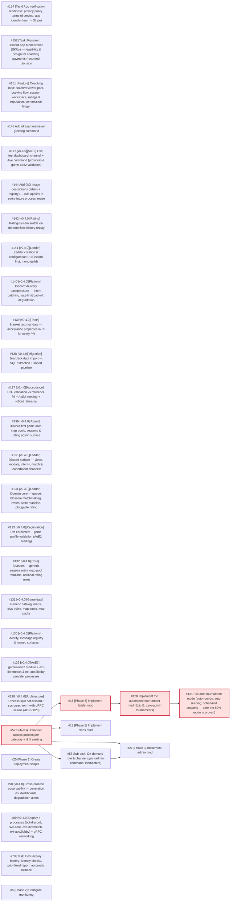

# Dependencies

> Auto-generated by `scripts/sync_dependencies.py`. Do not edit manually:
> edit the `## Dependencies` sections of the issues instead, then
> regenerate this page (see the [Update dependencies](../../.agents/skills/update-dependencies/SKILL.md) skill).

Source: open issues in [kingdoms-services](https://github.com/merlin-pinpin-org/kingdoms-services/issues) and [kingdoms-infra](https://github.com/merlin-pinpin-org/kingdoms-infra/issues).

Priority labels come from critical-path analysis (CPM):

| Label | Meaning |
| ----- | ------- |
| `priority/P0` | zero slack — on the critical path, any delay delays the project |
| `priority/P1` | slack ≤ 4 pts — near-critical |
| `priority/P2` | slack ≤ 12 pts |
| `priority/P3` | large slack — can be deferred without impact |

Sizes (`size/XS..XL`) map to points (1, 3, 5, 8, 13).

## Critical path

Total: **29 pts**. Critical path:

[kingdoms-services#57](https://github.com/merlin-pinpin-org/kingdoms-services/issues/57) -> [kingdoms-services#15](https://github.com/merlin-pinpin-org/kingdoms-services/issues/15) -> [kingdoms-services#120](https://github.com/merlin-pinpin-org/kingdoms-services/issues/120) -> [kingdoms-services#121](https://github.com/merlin-pinpin-org/kingdoms-services/issues/121)

## Dependency graph

```mermaid
flowchart LR
    ks_154["#154 [Task] App verification readiness: privacy policy, terms of service, app identity (team + Stripe)"]
    ks_152["#152 [Task] Research: Discord App Monetization (SKUs) — feasibility & design for coaching payments (recorded decision"]
    ks_151["#151 [Feature] Coaching mod: coach/reviewer pool, booking flow, session workspace, ratings & reputation, commission ledger"]
    ks_148["#148 Add /drasah medieval greeting command"]
    ks_147["#147 [v0.4.0][AoE2] Live test dashboard: channel + /live command (providers & game-aoe2 validation)"]
    ks_144["#144 Add OCI image descriptions (labels + registry) — rule applies to every future process image"]
    ks_142["#142 [v0.4.0][Rating] Rating-system switch via deterministic history replay"]
    ks_141["#141 [v0.4.0][Ladder] Ladder creation & configuration UI (Discord-first, mono-guild)"]
    ks_140["#140 [v0.4.0][Platform] Discord delivery backpressure — intent batching, rate-limit backoff, degradation"]
    ks_139["#139 [v0.4.0][Tests] Blanket test mandate — acceptance properties in CI for every PR"]
    ks_138["#138 [v0.4.0][Migration] JeanJack data import — SQL extraction + import pipeline"]
    ks_137["#137 [v0.4.0][Acceptance] E2E validation vs reference §9 + AoE2 seeding + rollout rehearsal"]
    ks_136["#136 [v0.4.0][Admin] Discord-first game data, map pools, seasons & rating admin surface"]
    ks_135["#135 [v0.4.0][Ladder] Discord surface — views, modals, intents, match & leaderboard channels"]
    ks_134["#134 [v0.4.0][Ladder] Domain core — queue, blossom matchmaking, invites, state machine, pluggable rating"]
    ks_133["#133 [v0.4.0][Registration] DM enrollment + game profile validation (AoE2 binding)"]
    ks_132["#132 [v0.4.0][Core] Seasons — generic season entity, map-pool rotations, optional rating reset"]
    ks_131["#131 [v0.4.0][Game data] Generic catalog: maps, civs, rules, map pools, map packs"]
    ks_130["#130 [v0.4.0][Platform] Identity, message registry & named surfaces"]
    ks_129["#129 [v0.4.0][AoE2] games/aoe2 module + ext-librematch & ext-aoe2lobby provider processes"]
    ks_128["#128 [v0.4.0][Architecture] Process split bot-discord / svc-core / ext-* with gRPC seams (ADR-0020)"]
    ks_121["#121 Full-auto tournament mode (auto rounds, auto seeding, scheduled seasons — after the 80% mode is proven)"]
    ks_120["#120 Implement the automated tournament mod (Epic B, zero-admin tournaments)"]
    ks_58["#58 Sub-task: On-demand role & channel sync (admin command, idempotent)"]
    ks_57["#57 Sub-task: Channel access policies per category + drift alerting"]
    ks_21["#21 [Phase 3] Implement admin mod"]
    ks_20["#20 [Phase 1] Create deployment scripts"]
    ks_19["#19 [Phase 3] Implement clans mod"]
    ks_15["#15 [Phase 3] Implement ladder mod"]
    ki_90["#90 [v0.4.0] Cross-process observability — correlation ids, dashboards, degradation alerts"]
    ki_89["#89 [v0.4.0] Deploy 4 processes (bot-discord, svc-core, ext-librematch, ext-aoe2lobby) + gRPC networking"]
    ki_78["#78 [Task] Post-deploy battery: identity checks, prioritized report, automatic rollback"]
    ki_5["#5 [Phase 2] Configure monitoring"]
    ks_120 --> ks_121
    ks_15 --> ks_120
    ks_57 --> ks_58
    ks_57 --> ks_21
    ks_58 --> ks_21
    ks_57 --> ks_19
    ks_57 --> ks_15
    classDef critical fill:#ffe0e0,stroke:#d43d51,stroke-width:3px;
    class ks_57,ks_15,ks_120,ks_121 critical
```

## Waves (parallelisable batches)

Issues in the same wave have no dependency on each other and can be
worked on in parallel.

**Wave 0**

| Issue | Size | Priority | Slack |
| ----- | ---- | -------- | ----- |
| [kingdoms-services#151](https://github.com/merlin-pinpin-org/kingdoms-services/issues/151) — [Feature] Coaching mod: coach/reviewer pool, booking flow, session workspace, ratings & reputation, commission ledger | `XL` (13) | `P2` | 16 |
| [kingdoms-infra#89](https://github.com/merlin-pinpin-org/kingdoms-infra/issues/89) — [v0.4.0] Deploy 4 processes (bot-discord, svc-core, ext-librematch, ext-aoe2lobby) + gRPC networking | `L` (8) | `P1` | 21 |
| [kingdoms-services#128](https://github.com/merlin-pinpin-org/kingdoms-services/issues/128) — [v0.4.0][Architecture] Process split bot-discord / svc-core / ext-* with gRPC seams (ADR-0020) | `L` (8) | `P1` | 21 |
| [kingdoms-services#129](https://github.com/merlin-pinpin-org/kingdoms-services/issues/129) — [v0.4.0][AoE2] games/aoe2 module + ext-librematch & ext-aoe2lobby provider processes | `L` (8) | `P1` | 21 |
| [kingdoms-services#130](https://github.com/merlin-pinpin-org/kingdoms-services/issues/130) — [v0.4.0][Platform] Identity, message registry & named surfaces | `L` (8) | `P1` | 21 |
| [kingdoms-services#131](https://github.com/merlin-pinpin-org/kingdoms-services/issues/131) — [v0.4.0][Game data] Generic catalog: maps, civs, rules, map pools, map packs | `L` (8) | `P1` | 21 |
| [kingdoms-services#132](https://github.com/merlin-pinpin-org/kingdoms-services/issues/132) — [v0.4.0][Core] Seasons — generic season entity, map-pool rotations, optional rating reset | `L` (8) | `P1` | 21 |
| [kingdoms-services#133](https://github.com/merlin-pinpin-org/kingdoms-services/issues/133) — [v0.4.0][Registration] DM enrollment + game profile validation (AoE2 binding) | `L` (8) | `P1` | 21 |
| [kingdoms-services#134](https://github.com/merlin-pinpin-org/kingdoms-services/issues/134) — [v0.4.0][Ladder] Domain core — queue, blossom matchmaking, invites, state machine, pluggable rating | `L` (8) | `P1` | 21 |
| [kingdoms-services#135](https://github.com/merlin-pinpin-org/kingdoms-services/issues/135) — [v0.4.0][Ladder] Discord surface — views, modals, intents, match & leaderboard channels | `L` (8) | `P1` | 21 |
| [kingdoms-services#136](https://github.com/merlin-pinpin-org/kingdoms-services/issues/136) — [v0.4.0][Admin] Discord-first game data, map pools, seasons & rating admin surface | `L` (8) | `P1` | 21 |
| [kingdoms-services#137](https://github.com/merlin-pinpin-org/kingdoms-services/issues/137) — [v0.4.0][Acceptance] E2E validation vs reference §9 + AoE2 seeding + rollout rehearsal | `L` (8) | `P1` | 21 |
| [kingdoms-services#138](https://github.com/merlin-pinpin-org/kingdoms-services/issues/138) — [v0.4.0][Migration] JeanJack data import — SQL extraction + import pipeline | `L` (8) | `P1` | 21 |
| [kingdoms-services#139](https://github.com/merlin-pinpin-org/kingdoms-services/issues/139) — [v0.4.0][Tests] Blanket test mandate — acceptance properties in CI for every PR | `L` (8) | `P1` | 21 |
| [kingdoms-services#140](https://github.com/merlin-pinpin-org/kingdoms-services/issues/140) — [v0.4.0][Platform] Discord delivery backpressure — intent batching, rate-limit backoff, degradation | `L` (8) | `P1` | 21 |
| [kingdoms-services#141](https://github.com/merlin-pinpin-org/kingdoms-services/issues/141) — [v0.4.0][Ladder] Ladder creation & configuration UI (Discord-first, mono-guild) | `L` (8) | `P1` | 21 |
| [kingdoms-services#142](https://github.com/merlin-pinpin-org/kingdoms-services/issues/142) — [v0.4.0][Rating] Rating-system switch via deterministic history replay | `L` (8) | `P1` | 21 |
| [kingdoms-services#144](https://github.com/merlin-pinpin-org/kingdoms-services/issues/144) — Add OCI image descriptions (labels + registry) — rule applies to every future process image | `L` (8) | `P1` | 21 |
| [kingdoms-services#147](https://github.com/merlin-pinpin-org/kingdoms-services/issues/147) — [v0.4.0][AoE2] Live test dashboard: channel + /live command (providers & game-aoe2 validation) | `L` (8) | `P1` | 21 |
| [kingdoms-infra#5](https://github.com/merlin-pinpin-org/kingdoms-infra/issues/5) — [Phase 2] Configure monitoring | `M` (5) | `P3` | 24 |
| [kingdoms-infra#78](https://github.com/merlin-pinpin-org/kingdoms-infra/issues/78) — [Task] Post-deploy battery: identity checks, prioritized report, automatic rollback | `M` (5) | `P2` | 24 |
| [kingdoms-infra#90](https://github.com/merlin-pinpin-org/kingdoms-infra/issues/90) — [v0.4.0] Cross-process observability — correlation ids, dashboards, degradation alerts | `M` (5) | `P2` | 24 |
| [kingdoms-services#152](https://github.com/merlin-pinpin-org/kingdoms-services/issues/152) — [Task] Research: Discord App Monetization (SKUs) — feasibility & design for coaching payments (recorded decision | `M` (5) | `P3` | 24 |
| [kingdoms-services#154](https://github.com/merlin-pinpin-org/kingdoms-services/issues/154) — [Task] App verification readiness: privacy policy, terms of service, app identity (team + Stripe) | `M` (5) | `P3` | 24 |
| [kingdoms-services#57](https://github.com/merlin-pinpin-org/kingdoms-services/issues/57) — Sub-task: Channel access policies per category + drift alerting | `M` (5) | `P1` | 0 |
| [kingdoms-services#148](https://github.com/merlin-pinpin-org/kingdoms-services/issues/148) — Add /drasah medieval greeting command | `S` (3) | `P3` | 26 |
| [kingdoms-services#20](https://github.com/merlin-pinpin-org/kingdoms-services/issues/20) — [Phase 1] Create deployment scripts | `S` (3) | `P3` | 26 |

**Wave 1**

| Issue | Size | Priority | Slack |
| ----- | ---- | -------- | ----- |
| [kingdoms-services#15](https://github.com/merlin-pinpin-org/kingdoms-services/issues/15) — [Phase 3] Implement ladder mod | `L` (8) | `P0` | 0 |
| [kingdoms-services#19](https://github.com/merlin-pinpin-org/kingdoms-services/issues/19) — [Phase 3] Implement clans mod | `M` (5) | `P2` | 19 |
| [kingdoms-services#58](https://github.com/merlin-pinpin-org/kingdoms-services/issues/58) — Sub-task: On-demand role & channel sync (admin command, idempotent) | `M` (5) | `P3` | 14 |

**Wave 2**

| Issue | Size | Priority | Slack |
| ----- | ---- | -------- | ----- |
| [kingdoms-services#120](https://github.com/merlin-pinpin-org/kingdoms-services/issues/120) — Implement the automated tournament mod (Epic B, zero-admin tournaments) | `L` (8) | `P0` | 0 |
| [kingdoms-services#21](https://github.com/merlin-pinpin-org/kingdoms-services/issues/21) — [Phase 3] Implement admin mod | `M` (5) | `P2` | 14 |

**Wave 3**

| Issue | Size | Priority | Slack |
| ----- | ---- | -------- | ----- |
| [kingdoms-services#121](https://github.com/merlin-pinpin-org/kingdoms-services/issues/121) — Full-auto tournament mode (auto rounds, auto seeding, scheduled seasons — after the 80% mode is proven) | `L` (8) | `P3` | 0 |

## All issues

| Issue | Phase | Size | Priority | Slack | Depends on |
| ----- | ----- | ---- | -------- | ----- | ---------- |
| [kingdoms-infra#5](https://github.com/merlin-pinpin-org/kingdoms-infra/issues/5) — [Phase 2] Configure monitoring | 2 | `M` | `P3` | 24 | ~~[kingdoms-infra#1](https://github.com/merlin-pinpin-org/kingdoms-infra/issues/1)~~ ✅, ~~[kingdoms-infra#2](https://github.com/merlin-pinpin-org/kingdoms-infra/issues/2)~~ ✅ |
| [kingdoms-infra#78](https://github.com/merlin-pinpin-org/kingdoms-infra/issues/78) — [Task] Post-deploy battery: identity checks, prioritized report, automatic rollback | 2 | `M` | `P2` | 24 | — |
| [kingdoms-infra#89](https://github.com/merlin-pinpin-org/kingdoms-infra/issues/89) — [v0.4.0] Deploy 4 processes (bot-discord, svc-core, ext-librematch, ext-aoe2lobby) + gRPC networking | ? | `L` | `P1` | 21 | — |
| [kingdoms-infra#90](https://github.com/merlin-pinpin-org/kingdoms-infra/issues/90) — [v0.4.0] Cross-process observability — correlation ids, dashboards, degradation alerts | ? | `M` | `P2` | 24 | — |
| [kingdoms-services#15](https://github.com/merlin-pinpin-org/kingdoms-services/issues/15) — [Phase 3] Implement ladder mod | 3 | `L` | `P0` | 0 | [kingdoms-services#57](https://github.com/merlin-pinpin-org/kingdoms-services/issues/57), ~~[kingdoms-services#4](https://github.com/merlin-pinpin-org/kingdoms-services/issues/4)~~ ✅, ~~[kingdoms-services#5](https://github.com/merlin-pinpin-org/kingdoms-services/issues/5)~~ ✅, ~~[kingdoms-services#6](https://github.com/merlin-pinpin-org/kingdoms-services/issues/6)~~ ✅, ~~[kingdoms-services#9](https://github.com/merlin-pinpin-org/kingdoms-services/issues/9)~~ ✅, ~~[kingdoms-services#10](https://github.com/merlin-pinpin-org/kingdoms-services/issues/10)~~ ✅, ~~[kingdoms-services#12](https://github.com/merlin-pinpin-org/kingdoms-services/issues/12)~~ ✅, ~~[kingdoms-services#55](https://github.com/merlin-pinpin-org/kingdoms-services/issues/55)~~ ✅, ~~[kingdoms-services#56](https://github.com/merlin-pinpin-org/kingdoms-services/issues/56)~~ ✅ |
| [kingdoms-services#19](https://github.com/merlin-pinpin-org/kingdoms-services/issues/19) — [Phase 3] Implement clans mod | 3 | `M` | `P2` | 19 | [kingdoms-services#57](https://github.com/merlin-pinpin-org/kingdoms-services/issues/57), ~~[kingdoms-services#4](https://github.com/merlin-pinpin-org/kingdoms-services/issues/4)~~ ✅, ~~[kingdoms-services#5](https://github.com/merlin-pinpin-org/kingdoms-services/issues/5)~~ ✅, ~~[kingdoms-services#6](https://github.com/merlin-pinpin-org/kingdoms-services/issues/6)~~ ✅, ~~[kingdoms-services#12](https://github.com/merlin-pinpin-org/kingdoms-services/issues/12)~~ ✅, ~~[kingdoms-services#16](https://github.com/merlin-pinpin-org/kingdoms-services/issues/16)~~ ✅, ~~[kingdoms-services#17](https://github.com/merlin-pinpin-org/kingdoms-services/issues/17)~~ ✅, ~~[kingdoms-services#55](https://github.com/merlin-pinpin-org/kingdoms-services/issues/55)~~ ✅, ~~[kingdoms-services#56](https://github.com/merlin-pinpin-org/kingdoms-services/issues/56)~~ ✅ |
| [kingdoms-services#20](https://github.com/merlin-pinpin-org/kingdoms-services/issues/20) — [Phase 1] Create deployment scripts | 1 | `S` | `P3` | 26 | ~~[kingdoms-infra#1](https://github.com/merlin-pinpin-org/kingdoms-infra/issues/1)~~ ✅, ~~[kingdoms-services#12](https://github.com/merlin-pinpin-org/kingdoms-services/issues/12)~~ ✅ |
| [kingdoms-services#21](https://github.com/merlin-pinpin-org/kingdoms-services/issues/21) — [Phase 3] Implement admin mod | 3 | `M` | `P2` | 14 | [kingdoms-services#57](https://github.com/merlin-pinpin-org/kingdoms-services/issues/57), [kingdoms-services#58](https://github.com/merlin-pinpin-org/kingdoms-services/issues/58), ~~[kingdoms-services#12](https://github.com/merlin-pinpin-org/kingdoms-services/issues/12)~~ ✅, ~~[kingdoms-services#14](https://github.com/merlin-pinpin-org/kingdoms-services/issues/14)~~ ✅, ~~[kingdoms-services#16](https://github.com/merlin-pinpin-org/kingdoms-services/issues/16)~~ ✅, ~~[kingdoms-services#17](https://github.com/merlin-pinpin-org/kingdoms-services/issues/17)~~ ✅, ~~[kingdoms-services#55](https://github.com/merlin-pinpin-org/kingdoms-services/issues/55)~~ ✅ |
| [kingdoms-services#57](https://github.com/merlin-pinpin-org/kingdoms-services/issues/57) — Sub-task: Channel access policies per category + drift alerting | 3 | `M` | `P1` | 0 | ~~[kingdoms-services#3](https://github.com/merlin-pinpin-org/kingdoms-services/issues/3)~~ ✅, ~~[kingdoms-services#5](https://github.com/merlin-pinpin-org/kingdoms-services/issues/5)~~ ✅, ~~[kingdoms-services#26](https://github.com/merlin-pinpin-org/kingdoms-services/issues/26)~~ ✅ |
| [kingdoms-services#58](https://github.com/merlin-pinpin-org/kingdoms-services/issues/58) — Sub-task: On-demand role & channel sync (admin command, idempotent) | 3 | `M` | `P3` | 14 | [kingdoms-services#57](https://github.com/merlin-pinpin-org/kingdoms-services/issues/57), ~~[kingdoms-services#5](https://github.com/merlin-pinpin-org/kingdoms-services/issues/5)~~ ✅, ~~[kingdoms-services#26](https://github.com/merlin-pinpin-org/kingdoms-services/issues/26)~~ ✅, ~~[kingdoms-services#35](https://github.com/merlin-pinpin-org/kingdoms-services/issues/35)~~ ✅, ~~[kingdoms-services#55](https://github.com/merlin-pinpin-org/kingdoms-services/issues/55)~~ ✅ |
| [kingdoms-services#120](https://github.com/merlin-pinpin-org/kingdoms-services/issues/120) — Implement the automated tournament mod (Epic B, zero-admin tournaments) | 3 | `L` | `P0` | 0 | [kingdoms-services#15](https://github.com/merlin-pinpin-org/kingdoms-services/issues/15), ~~[kingdoms-services#5](https://github.com/merlin-pinpin-org/kingdoms-services/issues/5)~~ ✅, ~~[kingdoms-services#27](https://github.com/merlin-pinpin-org/kingdoms-services/issues/27)~~ ✅ |
| [kingdoms-services#121](https://github.com/merlin-pinpin-org/kingdoms-services/issues/121) — Full-auto tournament mode (auto rounds, auto seeding, scheduled seasons — after the 80% mode is proven) | 3 | `L` | `P3` | 0 | [kingdoms-services#120](https://github.com/merlin-pinpin-org/kingdoms-services/issues/120) |
| [kingdoms-services#128](https://github.com/merlin-pinpin-org/kingdoms-services/issues/128) — [v0.4.0][Architecture] Process split bot-discord / svc-core / ext-* with gRPC seams (ADR-0020) | ? | `L` | `P1` | 21 | — |
| [kingdoms-services#129](https://github.com/merlin-pinpin-org/kingdoms-services/issues/129) — [v0.4.0][AoE2] games/aoe2 module + ext-librematch & ext-aoe2lobby provider processes | ? | `L` | `P1` | 21 | — |
| [kingdoms-services#130](https://github.com/merlin-pinpin-org/kingdoms-services/issues/130) — [v0.4.0][Platform] Identity, message registry & named surfaces | ? | `L` | `P1` | 21 | — |
| [kingdoms-services#131](https://github.com/merlin-pinpin-org/kingdoms-services/issues/131) — [v0.4.0][Game data] Generic catalog: maps, civs, rules, map pools, map packs | ? | `L` | `P1` | 21 | — |
| [kingdoms-services#132](https://github.com/merlin-pinpin-org/kingdoms-services/issues/132) — [v0.4.0][Core] Seasons — generic season entity, map-pool rotations, optional rating reset | ? | `L` | `P1` | 21 | — |
| [kingdoms-services#133](https://github.com/merlin-pinpin-org/kingdoms-services/issues/133) — [v0.4.0][Registration] DM enrollment + game profile validation (AoE2 binding) | ? | `L` | `P1` | 21 | — |
| [kingdoms-services#134](https://github.com/merlin-pinpin-org/kingdoms-services/issues/134) — [v0.4.0][Ladder] Domain core — queue, blossom matchmaking, invites, state machine, pluggable rating | ? | `L` | `P1` | 21 | — |
| [kingdoms-services#135](https://github.com/merlin-pinpin-org/kingdoms-services/issues/135) — [v0.4.0][Ladder] Discord surface — views, modals, intents, match & leaderboard channels | ? | `L` | `P1` | 21 | — |
| [kingdoms-services#136](https://github.com/merlin-pinpin-org/kingdoms-services/issues/136) — [v0.4.0][Admin] Discord-first game data, map pools, seasons & rating admin surface | ? | `L` | `P1` | 21 | — |
| [kingdoms-services#137](https://github.com/merlin-pinpin-org/kingdoms-services/issues/137) — [v0.4.0][Acceptance] E2E validation vs reference §9 + AoE2 seeding + rollout rehearsal | ? | `L` | `P1` | 21 | — |
| [kingdoms-services#138](https://github.com/merlin-pinpin-org/kingdoms-services/issues/138) — [v0.4.0][Migration] JeanJack data import — SQL extraction + import pipeline | ? | `L` | `P1` | 21 | — |
| [kingdoms-services#139](https://github.com/merlin-pinpin-org/kingdoms-services/issues/139) — [v0.4.0][Tests] Blanket test mandate — acceptance properties in CI for every PR | ? | `L` | `P1` | 21 | — |
| [kingdoms-services#140](https://github.com/merlin-pinpin-org/kingdoms-services/issues/140) — [v0.4.0][Platform] Discord delivery backpressure — intent batching, rate-limit backoff, degradation | ? | `L` | `P1` | 21 | — |
| [kingdoms-services#141](https://github.com/merlin-pinpin-org/kingdoms-services/issues/141) — [v0.4.0][Ladder] Ladder creation & configuration UI (Discord-first, mono-guild) | ? | `L` | `P1` | 21 | — |
| [kingdoms-services#142](https://github.com/merlin-pinpin-org/kingdoms-services/issues/142) — [v0.4.0][Rating] Rating-system switch via deterministic history replay | ? | `L` | `P1` | 21 | — |
| [kingdoms-services#144](https://github.com/merlin-pinpin-org/kingdoms-services/issues/144) — Add OCI image descriptions (labels + registry) — rule applies to every future process image | ? | `L` | `P1` | 21 | — |
| [kingdoms-services#147](https://github.com/merlin-pinpin-org/kingdoms-services/issues/147) — [v0.4.0][AoE2] Live test dashboard: channel + /live command (providers & game-aoe2 validation) | ? | `L` | `P1` | 21 | — |
| [kingdoms-services#148](https://github.com/merlin-pinpin-org/kingdoms-services/issues/148) — Add /drasah medieval greeting command | ? | `S` | `P3` | 26 | — |
| [kingdoms-services#151](https://github.com/merlin-pinpin-org/kingdoms-services/issues/151) — [Feature] Coaching mod: coach/reviewer pool, booking flow, session workspace, ratings & reputation, commission ledger | ? | `XL` | `P2` | 16 | — |
| [kingdoms-services#152](https://github.com/merlin-pinpin-org/kingdoms-services/issues/152) — [Task] Research: Discord App Monetization (SKUs) — feasibility & design for coaching payments (recorded decision | ? | `M` | `P3` | 24 | — |
| [kingdoms-services#154](https://github.com/merlin-pinpin-org/kingdoms-services/issues/154) — [Task] App verification readiness: privacy policy, terms of service, app identity (team + Stripe) | ? | `M` | `P3` | 24 | — |
