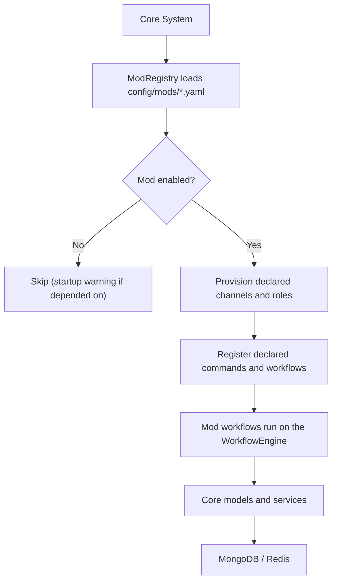

# Mods

Kingdoms uses a **modular architecture**: each game feature (register, ladder,
clans, ...) is a separate mod built on the generic core. This directory is
where the game designer defines and evolves mod rules and environments —
without coding.

## Mod system overview

A mod is a self-contained feature that:

- declares its configuration in YAML (`kingdoms-services/config/mods/<mod>.yaml`)
- implements its logic against the generic core (`IPlatform`,
  `WorkflowEngine`, `ChannelService`) — never against a specific platform
- documents its rules and environment here, in `docs/MODS/<mod-name>/`
  (following [TEMPLATE/](TEMPLATE/))

### How mods integrate with the workflow engine

Multi-step interactions (registration, match reporting) are declared as
workflows and executed by the core `WorkflowEngine`, which persists their
state so flows survive restarts (see
[ADR-0002](../DECISIONS/002-workflow-engine.md)). UI components feed events
back into the running workflow via the `custom_id` convention (see
[architecture/discord.md](../architecture/discord.md)).

### Mod lifecycle

1. **Load**: the bot reads mod declarations (`config/mods/*.yaml`) at startup
2. **Initialize**: enabled mods register their commands and workflows
3. **Execute**: user interactions drive mod workflows
4. **Cleanup**: on shutdown, in-flight workflows are persisted and can resume

### Mod configuration format (YAML)

```yaml
mod:
  name: register
  enabled: true
  settings:
    default_role: "Player"
    admin_notifications: true
    allowed_games:
      - aoe2
      - chess
```

### Extending core functionality

Mods extend the platform by combining core services:

- new workflows → `WorkflowEngine`
- new destinations → `ChannelCategory` via `ChannelService`
- new persistent data → MongoDB models
- new hot state → Redis keys through `StateService`



## Available mods

None implemented yet. The repo provides the generic mod tooling only:
the `config/mods/_example.yaml` declaration template and the
`ModRegistry` (kingdoms-services#26). Each mod lands with its own issue,
implementation and documentation set.

Planned: register (kingdoms-services#14), ladder
(kingdoms-services#15), clans (kingdoms-services#19), admin
(kingdoms-services#21). Design docs for planned mods live under
[register/](register/) and [ladder/](ladder/) — they describe the target
behavior, not shipped code.

## Mod version history

Mod rule and environment changes are tracked per mod (`register/CHANGELOG.md`)
and in the [roadmap](../../ROADMAP.md).

## See also

- [TEMPLATE/](TEMPLATE/) — template for new mod documentation
- [../WORKFLOWS.md](../WORKFLOWS.md) — user-facing workflow reference
- [../ARCHITECTURE.md](../ARCHITECTURE.md) — core components
