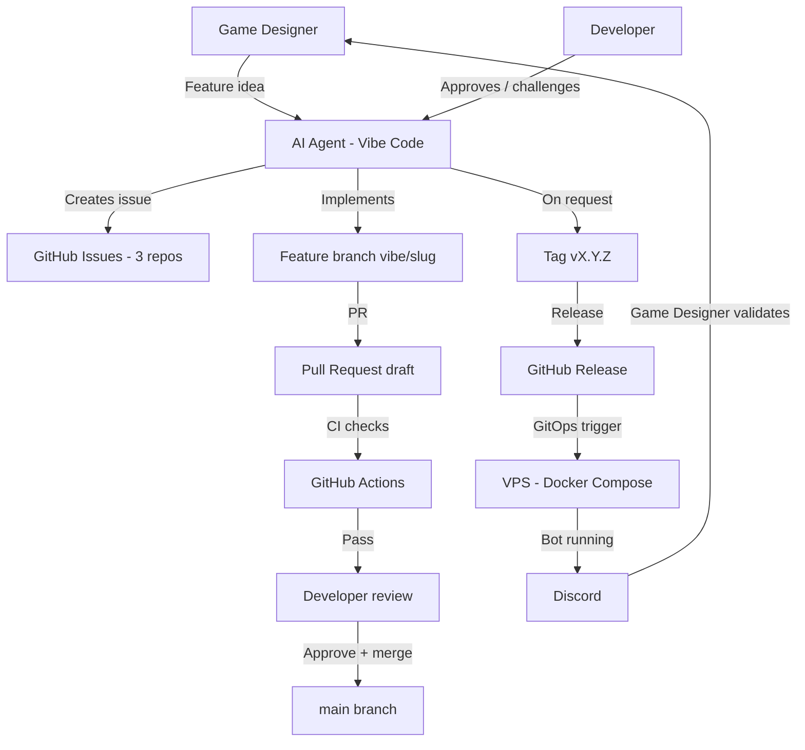

# Vibe-coding workflow

This document describes the operating model used to build Kingdoms: the full
interaction loop between the AI agent, GitHub, the VPS, Discord, and the humans
(game designer, developer).

Kingdoms is built by AI agent sessions that have **no access to previous
conversations**. This repo is the source of truth, so the operating model
itself is written down here. Any future session — and any human contributor —
must be able to understand the model from this page alone.

## Roles

| Role | Who | Responsibility |
|------|-----|----------------|
| Game designer | Non-developer, idea-rich | Defines features, game rules, environments; validates behavior in Discord |
| Developer | Experienced, maintains the platform | Reviews and approves PRs, infrastructure and architecture decisions, tags releases |
| AI agent (Vibe Code) | Mistral-powered coding agent | Implements issues, opens PRs, monitors CI, manages branches/tags/releases on request |

## Artifact map

| Artifact | Location | Owner |
|----------|----------|-------|
| Ideas, rules, environments | `kingdoms` docs (`docs/MODS/`) | Game designer (via agent) |
| Work items | GitHub issues (3 repos) | Agent creates, developer approves |
| Implementation | Feature branches `vibe/<slug>` → PRs | Agent |
| Approvals & merges | PR review | Developer |
| Versions | Git tags + GitHub releases | Developer approves, agent executes |
| Deployment | `kingdoms-infra` GitOps (dev / staging / prod) | Agent via CI/CD |

## End-to-end flow

Step by step:

1. The game designer brings a feature idea (or a change to rules or
   environment) to the agent.
2. The agent challenges and shapes the idea toward automatable, simply
   explainable behavior, then creates a self-contained GitHub issue in the
   relevant repo. The developer approves or adjusts the issue.
3. The agent implements the issue on a `vibe/<short-slug>` branch and opens a
   draft PR. CI runs on the PR; the agent monitors and fixes failures.
4. The developer reviews and merges the PR.
5. When the developer explicitly requests it, the agent tags a version and
   creates the GitHub release.
6. The release triggers the GitOps deployment to the chosen environment on the
   VPS; the bot runs and the game designer validates the behavior in Discord.

## PR commands automation

`ROADMAP.md` and `docs/DEPENDENCIES.md` are kept in
sync through **PR comment commands** (see the
[PR commands](SKILLS/pr-commands.md) skill, workflow
`.github/workflows/pr-commands.yml`): a collaborator with write access
comments `/roadmap`, `/dependencies` or `/check-docs` on a
pull request, the corresponding script runs against the PR branch, and the
generated artifact is **committed to that PR branch** — never a rolling
`automation/*` PR, never a direct push to `main`. Generated technical docs
(pydoc) live in `kingdoms-services` and are freshness-checked there.

- **Why comment-triggered:** the agent can post the commands itself
  (`gh pr comment <n> --body "/roadmap"`), so every open PR can absorb the
  generated drift it needs before review; nothing accumulates in ghost PRs.
- **Access control:** only `admin`/`maintain`/`write` collaborators can run
  the commands (checked in the `parse` job).
- **Fail-closed:** `/roadmap` and `/dependencies` read the issues of
  `kingdoms-services` and `kingdoms-infra` with the default `GITHUB_TOKEN`
  (all three repositories are public); they fail with an explicit error
  when a repo is unreadable, never regenerating from partial data.
- **Status mapping:** closed-as-completed → `done`, closed-as-not-planned →
  `dropped` (moved to "Out of Scope"), open with a closing-keyword PR →
  `in-review`, otherwise `todo`. `in-progress` and `blocked` require human
  judgment and are preserved as-is.
- **Fail-closed:** every sync/generation script fails when its validation
  fails (unreadable repo, partial data, missing labels, stale generated
  docs) — no best-effort or partial writes.
- **Linking PRs to issues:** use a closing keyword in the PR description
  (`Closes #N` same-repo, `Closes owner/repo#N` cross-repo) — this populates
  the GitHub "Development" section, drives `in-review` detection, and closes
  the issue on merge.

The [Update roadmap](SKILLS/update-roadmap.md) and
[Update dependencies](SKILLS/update-dependencies.md) skills remain the
manual fallbacks: run them only when automation is down or when a status
needs human judgment (`in-progress`/`blocked`).

## Session loop

An agent session (which starts with no memory of previous conversations):

1. Read `AGENTS.md` in the target repo, then the assigned issue in full —
   issues are self-contained, with skills tables and dependencies.
2. Create branch `vibe/<short-slug>`.
3. Implement, run `make lint` + `make test`.
4. Open a draft PR, monitor CI, fix failures.
5. Report the PR URL to the developer and wait for review.
6. On approval: merge, tag, release — only when explicitly requested by the
   developer.
7. Verify the roadmap: post `/roadmap` on the PR (the `PR commands` workflow
   commits the synced `ROADMAP.md` to the PR branch). Only if automation is
   down or a status needs human judgment (`in-progress`/`blocked`), run the
   "Update roadmap" skill manually.

## Rules

- The agent **never** merges a PR without an **explicit merge approval**
  from the developer. What an explicit merge approval includes:
  - a clear go-ahead naming the PR (e.g. "merge #44") — a review comment,
    a "LGTM", an approval of the *idea*, or silence is **not** a merge
    approval;
  - CI green on the PR head at merge time;
  - for changes with a **critical architecture impact** (ADR-level design,
    data model, core interfaces, infrastructure/deployment, security),
    the approval must come from **merlin-pinpin himself**: he is the only
    decision-maker for production; other users may at most deploy
    non-prod environments, as he directs.
- The agent never tags or releases without an explicit request from the
  developer.
- **Required status checks**: the merge-blocking checks are enforced by the
  `main` ruleset of each repository. For `kingdoms`: `check` (Check Docs —
  docstring completeness **and** generated-docs freshness) and `cla` (CLA
  Check). For `kingdoms-services`: the full CI matrix (lint, typecheck, unit
  tests, compose, smoke, Discord smoke, image build). A PR cannot be merged
  while any required check is red. All three repositories are public with an
  active `main` ruleset enforcing their required checks (`kingdoms`:
  `check`, `cla`; `kingdoms-services`: the full CI matrix + `cla`;
  `kingdoms-infra`: its CI matrix + `cla`). A PR cannot be merged with a
  red check.
- The agent **never** pushes infrastructure changes without developer approval.
- All issues are written in English and are self-contained (future sessions
  have no conversation memory).
- Every feature is validated by the game designer in Discord before a release
  is tagged.
- Environments:
  - **dev**: auto-deploy on merge to `main`
  - **staging**: manual deployment
  - **prod**: tag-triggered deployment

## Cross-references

- [AGENTS.md](../AGENTS.md) — repo rules for AI agents (all 3 repos link back
  to this document)
- [WORKFLOWS.md](WORKFLOWS.md) — user-facing game workflows
- [ARCHITECTURE.md](ARCHITECTURE.md) — technical architecture, including the
  deployment flow
- `kingdoms-infra` — GitOps implementation of the deployment flow
  (kingdoms-infra#2)
