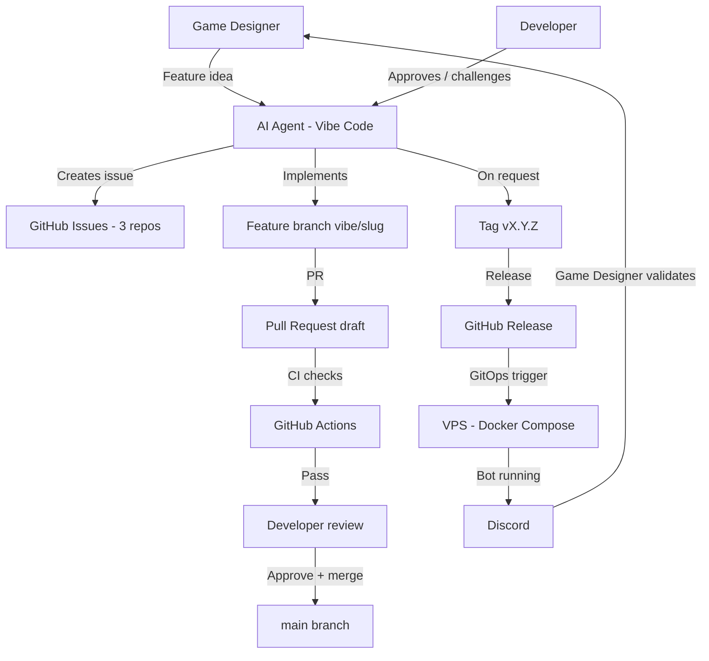

# Vibe-coding workflow

This document describes the operating model used to build Kingdoms: the full
interaction loop between the AI agent, GitHub, the VPS, Discord, and the humans
(game designer, developer).

Kingdoms is built by AI agent sessions that have **no access to previous
conversations**. This repo is the source of truth, so the operating model
itself is written down here. Any future session — and any human contributor —
must be able to understand the model from this page alone.

## Roles

| Role | Who | Responsibility |
|------|-----|----------------|
| Game designer | Non-developer, idea-rich | Defines features, game rules, environments; validates behavior in Discord |
| Developer | Experienced, maintains the platform | Reviews and approves PRs, infrastructure and architecture decisions, tags releases |
| AI agent (Vibe Code) | Mistral-powered coding agent | Implements issues, opens PRs, monitors CI, manages branches/tags/releases on request |

## Artifact map

| Artifact | Location | Owner |
|----------|----------|-------|
| Ideas, rules, environments | `kingdoms` docs (`docs/MODS/`) | Game designer (via agent) |
| Work items | GitHub issues (3 repos) | Agent creates, developer approves |
| Implementation | Feature branches `vibe/<slug>` → PRs | Agent |
| Approvals & merges | PR review | Developer |
| Versions | Git tags + GitHub releases | Developer approves, agent executes |
| Deployment | `kingdoms-infra` GitOps (dev / staging / prod) | Agent via CI/CD |

## End-to-end flow

Step by step:

1. The game designer brings a feature idea (or a change to rules or
   environment) to the agent.
2. The agent challenges and shapes the idea toward automatable, simply
   explainable behavior, then creates a self-contained GitHub issue in the
   relevant repo. The developer approves or adjusts the issue.
3. The agent implements the issue on a `vibe/<short-slug>` branch and opens a
   draft PR. CI runs on the PR; the agent monitors and fixes failures.
4. The developer reviews and merges the PR.
5. When the developer explicitly requests it, the agent tags a version and
   creates the GitHub release.
6. The release triggers the GitOps deployment to the chosen environment on the
   VPS; the bot runs and the game designer validates the behavior in Discord.

## Roadmap automation

`ROADMAP.md` is the single source of truth for project progress. It is kept
in sync **automatically** — no manual issue-edit, PR, or session-end ritual is
needed:

- **Trigger:** the `Sync roadmap` workflow in `kingdoms` runs
  `scripts/sync_roadmap.py` whenever an issue is opened, reopened or closed —
  including in `kingdoms-services` and `kingdoms-infra`, which forward their
  issue events via a `repository_dispatch` ping (`roadmap-ping.yml`, driven by
  the `ROADMAP_DISPATCH_PAT` secret). Merged PRs need no dedicated trigger:
  merging a PR closes its linked issue, and the issue event drives the sync.
- **Status mapping:** closed-as-completed → `done`, closed-as-not-planned →
  `dropped` (moved to "Out of Scope"), open with a closing-keyword PR →
  `in-review`, otherwise `todo`. `in-progress` and `blocked` require human
  judgment and are preserved as-is.
- **Delivery:** when the roadmap drifted, the workflow updates a single
  **rolling PR** on branch `automation/roadmap-sync` (never a direct push to
  `main`, never one PR per event). Reviewing that PR is the only human task.
- **Safety nets:** a weekly schedule run, manual `workflow_dispatch`, and a
  guard that fails the workflow when the GitHub API returns no issue data
  (instead of writing a roadmap update based on incomplete state).
- **Linking PRs to issues:** use a closing keyword in the PR description
  (`Closes #N` same-repo, `Closes owner/repo#N` cross-repo) — this populates
  the GitHub "Development" section, drives `in-review` detection, and closes
  the issue on merge, which in turn triggers the roadmap sync.

The [Update roadmap](SKILLS/update-roadmap.md) skill remains the manual
fallback: run it only when automation is down or when a status needs human
judgment (`in-progress`/`blocked`).

## Session loop

An agent session (which starts with no memory of previous conversations):

1. Read `AGENTS.md` in the target repo, then the assigned issue in full —
   issues are self-contained, with skills tables and dependencies.
2. Create branch `vibe/<short-slug>`.
3. Implement, run `make lint` + `make test`.
4. Open a draft PR, monitor CI, fix failures.
5. Report the PR URL to the developer and wait for review.
6. On approval: merge, tag, release — only when explicitly requested by the
   developer.
7. Verify the roadmap: the `Sync roadmap` workflow (kingdoms#27) updates
   `ROADMAP.md` automatically on issue state changes. Only if automation is
   down or a status needs human judgment (`in-progress`/`blocked`), run the
   "Update roadmap" skill manually.

## Rules

- The agent **never** merges to `main`, tags, or releases without explicit
  developer approval. In practice the agent environment cannot merge PRs at
  all: the developer merges every PR, even after an explicit approval.
- The agent **never** pushes infrastructure changes without developer approval.
- All issues are written in English and are self-contained (future sessions
  have no conversation memory).
- Every feature is validated by the game designer in Discord before a release
  is tagged.
- Environments:
  - **dev**: auto-deploy on merge to `main`
  - **staging**: manual deployment
  - **prod**: tag-triggered deployment

## Cross-references

- [AGENTS.md](../AGENTS.md) — repo rules for AI agents (all 3 repos link back
  to this document)
- [WORKFLOWS.md](WORKFLOWS.md) — user-facing game workflows
- [ARCHITECTURE.md](ARCHITECTURE.md) — technical architecture, including the
  deployment flow
- `kingdoms-infra` — GitOps implementation of the deployment flow
  (kingdoms-infra#2)
