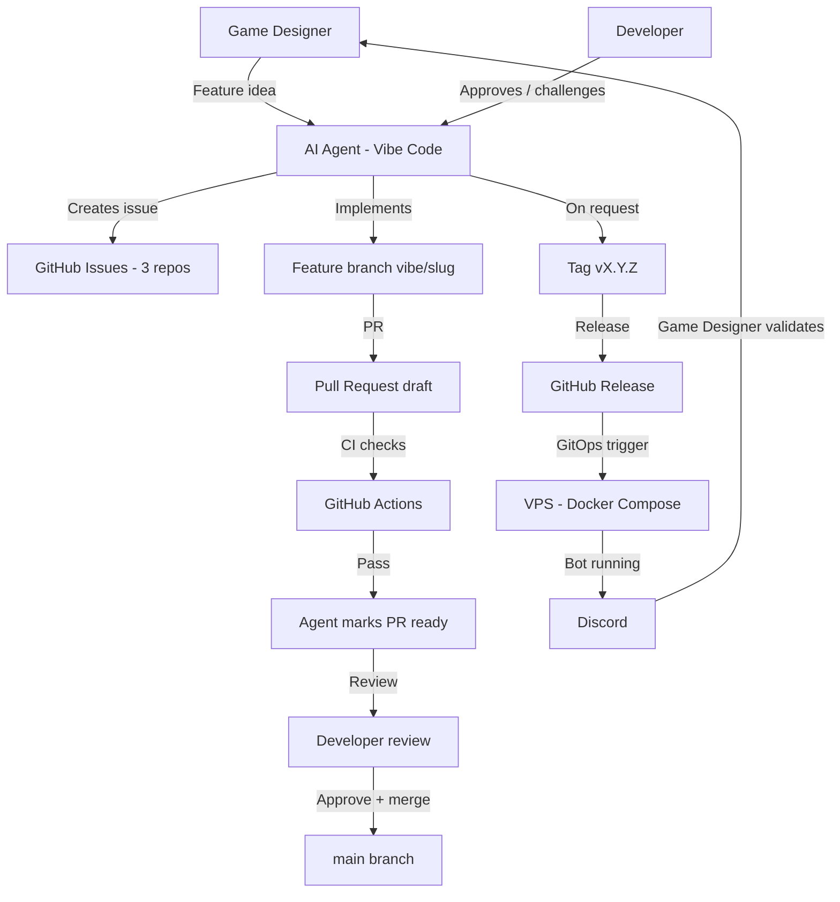

# Vibe-coding workflow

This document describes the operating model used to build Kingdoms: the full
interaction loop between the AI agent, GitHub, the VPS, Discord, and the humans
(game designer, developer).

Kingdoms is built by AI agent sessions that have **no access to previous
conversations**. This repo is the source of truth, so the operating model
itself is written down here. Any future session — and any human contributor —
must be able to understand the model from this page alone.

## Roles

| Role | Who | Responsibility |
|------|-----|----------------|
| Game designer | Non-developer, idea-rich | Defines features, game rules, environments; validates behavior in Discord |
| Developer | Experienced, maintains the platform | Challenges the design, **reviews and approves PRs** (one click); never codes |
| Ops | Infrastructure owner | Everything the developer does, plus environment and secret administration in the GitHub web UI and production deployment approvals |
| AI agent (Vibe Code) | Mistral-powered coding agent | Does 100% of the technical work: issues, code, branches, PRs, CI, test deployments, `/merge`, tags/releases on request |

**Humans never check out, write code, or run scripts** — this platform is a
pure vibe-coding test. Every human technical action is a **click in the
GitHub web UI**: approving PRs, approving production deployments, and the
one-time administration (org teams, rulesets, environments, secrets).
There is deliberately no human CLI step anywhere in the model; agents must
never propose one (see `AGENTS.md`).

The three roles map to GitHub org teams (created once in the web UI by the
org owner):

| Team | Members | Repo permissions |
|------|---------|-----------------|
| `@merlin-pinpin-org/maintainers` | developer + ops | Write on the 3 repos; code owners (required reviewers on `main` PRs) |
| `@merlin-pinpin-org/ops` | ops | Maintain on `kingdoms-infra` (environments + secrets), Read elsewhere; owns the `/deploy/prod/` CODEOWNERS paths |
| `@merlin-pinpin-org/game-designers` | game designer | Write on `kingdoms` and `kingdoms-services` (open PRs, never merge — rulesets enforce it), Read on `kingdoms-infra` |

## Artifact map

| Artifact | Location | Owner |
|----------|----------|-------|
| Ideas, rules, environments | `kingdoms` docs (`docs/MODS/`) | Game designer (via agent) |
| Work items | GitHub issues (3 repos) | Agent creates |
| Implementation | Feature branches `vibe/<slug>` → PRs | Agent |
| Approvals & merges | PR review, GitHub rulesets | Developer and ops (one click); the agent executes the merge on `/merge` |
| Versions | Git tags + GitHub releases | Agent executes on request; permissions enforced by GitHub |
| Deployment | `kingdoms-infra` GitOps (test / prod, self-hosted runner on the VPS) | Agent via CI/CD; ops approves prod |

## End-to-end flow

Step by step:

1. The game designer brings a feature idea (or a change to rules or
   environment) to the agent.
2. The agent challenges and shapes the idea toward automatable, simply
   explainable behavior, then creates a self-contained GitHub issue in the
   relevant repo, using that repo's issue templates — blank issues are
   disabled and a "Validate issue" workflow flags non-compliant issues
   `invalid`.
3. The agent implements the issue on a `vibe/<short-slug>` branch and opens a
   draft PR. CI runs on the PR; the agent monitors and fixes failures. When
   the agent considers the PR merge-ready (all checks green, implementation
   complete, self-review done, docs updated), it marks the PR *ready for
   review*; while work remains, the PR stays in draft.
4. A reviewer with merge access (developer or ops, per the CODEOWNERS
   rules backed by the `main` rulesets) reviews and approves the PR — one
   human click. On `/merge` (session instruction or PR comment), the agent
   verifies its merge criteria and executes the squash merge; GitHub
   rulesets remain the hard, fail-closed gate. The agent never approves its
   own PRs.
5. On `/merge` from a reviewer, the agent checks its merge criteria (PR
   ready, all checks green, required code-owner approval present, docs
   synced, linked issue, no unresolved review threads) and merges with
   squash, deleting the branch. **GitHub automerge is intentionally not
   used**: it merges as soon as checks and the required approval land,
   ignoring the agent's criteria and the game designer's Discord validation.
   The agent-executed `/merge` keeps the judgment (has the feature been
   validated in Discord? are the docs synced?) while GitHub rulesets keep
   the enforcement.
6. When explicitly requested, the agent tags a version and creates the GitHub
   release — tag and release permissions are enforced by GitHub.
7. Test deployments are **on demand** (`/deploy-test` PR comment posted by
   the session — commit-SHA image tag; the cross-repo dispatch uses the
   kingdoms-deployer GitHub App, an ephemeral Actions: write-only token);
   production deployments happen only from a released tag (`vX.Y.Z`),
   gated to ops (Actions policy on the Deploy prod workflow + required
   reviewers on the `prod` environment). The bot runs and the game
   designer validates the behavior in Discord.

## Generated artifacts sync

`ROADMAP.md` and `docs/DEPENDENCIES.md` are generated artifacts kept in
sync by the sync skills ([Update roadmap](SKILLS/update-roadmap.md),
[Update dependencies](SKILLS/update-dependencies.md)): the agent runs the
sync script locally (`scripts/sync_roadmap.py`,
`scripts/sync_dependencies.py`), fixes what the script reports, and
**commits the regenerated artifact to the current PR branch** — never a
rolling `automation/*` PR, never a direct push to `main`. Generated
technical docs (pydoc) live in `kingdoms-services` and are
freshness-checked there.

- **Fail-closed:** both scripts read the issues of `kingdoms-services` and
  `kingdoms-infra` through `gh api` (all three repositories are public, no
  custom secret); they fail with an explicit error when a repo is
  unreadable, never regenerating from partial data. Every sync script fails
  when its validation fails (unreadable repo, partial data, missing
  labels, stale generated docs) — no best-effort or partial writes.
- **Status mapping:** closed-as-completed → `done`, closed-as-not-planned →
  `dropped` (moved to "Out of Scope"), open with a closing-keyword PR →
  `in-review`, otherwise `todo`. `in-progress` and `blocked` require human
  judgment and are preserved as-is.
- **Linking PRs to issues:** use a closing keyword in the PR description
  (`Closes #N` same-repo, `Closes owner/repo#N` cross-repo) — this populates
  the GitHub "Development" section, drives `in-review` detection, and closes
  the issue on merge.

The `Check Docs` required check runs `scripts/validate_docs.py` on every PR
— documentation validation never depends on a manual command.

## Session loop

An agent session (which starts with no memory of previous conversations):

1. Read `AGENTS.md` in the target repo, then the assigned issue in full —
   issues are self-contained, with skills tables and dependencies.
2. Create branch `vibe/<short-slug>`.
3. Implement, run `make lint` + `make test`.
4. Open a draft PR, monitor CI, fix failures.
5. Mark the PR ready for review when merge-ready (see the PR draft-status
   rule below); otherwise keep it in draft.
6. Report the PR URL and wait for review.
7. On `/merge`: verify the merge criteria and execute the squash merge —
   GitHub rulesets stay the hard gate; on request, tag and release — only
   from actors authorized by the GitHub policies.
8. Verify the roadmap: run `scripts/sync_roadmap.py` (the
   [Update roadmap](SKILLS/update-roadmap.md) skill) and commit the synced
   `ROADMAP.md` to the current PR branch.

## Rules

- **Who may do what is enforced by GitHub, not by this document**: merge
  approvals are enforced by the `main` ruleset of each repository, PR
  validation by its required checks, and deployments by environment
  protection rules. No agent-facing instruction grants or restricts access
  to a person.
- **Required status checks**: the merge-blocking checks are enforced by the
  `main` ruleset of each repository. For `kingdoms`: `check` (Check Docs —
  docstring completeness **and** generated-docs freshness) and `cla` (CLA
  Check). For `kingdoms-services`: the full CI matrix (lint, typecheck, unit
  tests, compose, smoke, Discord smoke, image build). All three repositories
  are public with an active `main` ruleset enforcing their required checks
  (`kingdoms`: `check`, `cla`; `kingdoms-services`: the full CI matrix +
  `cla`; `kingdoms-infra`: its CI matrix + `cla`). A PR cannot be merged
  with a red check.
- **Anyone can run the tests locally**, with no special access: `make lint`,
  `make typecheck` and `make test` in `kingdoms-services`, the doc validation
  in `kingdoms`, the shell checks in `kingdoms-infra`. The local toolchain
  only requires public clones — no credentials. (In practice no human ever
  runs them: the agent runs them, and CI re-runs them on every PR.)
- **Humans never check out, write code, or run scripts.** The only manual
  technical actions are clicks in the GitHub web UI, listed in
  [PROCESS.md](PROCESS.md). An agent session must never propose a
  human CLI step.
- All issues are written in English and are self-contained (future sessions
  have no conversation memory).
- **PR draft status is the agent's merge-readiness signal.** The agent always
  opens PRs as drafts. It marks a PR *ready for review* —
  `gh pr ready` — **only** when, from its point of view, the PR can be merged:
  all checks green, implementation complete, self-review done, docs updated.
  If work remains (red or pending checks, missing doc updates, open review
  comments), the PR stays in (or returns to) draft — `gh pr ready --undo`.
  The reviewer remains free to merge or ask for changes at any time.
- Every feature is validated by the game designer in Discord before a release
  is tagged.
- Environments (all on the Kingdoms VPS, deployed by the CD pipeline
  running on its self-hosted runner — installation guide:
  [VPS-SETUP.md](https://github.com/merlin-pinpin-org/kingdoms-infra/blob/main/docs/VPS-SETUP.md)):
  - **test**: deployed **on demand** — by the `/deploy-test` PR comment
    (the PR image is built with its commit SHA tag and deployed; the
    cross-repo trigger goes through the kingdoms-deployer GitHub App,
    an ephemeral Actions: write token — setup guide: kingdoms-infra
    docs/DEPLOY-TEST-APP.md); test-config changes on `main` also redeploy.
    It is the validation environment where the game designer checks the
    bot in Discord
  - **prod**: released only — image tagged `vX.Y.Z`, triggered by the
    released tag or an ops member, paused until an ops member approves
    the `prod` environment protection (required reviewers), and gated to
    ops actors by the Actions policy on the Deploy prod workflow. Only
    ops deploys to production.

## Cross-references

- [AGENTS.md](../AGENTS.md) — repo rules for AI agents (all 3 repos link back
  to this document)
- [WORKFLOWS.md](WORKFLOWS.md) — user-facing game workflows
- [PROCESS.md](PROCESS.md) — the four processes (development, test
  deployment, release, production) per role: game designer, developer, ops
- [ARCHITECTURE.md](ARCHITECTURE.md) — technical architecture, including the
  deployment flow
- `kingdoms-infra` — GitOps implementation of the deployment flow
  (kingdoms-infra#2)
