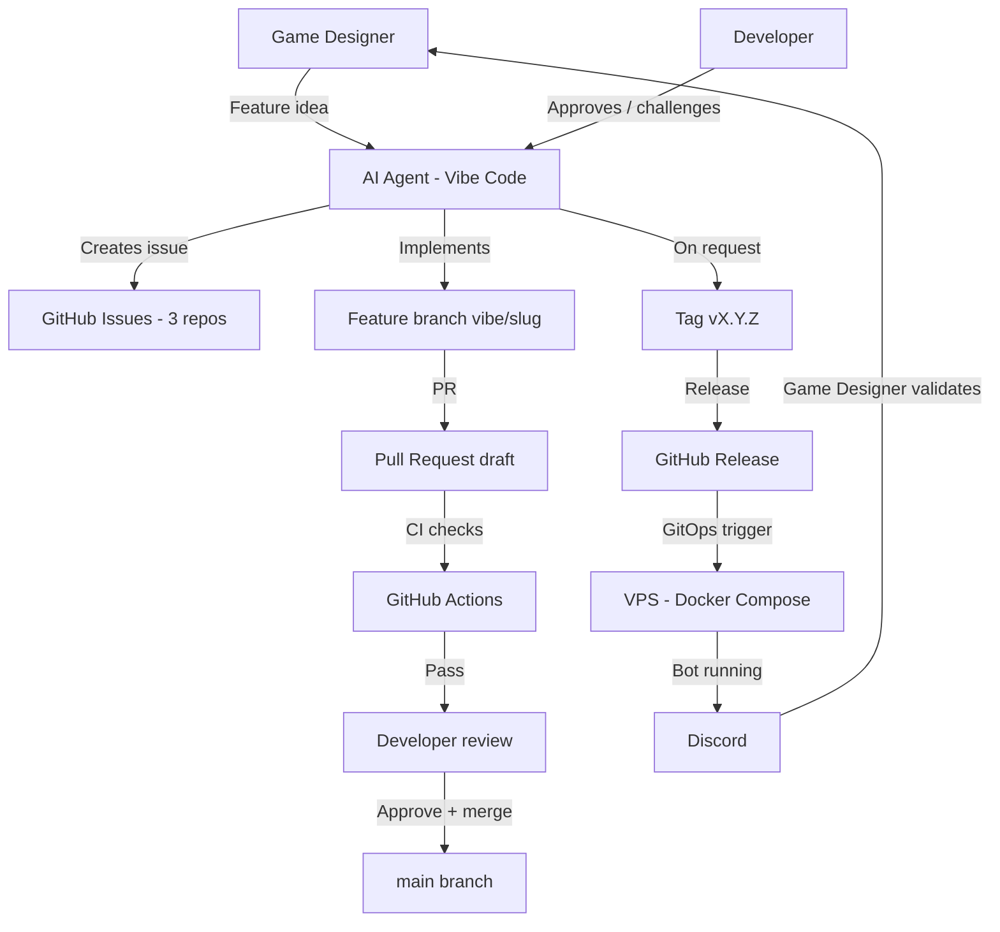

# Vibe-coding workflow

This document describes the operating model used to build Kingdoms: the full
interaction loop between the AI agent, GitHub, the VPS, Discord, and the humans
(game designer, developer).

Kingdoms is built by AI agent sessions that have **no access to previous
conversations**. This repo is the source of truth, so the operating model
itself is written down here. Any future session — and any human contributor —
must be able to understand the model from this page alone.

## Roles

| Role | Who | Responsibility |
|------|-----|----------------|
| Game designer | Non-developer, idea-rich | Defines features, game rules, environments; validates behavior in Discord |
| Developer | Experienced, maintains the platform | Reviews PRs, infrastructure and architecture decisions; permissions are enforced by GitHub policies |
| AI agent (Vibe Code) | Mistral-powered coding agent | Implements issues, opens PRs, monitors CI, manages branches/tags/releases on request |

## Artifact map

| Artifact | Location | Owner |
|----------|----------|-------|
| Ideas, rules, environments | `kingdoms` docs (`docs/MODS/`) | Game designer (via agent) |
| Work items | GitHub issues (3 repos) | Agent creates |
| Implementation | Feature branches `vibe/<slug>` → PRs | Agent |
| Approvals & merges | PR review, GitHub rulesets | Reviewers with merge access |
| Versions | Git tags + GitHub releases | Agent executes on request; permissions enforced by GitHub |
| Deployment | `kingdoms-infra` GitOps (dev / staging / prod) | Agent via CI/CD |

## End-to-end flow

Step by step:

1. The game designer brings a feature idea (or a change to rules or
   environment) to the agent.
2. The agent challenges and shapes the idea toward automatable, simply
   explainable behavior, then creates a self-contained GitHub issue in the
   relevant repo.
3. The agent implements the issue on a `vibe/<short-slug>` branch and opens a
   draft PR. CI runs on the PR; the agent monitors and fixes failures.
4. A reviewer with merge access reviews and merges the PR — approvals and
   merge rights are enforced by the GitHub rulesets, not by this document.
5. When explicitly requested, the agent tags a version and creates the GitHub
   release — tag and release permissions are enforced by GitHub.
6. The release triggers the GitOps deployment to the chosen environment on the
   VPS; the bot runs and the game designer validates the behavior in Discord.

## Generated artifacts sync

`ROADMAP.md` and `docs/DEPENDENCIES.md` are generated artifacts kept in
sync by the sync skills ([Update roadmap](SKILLS/update-roadmap.md),
[Update dependencies](SKILLS/update-dependencies.md)): the agent runs the
sync script locally (`scripts/sync_roadmap.py`,
`scripts/sync_dependencies.py`), fixes what the script reports, and
**commits the regenerated artifact to the current PR branch** — never a
rolling `automation/*` PR, never a direct push to `main`. Generated
technical docs (pydoc) live in `kingdoms-services` and are
freshness-checked there.

- **Fail-closed:** both scripts read the issues of `kingdoms-services` and
  `kingdoms-infra` through `gh api` (all three repositories are public, no
  custom secret); they fail with an explicit error when a repo is
  unreadable, never regenerating from partial data. Every sync script fails
  when its validation fails (unreadable repo, partial data, missing
  labels, stale generated docs) — no best-effort or partial writes.
- **Status mapping:** closed-as-completed → `done`, closed-as-not-planned →
  `dropped` (moved to "Out of Scope"), open with a closing-keyword PR →
  `in-review`, otherwise `todo`. `in-progress` and `blocked` require human
  judgment and are preserved as-is.
- **Linking PRs to issues:** use a closing keyword in the PR description
  (`Closes #N` same-repo, `Closes owner/repo#N` cross-repo) — this populates
  the GitHub "Development" section, drives `in-review` detection, and closes
  the issue on merge.

The `Check Docs` required check runs `scripts/validate_docs.py` on every PR
— documentation validation never depends on a manual command.

## Session loop

An agent session (which starts with no memory of previous conversations):

1. Read `AGENTS.md` in the target repo, then the assigned issue in full —
   issues are self-contained, with skills tables and dependencies.
2. Create branch `vibe/<short-slug>`.
3. Implement, run `make lint` + `make test`.
4. Open a draft PR, monitor CI, fix failures.
5. Report the PR URL and wait for review.
6. On request: merge, tag, release — only from actors authorized by the
   GitHub policies.
7. Verify the roadmap: run `scripts/sync_roadmap.py` (the
   [Update roadmap](SKILLS/update-roadmap.md) skill) and commit the synced
   `ROADMAP.md` to the current PR branch.

## Rules

- **Who may do what is enforced by GitHub, not by this document**: merge
  approvals are enforced by the `main` ruleset of each repository, PR
  validation by its required checks, and deployments by environment
  protection rules. No agent-facing instruction grants or restricts access
  to a person.
- **Required status checks**: the merge-blocking checks are enforced by the
  `main` ruleset of each repository. For `kingdoms`: `check` (Check Docs —
  docstring completeness **and** generated-docs freshness) and `cla` (CLA
  Check). For `kingdoms-services`: the full CI matrix (lint, typecheck, unit
  tests, compose, smoke, Discord smoke, image build). All three repositories
  are public with an active `main` ruleset enforcing their required checks
  (`kingdoms`: `check`, `cla`; `kingdoms-services`: the full CI matrix +
  `cla`; `kingdoms-infra`: its CI matrix + `cla`). A PR cannot be merged
  with a red check.
- **Anyone can run the tests locally**, with no special access: `make lint`,
  `make typecheck` and `make test` in `kingdoms-services`, the doc validation
  in `kingdoms`, the shell checks in `kingdoms-infra`. The local toolchain
  only requires public clones — no credentials.
- All issues are written in English and are self-contained (future sessions
  have no conversation memory).
- Every feature is validated by the game designer in Discord before a release
  is tagged.
- Environments:
  - **dev**: auto-deploy on merge to `main`; authorized contributors (as
    defined by the GitHub environment protection rules) can also trigger a
    dev deployment manually
  - **staging**: manual deployment
  - **prod**: tag-triggered deployment

## Cross-references

- [AGENTS.md](../AGENTS.md) — repo rules for AI agents (all 3 repos link back
  to this document)
- [WORKFLOWS.md](WORKFLOWS.md) — user-facing game workflows
- [ARCHITECTURE.md](ARCHITECTURE.md) — technical architecture, including the
  deployment flow
- `kingdoms-infra` — GitOps implementation of the deployment flow
  (kingdoms-infra#2)
