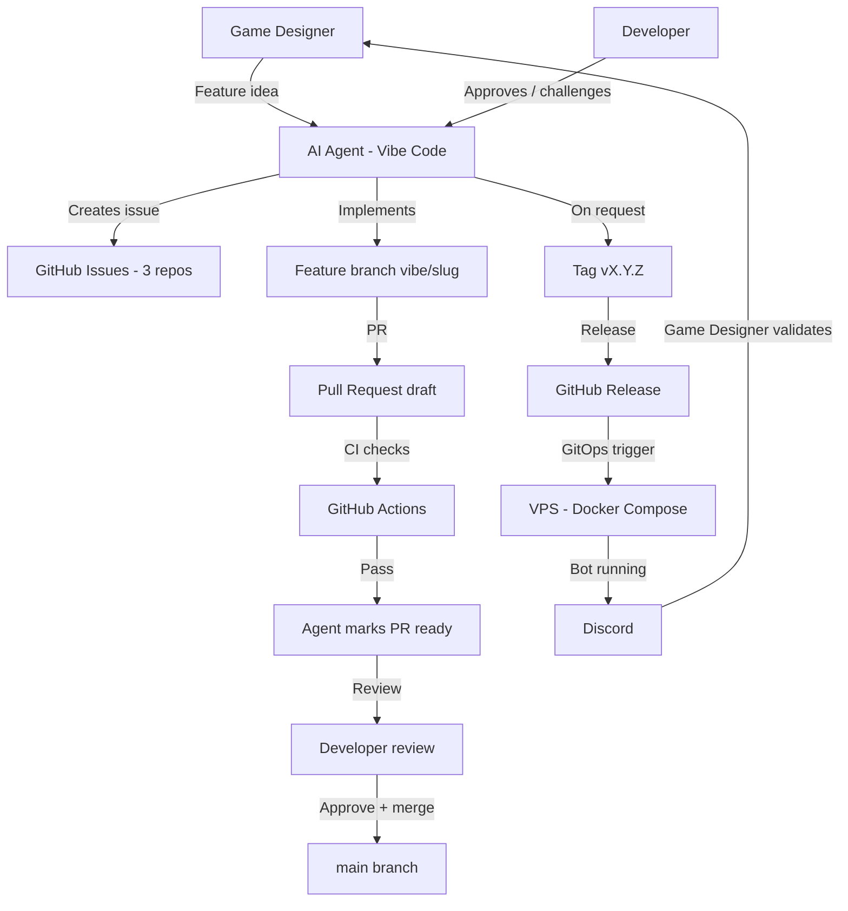

# Vibe-coding workflow

This document describes the operating model used to build Kingdoms: the full
interaction loop between the AI agent, GitHub, the VPS, Discord, and the humans
(game designer, developer).

Kingdoms is built by AI agent sessions that have **no access to previous
conversations**. This repo is the source of truth, so the operating model
itself is written down here. Any future session — and any human contributor —
must be able to understand the model from this page alone.

## Roles

| Role | Who | Responsibility |
|------|-----|----------------|
| Game designer | Non-developer, idea-rich | Defines features, game rules, environments; validates behavior in Discord |
| Developer | Experienced, maintains the platform | Challenges the design, **reviews and approves PRs** (one click); never codes |
| Ops | Infrastructure owner | Everything the developer does, plus environment and secret administration in the GitHub web UI and production deployment approvals |
| AI agent (Vibe Code) | Mistral-powered coding agent | Does 100% of the technical work: issues, code, branches, PRs, CI, test deployments, tags/releases on request. The agent never merges — the human clicks Merge |

**Humans never check out, write code, or run scripts** — this platform is a
pure vibe-coding test. Every human technical action is a **click in the
GitHub web UI**: approving PRs, approving production deployments, and the
one-time administration (org teams, rulesets, environments, secrets).
There is deliberately no human CLI step anywhere in the model; agents must
never propose one (see `AGENTS.md`).**Human GitHub scope (developer-mandated, exhaustive):** humans accept to
do exactly two recurring things on GitHub — **merge PRs** and **approve
production deployments** — plus the one-time bootstrapping (org teams,
rulesets, environments, secrets, runner install). Everything else is the
agent's job, done through automation. When a session hits a step that
seems to require another manual action, fix the automation instead (see
CONVENTIONS.md, *Human GitHub scope*).

The three roles map to GitHub org teams (created once in the web UI by the
org owner):

| Team | Members | Repo permissions |
|------|---------|-----------------|
| `@merlin-pinpin-org/maintainers` | developer + ops | Write on the 3 repos; code owners (required reviewers on `main` PRs) |
| `@merlin-pinpin-org/ops` | ops | Maintain on `kingdoms-infra` (environments + secrets), Read elsewhere; owns the `/deploy/prod/` CODEOWNERS paths |
| `@merlin-pinpin-org/game-designers` | game designer | Write on `kingdoms` and `kingdoms-services` (open PRs, never merge — rulesets enforce it), Read on `kingdoms-infra` |

## Artifact map

| Artifact | Location | Owner |
|----------|----------|-------|
| Ideas, rules, environments | `kingdoms` docs (`docs/MODS/`) | Game designer (via agent) |
| Work items | GitHub issues (3 repos) | Agent creates |
| Implementation | Feature branches `vibe/<slug>` → PRs | Agent |
| Approvals & merges | PR review, GitHub rulesets | Developer and ops — one **Merge** click in the GitHub web UI |
| Versions | Git tags + GitHub releases | Agent executes on request; permissions enforced by GitHub |
| Deployment | `kingdoms-infra` GitOps (test / prod, self-hosted runner on the VPS) | Agent via CI/CD; ops approves prod |

## End-to-end flow

Step by step:

1. The game designer brings a feature idea (or a change to rules or
   environment) to the agent.
2. The agent challenges and shapes the idea toward automatable, simply
   explainable behavior, then creates a self-contained GitHub issue in the
   relevant repo, using that repo's issue templates — blank issues are
   disabled and a "Validate issue" workflow flags non-compliant issues
   `invalid`.
3. The agent implements the issue on a `vibe/<short-slug>` branch and opens a
   draft PR. CI runs on the PR; the agent monitors and fixes failures. When
   all checks are green, the branch is up to date and the implementation is
   complete, the agent deploys the PR to the test environment (when there is
   something to deploy), **validates the deployment itself** (healthchecks
   green, stack healthy, no crash loop), and only then marks the PR *ready
   for review* and asks the human to test and merge; while work or
   validation remains, the PR stays in draft.
4. A reviewer with merge access (developer or ops, per the CODEOWNERS
   rules backed by the `main` rulesets) reads the PR and **clicks Merge**
   in the GitHub web UI — one human click, the trust anchor of the model.
   The agent never merges (an earlier `/merge` agent-executed convention
   was abandoned: GitHub forbids author self-approval, and the session
   platform blocks agent-executed merges). The agent commits as
   `Mistral AI <noreply@mistral.ai>` and **never adds a `Co-authored-by`
   naming the human** — a trailer would make the human a co-author of
   the PR and block their own approval (see the *Git identity of agent
   sessions* rule in CONVENTIONS.md). **GitHub automerge is intentionally not
   used**: it merges as soon as checks and the required approval land,
   ignoring the game designer's Discord validation. The agent keeps its
   merge-readiness judgment (draft status, checks, docs, validation) and
   GitHub rulesets keep the enforcement.
5. When explicitly requested, the agent tags a version and creates the GitHub
   release — tag and release permissions are enforced by GitHub.
7. Test deployments are **on demand** (`/deploy [env]` PR comment posted by
   the session); the PR image (commit-SHA tagged) is pinned in the
   environment **state branch** `deploy/test` by the kingdoms-deployer
   GitHub App (ephemeral Actions: write token), and the push to
   `deploy/test` triggers the deployment — the deploy reads the pinned
   image from Git, never from a workflow input (ADR-0018). Production
   deployments happen only from a released tag (`vX.Y.Z`), written to
   `deploy/prod` by the release pipeline; its branch ruleset requires a
   pull request, so approving a prod deployment is merging that PR. The bot runs and the game
   designer validates the behavior in Discord.

## Automation mandate (developer-mandated)

**Everything is automation, on both sides of the table.** Humans never
run commands (above), and sessions never leave recurring operations as
one-off shell commands: every operation that will be needed again exists
as a committed Makefile target, script, or GitHub Actions workflow, so
future sessions (which have no conversation memory) rediscover it from
the repos. **Learn it or drop it:** whenever a session improvises a command
or helper script that could be useful again, it commits it — wrapped in a
Makefile target or script, with the session's learnings baked in. The
procedure and placement rules live in the
[Automate or learn](../.agents/skills/automate-or-learn/SKILL.md) skill.

## PR conventions (agent rules, developer-mandated)

These conventions are binding for the agent; they keep the human merge
flow frictionless:

1. **Never leave a PR in draft when asking for a merge.** A PR the agent
   asks the developer to merge is *ready for review* first (checks green,
   implementation complete, docs updated).
2. **Deploy to test, validate, then ready — in that order.** For any
   change with something to deploy: the agent deploys the PR to the test
   environment, **verifies the deployment itself** (healthchecks green,
   stack healthy, no crash loop), marks the PR *ready for review*, and
   only then asks the human to test and merge. The PR stays in draft
   while a test deployment is running or can be re-run; the human's
   Discord check is the final acceptance, not a precondition for ready.
   Doc-only or infra-only changes with nothing to redeploy skip the
   deployment step.
3. **Never overwrite another PR's test deployment.** One image runs on
   test at a time: if a different PR is pinned on `deploy/test` under
   validation, don't deploy on top of it. After a merge, re-align test
   to `main` only if the merged PR is the one deployed there.
4. **Stack sequential PRs on the same repository.** When several PRs are
   open on one repo, later ones are rebased on their predecessors so the
   developer can merge them in order without conflicts (merge PR 1, then
   PR 2 rebases cleanly, and so on).
5. **Group related issues into one PR when the scope is coherent.**
   One focused PR per coherent scope beats one PR per sub-issue; the PR
   body lists the covered issues.

## Generated artifacts sync

`ROADMAP.md` and `docs/DEPENDENCIES.md` are generated artifacts kept in
sync by the sync skills ([Update roadmap](../.agents/skills/update-roadmap/SKILL.md),
[Update dependencies](../.agents/skills/update-dependencies/SKILL.md)): the agent runs the
sync script locally (`scripts/sync_roadmap.py`,
`scripts/sync_dependencies.py`), fixes what the script reports, and
**commits the regenerated artifact to the current PR branch** — never a
rolling `automation/*` PR, never a direct push to `main`. Generated
technical docs (pydoc) live in `kingdoms-services` and are
freshness-checked there.

- **Fail-closed:** both scripts read the issues of `kingdoms-services` and
  `kingdoms-infra` through `gh api` (all three repositories are public, no
  custom secret); they fail with an explicit error when a repo is
  unreadable, never regenerating from partial data. Every sync script fails
  when its validation fails (unreadable repo, partial data, missing
  labels, stale generated docs) — no best-effort or partial writes.
- **Status mapping:** closed-as-completed → `done`, closed-as-not-planned →
  `dropped` (moved to "Out of Scope"), open with a closing-keyword PR →
  `in-review`, otherwise `todo`. `in-progress` and `blocked` require human
  judgment and are preserved as-is.
- **Linking PRs to issues:** use a closing keyword in the PR description
  (`Closes #N` same-repo, `Closes owner/repo#N` cross-repo) — this populates
  the GitHub "Development" section, drives `in-review` detection, and closes
  the issue on merge.

The `Check Docs` required check runs `scripts/validate_docs.py` on every PR
— documentation validation never depends on a manual command.

## Session loop

An agent session (which starts with no memory of previous conversations):

1. Read `AGENTS.md` in the target repo, then the assigned issue in full —
   issues are self-contained, with skills tables and dependencies.
2. Create branch `vibe/<short-slug>`.
3. Implement, run `make lint` + `make test`.
4. Open a draft PR, monitor CI, fix failures.
5. Mark the PR ready for review when merge-ready (see the PR draft-status
   rule below); otherwise keep it in draft.
6. Report the PR URL; the human reviewer clicks Merge (or asks for changes
   — the agent never merges). On request, tag and release — only from
   actors authorized by the GitHub policies.
8. Verify the roadmap: run `scripts/sync_roadmap.py` (the
   [Update roadmap](../.agents/skills/update-roadmap/SKILL.md) skill) and commit the synced
   `ROADMAP.md` to the current PR branch.

## Rules

- **Who may do what is enforced by GitHub, not by this document**: merge
  approvals are enforced by the `main` ruleset of each repository, PR
  validation by its required checks, and deployments by environment
  protection rules. No agent-facing instruction grants or restricts access
  to a person.
- **Required status checks**: the merge-blocking checks are enforced by the
  `main` ruleset of each repository. For `kingdoms`: `check` (Check Docs —
  docstring completeness **and** generated-docs freshness) and `cla` (CLA
  Check). For `kingdoms-services`: the full CI matrix (lint, typecheck, unit
  tests, compose, smoke, Discord smoke, image build). All three repositories
  are public with an active `main` ruleset enforcing their required checks
  (`kingdoms`: `check`, `cla`; `kingdoms-services`: the full CI matrix +
  `cla`; `kingdoms-infra`: its CI matrix + `cla`). A PR cannot be merged
  with a red check.
- **Anyone can run the tests locally**, with no special access: `make lint`,
  `make typecheck` and `make test` in `kingdoms-services`, the doc validation
  in `kingdoms`, the shell checks in `kingdoms-infra`. The local toolchain
  only requires public clones — no credentials. (In practice no human ever
  runs them: the agent runs them, and CI re-runs them on every PR.)
- **Humans never check out, write code, or run scripts.** The only manual
  technical actions are clicks in the GitHub web UI, listed in
  [PROCESS.md](PROCESS.md). An agent session must never propose a
  human CLI step.
- **Always include GitHub links in user-facing reports.** Every PR,
  issue, workflow run or branch mentioned in a report to a human carries
  its full GitHub URL: humans never open a terminal, links are their
  only access to the artifacts.
- All issues are written in English and are self-contained (future sessions
  have no conversation memory).
- **PR draft status is the agent's merge-readiness signal.** The agent always
  opens PRs as drafts. It marks a PR *ready for review* —
  `gh pr ready` — **only** when, from its point of view, the PR can be merged:
  all checks green, implementation complete, self-review done, docs updated.
  If work remains (red or pending checks, missing doc updates, open review
  comments), the PR stays in (or returns to) draft — `gh pr ready --undo`.
  The reviewer remains free to merge or ask for changes at any time.
- Every feature is validated by the game designer in Discord before a release
  is tagged.
- Environments (all on the Kingdoms VPS, deployed by the CD pipeline
  running on its self-hosted runner — installation guide:
  [VPS-SETUP.md](https://github.com/merlin-pinpin-org/kingdoms-infra/blob/main/docs/VPS-SETUP.md)):
  - **test**: deployed **on demand** — by the `/deploy [env]` PR comment
    (the PR image, commit-SHA tagged, is pinned in the `deploy/test`
    state branch by the kingdoms-deployer GitHub App — setup guide:
    kingdoms-infra docs/DEPLOY-TEST-APP.md); the push to `deploy/test`
    deploys the pinned image (ADR-0018). Test-config changes on `main`
    also redeploy (the pipeline pins the latest `sha-<sha>` image).
    It is the validation environment where the game designer checks the
    bot in Discord
  - **prod**: released only — image tagged `vX.Y.Z`, triggered by the
    released tag or an ops member, paused until an ops member approves
    the `prod` environment protection (required reviewers), and gated to
    ops actors by the Actions policy on the Deploy prod workflow. Only
    ops deploys to production.

## Cross-references

- [AGENTS.md](../AGENTS.md) — agent entry points (all 3 repos link back
  to this document)
- [CONVENTIONS.md](CONVENTIONS.md) — conventions shared by the three
  repositories (language, secrets, PR lifecycle, issues, checks)
- [DEVELOPER.md](DEVELOPER.md) — developer guide for this repo
- [WORKFLOWS.md](WORKFLOWS.md) — user-facing game workflows
- [PROCESS.md](PROCESS.md) — the four processes (development, test
  deployment, release, production) per role: game designer, developer, ops
- [ARCHITECTURE.md](ARCHITECTURE.md) — technical architecture, including the
  deployment flow
- `kingdoms-infra` — GitOps implementation of the deployment flow
  (kingdoms-infra#2)
