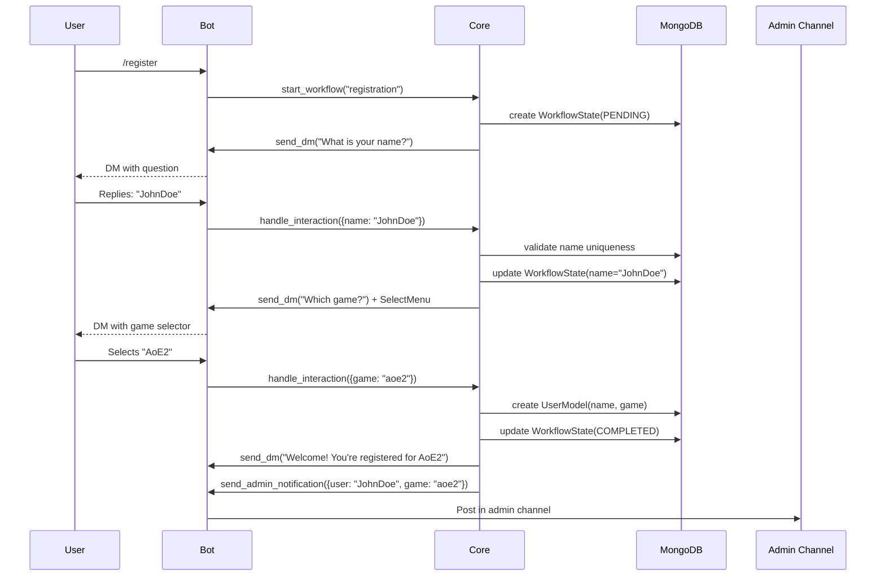
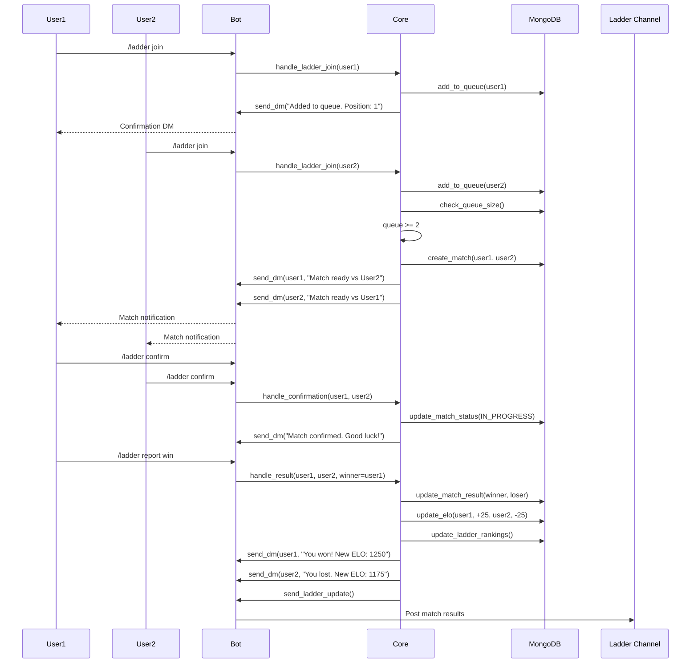
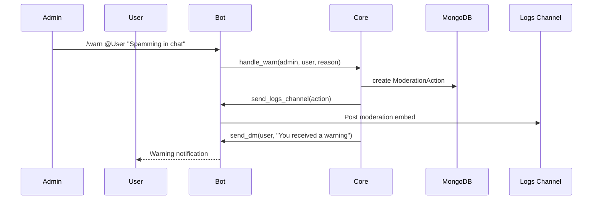
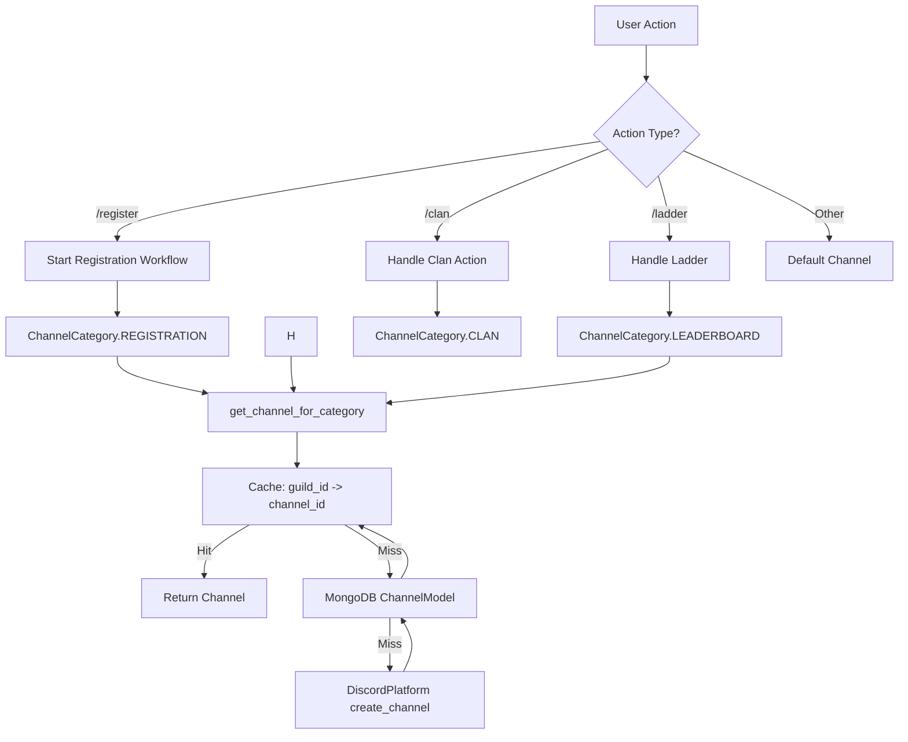
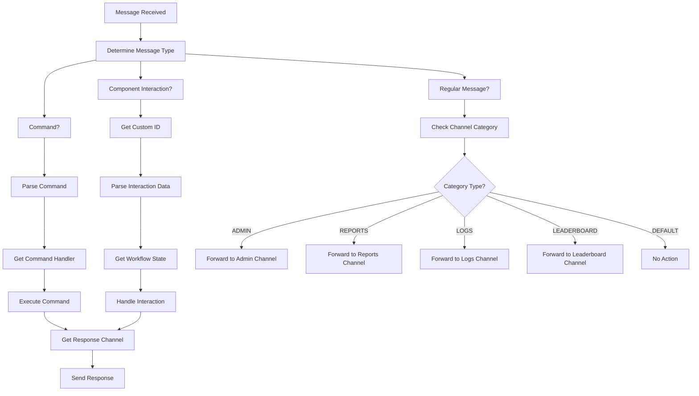
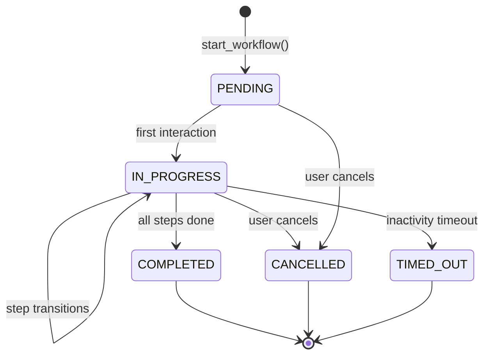

# Workflows

This document is the definitive reference for Kingdoms user interactions and
system behavior. All workflows are described **platform-agnostically**: they
are expressed against the generic core (see
[ARCHITECTURE.md](ARCHITECTURE.md)), so they apply to Discord today and to
future platforms (Twitch, Telegram) without changes.

Components referenced here (`WorkflowEngine`, `ChannelService`,
`ChannelCategory`, `WorkflowState`) are documented in
[ARCHITECTURE.md](ARCHITECTURE.md#2-generic-core-kingdoms-servicessrckingdomscore).
UI component conventions (buttons, select menus, modals, `custom_id`) are
documented in [architecture/discord.md](architecture/discord.md).

> The `/report` command is **out of scope** (dropped, see
> kingdoms-services#18). Moderation is admin-driven.

## 1. Registration workflow

**Description:** new user onboarding process.

**Steps:**

1. User sends `/register` command
2. Bot sends DM: "What is your name?"
3. User replies with name
4. Bot validates name uniqueness
5. Bot sends DM: "Which game? [AoE2, Chess, Other]"
6. User selects game
7. Bot assigns default role for that game
8. Bot sends confirmation DM with welcome message
9. Bot posts notification in admin channel

**Channels used:**

- DM for user interaction
- `ADMIN` channel for notification

## 2. Ladder workflow

**Description:** competitive ranking system.

**Steps:**

1. User sends `/ladder join`
2. Bot verifies user is registered
3. Bot adds user to ladder queue
4. When 2+ users in queue, bot creates match
5. Bot sends DM to both players: "Match ready vs [opponent]"
6. Players confirm availability
7. Bot records match result
8. Bot updates ELO ratings
9. Bot updates ladder rankings
10. Bot posts results in `LADDER` channel

**Channels used:**

- DM for match coordination
- `LADDER` channel for rankings and results

## 3. Moderation workflow

**Description:** admin actions and warnings. There is **no user-facing report
command**; moderation is admin-driven.

**Steps:**

1. Admin sends `/warn @user "reason"` or `/ban @user`
2. Bot validates admin permission
3. Bot records moderation action (`ModerationSystem`)
4. Bot posts the action in the `LOGS` channel
5. Bot notifies the user by DM

**Channels used:**

- `ADMIN` channel for admin actions
- `LOGS` channel for moderation history
- DM for user notification

## 4. Channel category management

**Description:** how the system routes messages to the correct channels.
Mods request channels by `ChannelCategory`, never by name or ID; the
`ChannelService` resolves the category (cache → database → creation).
See [ADR-0003](DECISIONS/003-channel-categories.md).

## 5. Message routing workflow

**Description:** how incoming messages are dispatched based on their type and
the channel category. Component interactions are dispatched through the
`custom_id` convention (`<mod>:<component>:<payload>`, see
[architecture/discord.md](architecture/discord.md#6-custom_id-conventions-project-wide)).

## Workflow state lifecycle

Every multi-step workflow is executed by the `WorkflowEngine` and persisted as
a `WorkflowState` (MongoDB, hot state in Redis), so flows survive restarts and
can be resumed. Status transitions:

## See also

- [ARCHITECTURE.md](ARCHITECTURE.md) — core components and data flow
- [architecture/discord.md](architecture/discord.md) — UI component patterns
  and `custom_id` routing
- [MODS/](MODS/) — per-mod rules and environments
- [DECISIONS/](DECISIONS/) — ADRs backing these workflows
- [VIBEWORKFLOW.md](VIBEWORKFLOW.md) — the human + agent operating model
