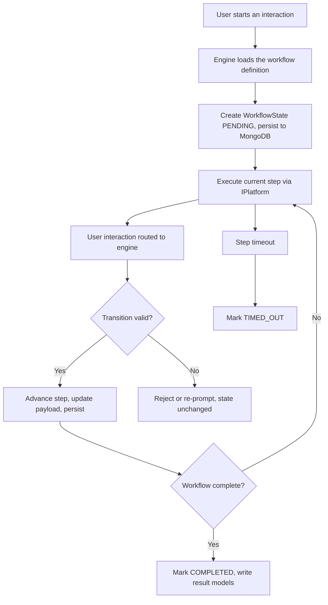

# Core services design

This page is the design deep-dive of the generic core
(`kingdoms-services/src/kingdoms/core/`). It complements
[ARCHITECTURE.md](../ARCHITECTURE.md), which stays the system overview. When
the two disagree, the overview wins and this page must be fixed.

The core is **platform-agnostic**: it contains everything reusable across
Discord or Twitch, and never imports platform-specific code (see
[ADR-0001](../DECISIONS/001-multi-platform-architecture.md)). Implementation
is tracked by the Phase 2 issues of
[kingdoms-services](https://github.com/merlin-pinpin/kingdoms-services)
(kingdoms-services#3–kingdoms-services#10, kingdoms-services#16,
kingdoms-services#17).

## Service map

| Service | Responsibility | ADR |
| ------- | -------------- | --- |
| `WorkflowEngine` | Drives multi-step interactions; loads definitions, executes step transitions, dispatches UI events to the right running workflow | [ADR-0002](../DECISIONS/002-workflow-engine.md) |
| `ChannelService` | Resolves channels by category; cache → database → platform creation | [ADR-0003](../DECISIONS/003-channel-categories.md) |
| `StateService` | Manages hot state in Redis (current step, short-lived payloads, locks) with MongoDB as durable backing store | [ADR-0005](../DECISIONS/005-redis-state-management.md) |

Models and enums are described in the
[overview](../ARCHITECTURE.md#2-generic-core-kingdoms-servicessrckingdomscore)
and in [ADR-0004](../DECISIONS/004-mongodb-schema-design.md) for the MongoDB
schema.

## 1. WorkflowEngine

`WorkflowEngine` executes interaction sequences declared through the
`IWorkflow` contract (steps, transitions, timeouts). It owns no game logic:
mods register their workflows, and the engine provides uniform state
management, restart recovery, and event routing.

Responsibilities:

1. **Registry** — keep a registry of available `IWorkflow` implementations,
   loaded from mod declarations (`kingdoms-services/config/mods/<mod>.yaml`)
   at startup
2. **Execution** — start a workflow instance for a user (or a channel),
   move it forward at each `handle_interaction` call, and complete or
   cancel it
3. **Persistence** — persist each instance as a `WorkflowState` document
   (current step, payload, `WorkflowStatus`), so flows survive restarts and
   can resume where they stopped
4. **Timeouts** — enforce per-step timeouts, moving stale instances to
   `TIMED_OUT` so they stop consuming resources and can be cleaned up
5. **Event routing** — receive UI events from platform adapters and
   dispatch them to the running workflow instance they belong to



### Engine contract (target API)

The engine is written against interfaces only:

```text
WorkflowEngine
    start_workflow(name, context) -> workflow_id
    resume(workflow_id)
    handle_interaction(workflow_id, event)
    cancel(workflow_id)
```

### Durable state vs Redis hot state

Workflow instances are **durable-first**: every transition writes the
`WorkflowState` document to MongoDB. Redis holds a hot copy of the active
step pointer and short-lived payloads, keyed by workflow ID, with a TTL a
little longer than the step timeout, so fast lookups never need a MongoDB
round-trip while the flow is alive. When the hot key expires or is lost, the
durable document is the recovery source. Detailed key scheme:
[ADR-0005](../DECISIONS/005-redis-state-management.md).

| Data | Store | Lifetime |
| ---- | ----- | -------- |
| Workflow definition (steps, transitions) | Python class implementing `IWorkflow` | Process |
| Instance: current step, payload, status | MongoDB `WorkflowState` | Until terminal status + retention |
| Hot pointer and short-lived payload | Redis with TTL | Step timeout + grace |
| Distributed locks around transitions | Redis | Duration of the transition |

### Failure and concurrency rules

- Every transition is applied under a Redis lock on the workflow ID, so the
  same interaction never advances a flow twice (double-click protection).
- `handle_interaction` is idempotent per step: replaying an event must not
  corrupt state.
- On startup, the engine scans MongoDB for `IN_PROGRESS` instances and
  resumes or times them out — never silently drops them.

## 2. ChannelService

Mods and workflows ask for a channel by **category**, never by name or
ID. Categories are **mod-scoped**: the core enum keeps only platform-level
categories (`ADMIN`, `REPORTS`, `LOGS`); each mod declares its own channel
categories (e.g. the ladder mod: admins, rankings, info) in its mod config,
provisioned automatically via `ModRegistry` (kingdoms-services#26). A mod
category is addressed as `mod:key` (e.g. `ladder:ladder_rankings`).
Resolution order is cache → database → platform creation, described in
[ADR-0003](../DECISIONS/003-channel-categories.md) and diagrammed in the
[overview](../ARCHITECTURE.md#6-key-diagrams).

Design rules:

1. Resolution returns a channel handle through `IPlatform`, keeping the
   service platform-agnostic
2. Creation is idempotent: if the platform channel already exists under the
   guild, it is registered in `ChannelModel` instead of recreated
3. Cache entries are invalidated on channel deletion and on manual override
4. Per-guild overrides (channel name, visibility) live in
   `GuildModel` configuration, not in mod code

## 3. StateService

`StateService` is the single gateway to Redis. Core services and mods never
issue raw Redis commands; they call typed accessors:

- `get_state(key) / set_state(key, value, ttl)` — hot state with TTL
- `acquire_lock(key, ttl)` — distributed lock (used by `WorkflowEngine`
  transitions and any singleton operation such as ladder recalculation)
- `publish / subscribe` — cross-component events
- Rate-limiting counters

Everything written through `StateService` must be reproducible from durable
data (MongoDB or YAML config): Redis loss degrades performance, never
correctness. Key naming follows `kingdoms:{scope}:{key}` (see
[ADR-0005](../DECISIONS/005-redis-state-management.md)).

## 4. Extension points

The core exposes deliberate seams for the platform layer and mods:

| Extension point | Consumer | Purpose |
| --------------- | -------- | ------- |
| `IPlatform` implementation | Discord layer (`DiscordPlatform`) | Platform capabilities without touching core logic |
| `IWorkflow` implementation | Mods | New interaction sequences |
| Mod-declared channel category (`mod:key`) | Mods | New message destinations, no core change |
| MongoDB model | Mods | New persistent game data |
| `StateService` key | Mods | New hot state, locks, counters |
| YAML config file | Game designer | Games, locales, mod settings — no code change needed |

## 5. Testing strategy for core services

Core services have no platform dependency, so they are tested with an
in-memory `IPlatform` implementation (`MockDiscord`, kingdoms-services#2)
plus in-memory MongoDB/Redis substitutes. Full strategy:
[testing.md](testing.md).

## See also

- [ARCHITECTURE.md](../ARCHITECTURE.md) — system overview
- [mods.md](mods.md) — mod system design
- [discord.md](discord.md) — Discord platform guide
- [testing.md](testing.md) — testing strategy
