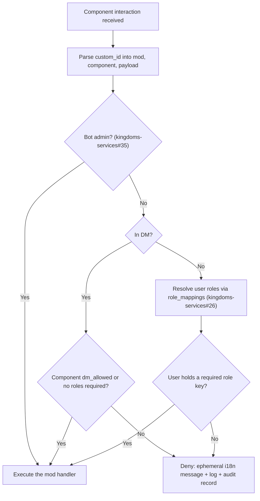
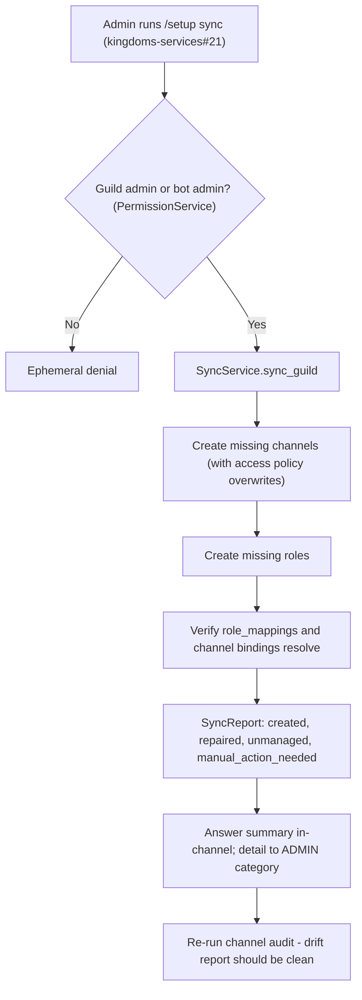

# Discord permissions & message delivery guide

This guide documents how Kingdoms handles **permissions** and **message
delivery** on Discord: the DM vs channel distinction, role-based runtime
authorization of component actions, per-destination rendering rules, channel
access categories, drift alerting, and the on-demand role/channel sync.

These rules were decided with the game designer; they are **binding for every
mod**. Implementation is tracked in kingdoms-services#55, kingdoms-services#56,
kingdoms-services#57 and kingdoms-services#58. The decision record is
[ADR-0016](../DECISIONS/016-discord-permissions-and-delivery.md); this page is
the operating reference.

Two principles anchor everything:

1. **Rendering is a hint, enforcement is runtime.** What a message displays
   (hidden, disabled, visible buttons) only guides the user. The real
   authorization happens when an interaction arrives, against the user's
   actual roles at that moment.
2. **The audience defines the content.** A DM has one known recipient; a
   channel message is broadcast to everyone who can read the channel, so it
   may only carry what everyone may see.

## 1. DM vs channel: two delivery contexts

Every send path must know its **destination**:

| Destination | Recipient | Personalization | Components |
| ----------- | --------- | --------------- | ---------- |
| **DM** | One known user | Allowed (user-specific state, roles, progress) | Buttons the user may use; unauthorized ones rendered **disabled** |
| **Channel** | Everyone who can read the channel | Forbidden (no per-user state, no personal data) | **Public components only** — never role-gated ones |
| **Ephemeral** (in-guild, in-context) | The interacting user only | Allowed | Same content rules as DM |

Key differences:

- A **DM message** is a private conversation with one user. It can be
  personalized and can show the full set of buttons the user *could* use.
  Buttons the user lacks the role for are sent **disabled** — visible but not
  clickable, optionally with the required role named — so the user learns
  what to unlock next. A button that can never apply to the user (neither
  role-satisfiable nor DM-allowed) is omitted entirely.
- A **channel message** is a broadcast. It must never contain role-gated
  buttons, personal data, or per-user state: anyone who can read the channel
  sees it. If a channel message would carry only gated components, send it
  without components, or route the gated part to the acting user's DM
  (decided per view and documented in the mod).
- Components declare their delivery intent once, and the UI layer applies it:

```python
ActionButton(
    custom_id="clans:join:confirm",
    required_roles=["clan_member"],  # logical role keys, never Discord IDs
    dm_allowed=False,               # may not appear in a DM
    public=False,                    # may not appear in a channel message
)
```

Mods never hand-write `disabled=True` per button: they declare intent, the
shared render helper (`render_for(destination, user_roles)`) applies the
policy. The helper works for both UI systems of
[ADR-0009](discord.md#1b-components-v2--layoutview-for-rich-ui) (embed-views
and Components V2 `LayoutView`, walking `walk_children()`).

## 2. Runtime authorization of component actions

Hiding or disabling a button is **UX, not a security boundary**: roles change
over time, persistent views survive restarts, and any interaction attempt
reaches the bot regardless of what the message displayed. Therefore **every**
interactive component action (button, select, modal) is authorized at
interaction time by the core `PermissionService`
(kingdoms-services#55):



Rules:

- Components reference **logical role keys** (`required_roles`), never
  hardcoded Discord role IDs; keys resolve through the `role_mappings`
  persisted by `RoleService` (kingdoms-services#26).
- **DMs have no guild roles**: a component usable from a DM must declare
  `dm_allowed=True` or require no roles; otherwise the interaction is denied.
- **Bot admins bypass** mod-level checks (kingdoms-services#35); guild admins
  do not, unless a component explicitly grants them the role key.
- A denial answers with an **ephemeral i18n message** and is logged with an
  audit record routed to the `LOGS` category (ADR-0003). A denied action
  never produces side effects.
- No view implements its own ad-hoc `interaction_check`: all checks route
  through `PermissionService`, so behavior is identical everywhere.

## 3. Channel access categories

Every channel category (ADR-0003, kingdoms-services#26) declares its
**audience**: which roles must/should have access. The declaration — not the
Discord permission overwrites — is the source of truth:

```python
@dataclass
class ChannelAccessPolicy:
    view: list[str]          # logical role keys that can view (empty = everyone)
    post: list[str]         # logical role keys that can post (empty = view policy)
    everyone_view: bool = True
    everyone_post: bool = False
    bot_overwrite: bool = True   # the bot always view + post
```

Core category policies:

| Category | View | Post | Notes |
| -------- | ---- | ---- | ----- |
| `ADMIN` | admin roles (kingdoms-services#35) | admin roles | Bot admin notifications, drift alerts |
| `REPORTS` | admin roles | everyone | Users may report; only admins read |
| `LOGS` | bot only | bot only | Audit records, denials |
| `ANNOUNCEMENTS` | everyone | bot only | Broadcasts |
| `LEADERBOARD` | everyone | bot only | Ladder standings |

Mods extend the policy per category: e.g. a `per_instance` clan-chat channel
restricts view and post to the clan's role. When the bot creates a channel,
it applies the policy as **permission overwrites** and stores it in the
`ChannelModel` document. The bot never applies overwrites to a channel it did
not create or claim via `/setup`.

## 4. Drift alerting

The declared policy and the actual guild state can drift: a human edits
channel permissions, a role is deleted, a channel is moved. The
`ChannelAuditService` (kingdoms-services#57) compares declaration against
reality and reports findings; **drift is reported, never silently repaired**:

- Triggers: bot startup, after each sync (section 5), a configurable
  schedule, and on demand from the admin mod.
- Routing: a human-readable summary (i18n, with severity) to the `ADMIN`
  category; full detail to `LOGS`. An admin-role mention for `high` severity
  is configurable, default off.
- Drift never blocks normal operation.

This mirrors the runtime rule at the infrastructure level: just as a stale
message must not grant an action, a stale overwrite must not grant access.
Both are caught at a trust boundary — interaction time for actions, audit
time for access.

## 5. On-demand role & channel sync

The sync (kingdoms-services#58) reconciles the guild with the declarations —
**explicitly, admin-triggered, idempotent, non-destructive**:



Rules:

- **Never automatic**: the bot never rewrites guild structure on its own at
  runtime; the sync runs only through the admin command.
- **Idempotent**: running twice changes nothing the second time.
- **Never deletes**: channels/roles no longer declared are reported as
  "no longer managed", not removed.
- **Never overwrites foreign objects**: a broken binding to a bot-managed
  role/channel is re-provisioned; anything else is flagged
  `manual_action_needed` for the admin to rebind (`bind_role`) or re-claim
  via `/setup`.
- Combined with the audit it closes the loop: **audit reports drift → admin
  runs sync → audit is clean**.

## 6. Rules summary (binding for all mods)

- Know the destination: DM, channel or ephemeral. Never send channel
  messages that contain role-gated components or personal data.
- Declare delivery intent on components (`required_roles`, `dm_allowed`,
  `public`); the render helper applies it. In DMs, unauthorized buttons are
  **disabled**, not hidden; impossible buttons are omitted.
- Authorize **at interaction time** through `PermissionService`; never trust
  what was rendered. Denials are ephemeral, i18n, logged.
- Reference logical role keys only; IDs resolve through `role_mappings`.
- Declare an access policy per channel category; the declaration is the
  source of truth, the audit reports drift, the admin-triggered sync repairs
  it.

## See also

- [ADR-0016](../DECISIONS/016-discord-permissions-and-delivery.md) — decision
  record for this guide
- [discord.md](discord.md) — Discord.py components guide (UI systems, views,
  persistent views, custom_id conventions)
- [ADR-0003](../DECISIONS/003-channel-categories.md) — channel categories
- kingdoms-services#55, kingdoms-services#56, kingdoms-services#57,
  kingdoms-services#58 — implementation issues
