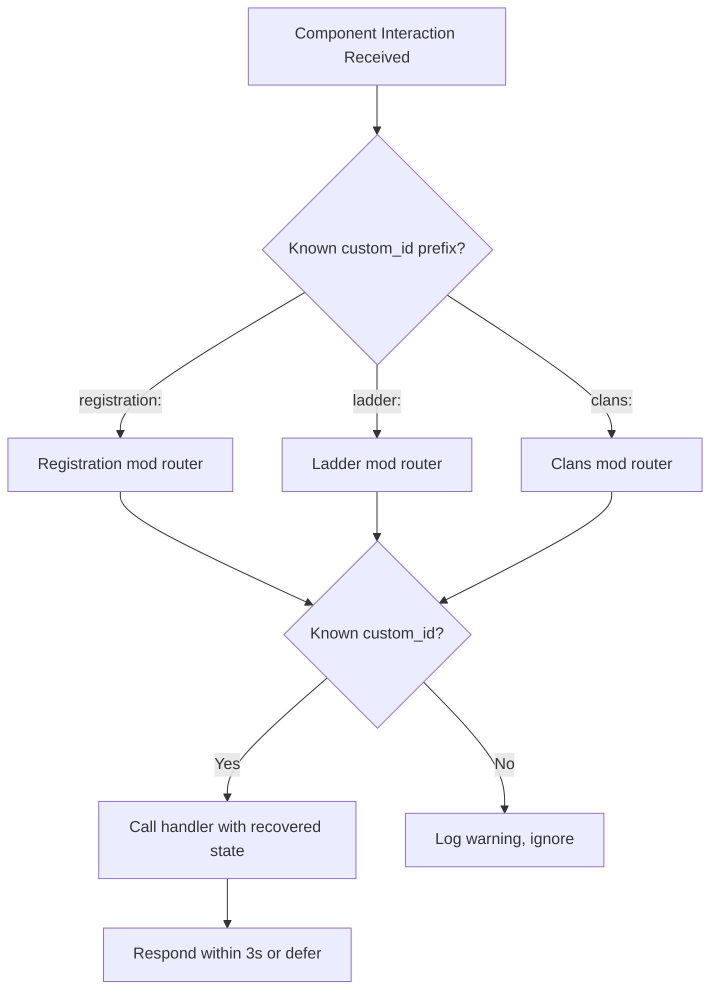

# Discord.py components guide

This guide documents the discord.py UI component concepts used throughout
Kingdoms: Views, Buttons, Selects, Modals, **Persistent Views**, and
**Dynamic Items**, with concrete usage patterns and pitfalls.

The goal is that all mods use consistent patterns, so interactions behave the
same everywhere and the game designer can iterate on interactions without
coding.

Implementation lives in `kingdoms-services` (see kingdoms-services#13); this
page is the reference for the patterns the implementation must follow.

## 1. Views (basic)

A `discord.ui.View` is a container for buttons/selects attached to a message.
It dies after its timeout.

Good for: one-off confirmations within a single conversation.

```python
"""
Basic view: buttons attached to a message. Dies after timeout.
Good for: one-off confirmations within a single conversation.
"""
import discord


class ConfirmCancelView(discord.ui.View):
    """Simple confirm/cancel with a timeout."""

    def __init__(self, author_id: int, timeout: int = 60):
        super().__init__(timeout=timeout)
        self.author_id = author_id
        self.value: bool | None = None

    async def interaction_check(self, interaction: discord.Interaction) -> bool:
        """Only the command author can use these buttons."""
        if interaction.user.id != self.author_id:
            await interaction.response.send_message(
                "This button is not for you.", ephemeral=True
            )
            return False
        return True

    @discord.ui.button(label="Confirm", style=discord.ButtonStyle.green)
    async def confirm(self, interaction: discord.Interaction, button: discord.ui.Button):
        self.value = True
        await interaction.response.send_message("Confirmed!", ephemeral=True)
        self.stop()

    @discord.ui.button(label="Cancel", style=discord.ButtonStyle.red)
    async def cancel(self, interaction: discord.Interaction, button: discord.ui.Button):
        self.value = False
        await interaction.response.send_message("Cancelled.", ephemeral=True)
        self.stop()
```

Usage:

```python
view = ConfirmCancelView(author_id=interaction.user.id)
await interaction.response.send_message("Are you sure?", view=view, ephemeral=True)
await view.wait()
if view.value:
    # proceed
    ...
```

## 2. Persistent Views (survive restarts)

Key rules:

1. `timeout=None`
2. Every component has an explicit, unique `custom_id`
3. The view must be added with `bot.add_view(...)` at startup
4. Callbacks must be able to recover state from `custom_id` or the database

```python
"""
Persistent view: works even after bot restarts.
Good for: registration welcome panels, leaderboard refresh buttons.
Custom IDs follow the convention: mod:component:payload
"""
import discord


class RegistrationPanelView(discord.ui.View):
    """Welcome panel with a Register button that always works."""

    def __init__(self):
        super().__init__(timeout=None)  # MUST be None for persistence

    @discord.ui.button(
        label="Register",
        style=discord.ButtonStyle.green,
        custom_id="registration:panel:register",  # Explicit custom_id
        emoji="✅",
    )
    async def register(self, interaction: discord.Interaction, button: discord.ui.Button):
        # No in-memory state here: recover everything from DB/interaction
        await interaction.response.defer(ephemeral=True)
        # ... start registration workflow ...
        await interaction.followup.send(
            "Check your DMs to complete registration!", ephemeral=True
        )


# At bot startup (in setup_hook):
# bot.add_view(RegistrationPanelView())
```

## 3. Dynamic Items (templated components)

`discord.ui.DynamicItem` allows a **single class** to serve components whose
`custom_id` embeds parameters. The template decorator declares the custom_id
shape:

```python
"""
Dynamic item: one class for many component instances.
Custom ID template: ladder:page:<int>
Example IDs: ladder:page:1, ladder:page:2, ladder:page:17
"""
import discord


class LadderPageButton(
    discord.ui.DynamicItem[discord.ui.Button],
    template=r"ladder:page:(?P<page>\d+)",
):
    """A pagination button that encodes the page number in its custom_id."""

    def __init__(self, page: int):
        super().__init__(
            discord.ui.Button(
                label=f"Page {page}",
                style=discord.ButtonStyle.grey,
                custom_id=f"ladder:page:{page}",
            )
        )
        self.page = page

    @classmethod
    def from_custom_id(cls, interaction, item, match):
        """Reconstruct the item from the custom_id regex match."""
        return cls(int(match["page"]))

    async def callback(self, interaction: discord.Interaction):
        # self.page was recovered from the custom_id
        await interaction.response.defer()
        # ... render page self.page of the leaderboard ...
```

Registration at startup:

```python
# in setup_hook:
bot.add_dynamic_items(LadderPageButton)
```

Why this matters for Kingdoms: the leaderboard channel can have dozens of page
buttons; a single `DynamicItem` class handles them all, including after
restarts.

## 4. Modals (text input forms)

```python
"""
Modal: popup form for text input.
Good for: report details, clan descriptions.
"""
import discord


class ReportModal(discord.ui.Modal, title="Submit a Report"):
    title_input = discord.ui.TextInput(
        label="Title",
        placeholder="Short summary",
        max_length=100,
        required=True,
    )
    description_input = discord.ui.TextInput(
        label="Description",
        style=discord.TextStyle.paragraph,
        placeholder="Describe the issue in detail",
        max_length=1000,
        required=True,
    )

    async def on_submit(self, interaction: discord.Interaction):
        await interaction.response.defer(ephemeral=True)
        # Access: self.title_input.value, self.description_input.value
        # ... create report, route to admin channel ...
        await interaction.followup.send("Report submitted. Thank you!", ephemeral=True)

    async def on_error(self, interaction, error):
        await interaction.response.send_message(
            "Something went wrong submitting your report.", ephemeral=True
        )
```

Launching a modal:

```python
@tree.command(name="report", description="Submit a report")
async def report_command(interaction: discord.Interaction):
    await interaction.response.send_modal(ReportModal())
```

## 5. Interaction lifecycle cheat sheet

| Method | When | Notes |
|--------|------|-------|
| `interaction.response.send_message(...)` | First response, < 3s | Public by default; `ephemeral=True` for private |
| `interaction.response.defer()` | First response when slow work follows | Must `followup.send()` later |
| `interaction.response.send_modal(...)` | First response, opens modal | Only valid first response for modals |
| `interaction.response.edit_message(...)` | Component click that edits the host message | For select menus, page turns |
| `interaction.followup.send(...)` | After defer, or second message | Multiple allowed |
| `interaction.edit_original_response(...)` | Edit the deferred first message | |

**Critical pitfall:** you have **3 seconds** to make the first response. Any DB
or external API call before that must use `defer()` first.

## 6. custom_id conventions (project-wide)

```
<mod>:<component>:<payload>
```

Examples:

- `registration:panel:register` — persistent panel button
- `registration:step:game` — select in registration workflow
- `ladder:page:3` — dynamic page button
- `clans:join:<clan_id>` — dynamic join button (payload = clan ID)

These conventions let the **DM listener and component router** dispatch any
interaction to the right mod handler with zero configuration.

### Component routing



## Pitfalls summary

- **`interaction_check`**: always restrict components to the intended user
  (e.g., the command author), with an ephemeral rejection message.
- **`timeout=None` is required** for persistence; any non-`None` timeout kills
  the view after inactivity, including after restarts.
- **Never store workflow state in memory** in persistent/dynamic components:
  recover it from the `custom_id` payload or the database
  (see [ADR-0002](../DECISIONS/002-workflow-engine.md)).
- **3-second rule**: defer before any slow work (DB, external API).
- **Modals have exactly one valid first response**:
  `response.send_modal(...)`.

## See also

- [../ARCHITECTURE.md](../ARCHITECTURE.md) — overall architecture and the UI
  layer placement (`discord/ui/`)
- [../WORKFLOWS.md](../WORKFLOWS.md) — how UI components feed the workflow
  engine
- kingdoms-services#13 — UI components implementation
