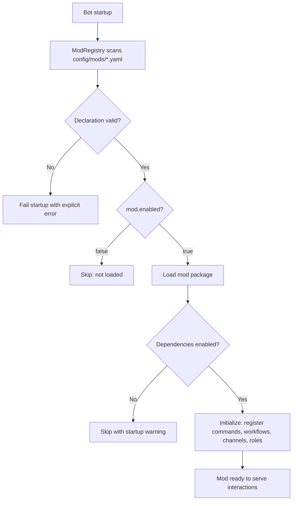

# Mod system design

This page documents the **design** of the mod system: registry, lifecycle,
and extension points. It complements [MODS/README.md](../MODS/README.md),
which stays documentation-facing (how to document a mod, available mods),
and [core.md](core.md), which covers the core services mods build on.

A mod is a self-contained game feature (register, ladder, clans, ...) built
only on the generic core. It never imports platform-specific code, and it
ships with its documentation set in `docs/MODS/<mod-name>/` (see the
[template](../MODS/TEMPLATE/)).

## 1. ModRegistry

`ModRegistry` is the central catalog of installed mods. It does not contain
game logic; it answers "which mods exist, which are enabled, and what do
they declare?".

Responsibilities:

1. **Discovery** — read mod declarations from
   `kingdoms-services/config/mods/<mod>.yaml` at startup
2. **Enablement** — honor the `enabled` flag; disabled mods are never
   loaded (no commands registered, no workflows, no channels created)
3. **Declaration surface** — expose, per mod:
   - its commands (names and descriptions, i18n keys)
   - its workflows (name → `IWorkflow` implementation)
   - its channel needs (`ChannelCategory` values it consumes or creates)
   - its role needs (roles it assigns or manages)
   - its MongoDB collections and Redis key scopes
4. **Dependency awareness** — declare soft dependencies between mods (e.g.
   ladder depends on register for player identity); a disabled dependency
   disables dependents with an explicit startup warning

### Declaration example

```yaml
# kingdoms-services/config/mods/register.yaml
mod:
  name: register
  enabled: true
  settings:
    default_role: "Player"
    admin_notifications: true
    allowed_games:
      - aoe2
      - chess
```

`ModRegistry` validates the declaration (schema, known categories, known
locales, resolvable workflow classes) before the mod is loaded; an invalid
declaration fails startup loudly rather than loading a half-initialized mod.



## 2. Mod lifecycle

| Phase | What happens | Failure policy |
| ----- | ------------ | -------------- |
| Discover | `ModRegistry` reads YAML declarations | Invalid YAML/schema → startup error |
| Validate | Schema, categories, locales, workflow classes | Unknown reference → startup error |
| Initialize | Register commands, workflows, channel needs, role needs | Initialization exception → startup error (fail-fast, no half-loaded mod) |
| Execute | Interactions drive mod workflows through `WorkflowEngine` | Runtime errors → user-facing error message, workflow instance left recoverable |
| Persist | In-flight workflows survive as `WorkflowState` | Restart → resume or timeout, never drop |
| Shutdown | Persist state, release locks, unregister | — |

The game-designer-facing summary of this lifecycle lives in
[MODS/README.md](../MODS/README.md#mod-lifecycle).

## 3. Extension points

Mods extend the platform by combining core seams (detailed in
[core.md](core.md#4-extension-points)):

| Need | Extension point | Example |
| ---- | --------------- | ------- |
| New interaction sequence | `IWorkflow` + `WorkflowEngine` | Registration flow |
| New destination | `ChannelCategory` value + `ChannelService` | `REPORTS` for match reports |
| New persistent data | MongoDB model | Ladder standings |
| New hot state | `StateService` key scope | Matchmaking queue |
| New user-facing identity | Role declared in mod settings | `Player` role |
| New content without code | YAML config (games, locales) | Add a game to `register` |

Anti-patterns (enforced by review, not by code):

- Importing `discord.py` (or any platform package) from mod or core code
- Hardcoding channel IDs, role IDs, or guild IDs
- Writing raw Redis commands instead of going through `StateService`
- Duplicating another mod's logic instead of depending on it explicitly

## 4. Mod contract

To be loadable, a mod package must provide:

1. A YAML declaration in `kingdoms-services/config/mods/<mod>.yaml`
   (schema shared with the [template](../../templates/mod-template/))
2. A Python package implementing its workflows against `IWorkflow` and
   calling only core services
3. A documentation set in `kingdoms/docs/MODS/<mod-name>/`:
   `README.md`, `RULES.md`, `ENVIRONMENT.md` (+ `CHANGELOG.md` when rules
   evolve) — validated by `scripts/validate_docs.py`
4. Locale entries for every user-facing string in
   `kingdoms-services/config/locales/{en,fr}.yaml`
   ([ADR-0008](../DECISIONS/008-i18n-system.md))

Mods are wired into Discord as cogs (see
[ARCHITECTURE.md](../ARCHITECTURE.md#3-discord-implementation-kingdoms-servicessrckingdomsdiscord)),
but cogs contain no game logic: they translate platform events into core
calls.

## 5. Testing a mod

Mods are tested through the same seams they use in production: `MockDiscord`
as the `IPlatform` implementation, in-memory stores, and the real
`WorkflowEngine`. A mod that only talks to the core is fully testable
without Discord. Strategy details: [testing.md](testing.md).

## See also

- [MODS/README.md](../MODS/README.md) — mod system overview (documentation-facing)
- [core.md](core.md) — core services design
- [ADR-0002](../DECISIONS/002-workflow-engine.md) — workflow engine decision
- [ADR-0008](../DECISIONS/008-i18n-system.md) — i18n decision
