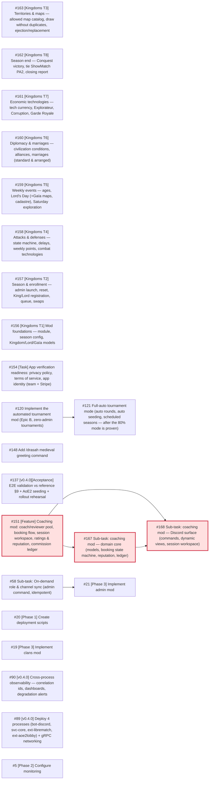

# Dependencies

> Auto-generated by `scripts/sync_dependencies.py`. Do not edit manually:
> edit the `## Dependencies` sections of the issues instead, then
> regenerate this page (see the [Update dependencies](../.agents/skills/update-dependencies/SKILL.md) skill).

Source: open issues in [kingdoms-services](https://github.com/merlin-pinpin-org/kingdoms-services/issues) and [kingdoms-infra](https://github.com/merlin-pinpin-org/kingdoms-infra/issues).

Priority labels come from critical-path analysis (CPM):

| Label | Meaning |
| ----- | ------- |
| `priority/P0` | zero slack — on the critical path, any delay delays the project |
| `priority/P1` | slack ≤ 4 pts — near-critical |
| `priority/P2` | slack ≤ 12 pts |
| `priority/P3` | large slack — can be deferred without impact |

Sizes (`size/XS..XL`) map to points (1, 3, 5, 8, 13).

## Critical path

Total: **31 pts**. Critical path:

[kingdoms-services#151](https://github.com/merlin-pinpin-org/kingdoms-services/issues/151) -> [kingdoms-services#167](https://github.com/merlin-pinpin-org/kingdoms-services/issues/167) -> [kingdoms-services#168](https://github.com/merlin-pinpin-org/kingdoms-services/issues/168)

## Dependency graph

## Waves (parallelisable batches)

Issues in the same wave have no dependency on each other and can be
worked on in parallel.

**Wave 0**

| Issue | Size | Priority | Slack |
| ----- | ---- | -------- | ----- |
| [kingdoms-services#151](https://github.com/merlin-pinpin-org/kingdoms-services/issues/151) — [Feature] Coaching mod: coach/reviewer pool, booking flow, session workspace, ratings & reputation, commission ledger | `XL` (13) | `P2` | 0 |
| [kingdoms-services#156](https://github.com/merlin-pinpin-org/kingdoms-services/issues/156) — [Kingdoms T1] Mod foundations — module, season config, Kingdom/Lord/Gaïa models | `XL` (13) | `P1` | 18 |
| [kingdoms-services#157](https://github.com/merlin-pinpin-org/kingdoms-services/issues/157) — [Kingdoms T2] Season & enrollment — admin launch, reset, King/Lord registration, queue, swaps | `XL` (13) | `P1` | 18 |
| [kingdoms-services#158](https://github.com/merlin-pinpin-org/kingdoms-services/issues/158) — [Kingdoms T4] Attacks & defenses — state machine, delays, weekly points, combat technologies | `XL` (13) | `P1` | 18 |
| [kingdoms-services#159](https://github.com/merlin-pinpin-org/kingdoms-services/issues/159) — [Kingdoms T5] Weekly events — ages, Lord's Day (+Gaïa maps, cadastre), Saturday exploration | `XL` (13) | `P1` | 18 |
| [kingdoms-services#160](https://github.com/merlin-pinpin-org/kingdoms-services/issues/160) — [Kingdoms T6] Diplomacy & marriages — civilization conditions, alliances, marriages (standard & arranged) | `XL` (13) | `P1` | 18 |
| [kingdoms-services#161](https://github.com/merlin-pinpin-org/kingdoms-services/issues/161) — [Kingdoms T7] Economic technologies — tech currency, Explorateur, Corruption, Garde Royale | `XL` (13) | `P1` | 18 |
| [kingdoms-services#162](https://github.com/merlin-pinpin-org/kingdoms-services/issues/162) — [Kingdoms T8] Season end — Conquest victory, tie ShowMatch PA2, closing report | `XL` (13) | `P1` | 18 |
| [kingdoms-services#163](https://github.com/merlin-pinpin-org/kingdoms-services/issues/163) — [Kingdoms T3] Territories & maps — allowed map catalog, draw without duplicates, ejection/replacement | `XL` (13) | `P1` | 18 |
| [kingdoms-infra#89](https://github.com/merlin-pinpin-org/kingdoms-infra/issues/89) — [v0.4.0] Deploy 4 processes (bot-discord, svc-core, ext-librematch, ext-aoe2lobby) + gRPC networking | `L` (8) | `P1` | 23 |
| [kingdoms-services#120](https://github.com/merlin-pinpin-org/kingdoms-services/issues/120) — Implement the automated tournament mod (Epic B, zero-admin tournaments) | `L` (8) | `P0` | 15 |
| [kingdoms-services#137](https://github.com/merlin-pinpin-org/kingdoms-services/issues/137) — [v0.4.0][Acceptance] E2E validation vs reference §9 + AoE2 seeding + rollout rehearsal | `L` (8) | `P1` | 23 |
| [kingdoms-infra#5](https://github.com/merlin-pinpin-org/kingdoms-infra/issues/5) — [Phase 2] Configure monitoring | `M` (5) | `P3` | 26 |
| [kingdoms-infra#90](https://github.com/merlin-pinpin-org/kingdoms-infra/issues/90) — [v0.4.0] Cross-process observability — correlation ids, dashboards, degradation alerts | `M` (5) | `P2` | 26 |
| [kingdoms-services#154](https://github.com/merlin-pinpin-org/kingdoms-services/issues/154) — [Task] App verification readiness: privacy policy, terms of service, app identity (team + Stripe) | `M` (5) | `P3` | 26 |
| [kingdoms-services#19](https://github.com/merlin-pinpin-org/kingdoms-services/issues/19) — [Phase 3] Implement clans mod | `M` (5) | `P2` | 26 |
| [kingdoms-services#58](https://github.com/merlin-pinpin-org/kingdoms-services/issues/58) — Sub-task: On-demand role & channel sync (admin command, idempotent) | `M` (5) | `P3` | 21 |
| [kingdoms-services#148](https://github.com/merlin-pinpin-org/kingdoms-services/issues/148) — Add /drasah medieval greeting command | `S` (3) | `P3` | 28 |
| [kingdoms-services#20](https://github.com/merlin-pinpin-org/kingdoms-services/issues/20) — [Phase 1] Create deployment scripts | `S` (3) | `P3` | 28 |

**Wave 1**

| Issue | Size | Priority | Slack |
| ----- | ---- | -------- | ----- |
| [kingdoms-services#167](https://github.com/merlin-pinpin-org/kingdoms-services/issues/167) — Sub-task: coaching mod — domain core (models, booking state machine, reputation, ledger) | `XL` (13) | `P2` | 0 |
| [kingdoms-services#121](https://github.com/merlin-pinpin-org/kingdoms-services/issues/121) — Full-auto tournament mode (auto rounds, auto seeding, scheduled seasons — after the 80% mode is proven) | `L` (8) | `P3` | 15 |
| [kingdoms-services#21](https://github.com/merlin-pinpin-org/kingdoms-services/issues/21) — [Phase 3] Implement admin mod | `M` (5) | `P2` | 21 |

**Wave 2**

| Issue | Size | Priority | Slack |
| ----- | ---- | -------- | ----- |
| [kingdoms-services#168](https://github.com/merlin-pinpin-org/kingdoms-services/issues/168) — Sub-task: coaching mod — Discord surface (commands, dynamic views, session workspace) | `M` (5) | `P1` | 0 |

## All issues

| Issue | Phase | Size | Priority | Slack | Depends on |
| ----- | ----- | ---- | -------- | ----- | ---------- |
| [kingdoms-infra#5](https://github.com/merlin-pinpin-org/kingdoms-infra/issues/5) — [Phase 2] Configure monitoring | 2 | `M` | `P3` | 26 | ~~[kingdoms-infra#1](https://github.com/merlin-pinpin-org/kingdoms-infra/issues/1)~~ ✅, ~~[kingdoms-infra#2](https://github.com/merlin-pinpin-org/kingdoms-infra/issues/2)~~ ✅ |
| [kingdoms-infra#89](https://github.com/merlin-pinpin-org/kingdoms-infra/issues/89) — [v0.4.0] Deploy 4 processes (bot-discord, svc-core, ext-librematch, ext-aoe2lobby) + gRPC networking | ? | `L` | `P1` | 23 | — |
| [kingdoms-infra#90](https://github.com/merlin-pinpin-org/kingdoms-infra/issues/90) — [v0.4.0] Cross-process observability — correlation ids, dashboards, degradation alerts | ? | `M` | `P2` | 26 | — |
| [kingdoms-services#19](https://github.com/merlin-pinpin-org/kingdoms-services/issues/19) — [Phase 3] Implement clans mod | 3 | `M` | `P2` | 26 | ~~[kingdoms-services#4](https://github.com/merlin-pinpin-org/kingdoms-services/issues/4)~~ ✅, ~~[kingdoms-services#5](https://github.com/merlin-pinpin-org/kingdoms-services/issues/5)~~ ✅, ~~[kingdoms-services#6](https://github.com/merlin-pinpin-org/kingdoms-services/issues/6)~~ ✅, ~~[kingdoms-services#12](https://github.com/merlin-pinpin-org/kingdoms-services/issues/12)~~ ✅, ~~[kingdoms-services#16](https://github.com/merlin-pinpin-org/kingdoms-services/issues/16)~~ ✅, ~~[kingdoms-services#17](https://github.com/merlin-pinpin-org/kingdoms-services/issues/17)~~ ✅, ~~[kingdoms-services#55](https://github.com/merlin-pinpin-org/kingdoms-services/issues/55)~~ ✅, ~~[kingdoms-services#56](https://github.com/merlin-pinpin-org/kingdoms-services/issues/56)~~ ✅, ~~[kingdoms-services#57](https://github.com/merlin-pinpin-org/kingdoms-services/issues/57)~~ ✅ |
| [kingdoms-services#20](https://github.com/merlin-pinpin-org/kingdoms-services/issues/20) — [Phase 1] Create deployment scripts | 1 | `S` | `P3` | 28 | ~~[kingdoms-infra#1](https://github.com/merlin-pinpin-org/kingdoms-infra/issues/1)~~ ✅, ~~[kingdoms-services#12](https://github.com/merlin-pinpin-org/kingdoms-services/issues/12)~~ ✅ |
| [kingdoms-services#21](https://github.com/merlin-pinpin-org/kingdoms-services/issues/21) — [Phase 3] Implement admin mod | 3 | `M` | `P2` | 21 | [kingdoms-services#58](https://github.com/merlin-pinpin-org/kingdoms-services/issues/58), ~~[kingdoms-services#12](https://github.com/merlin-pinpin-org/kingdoms-services/issues/12)~~ ✅, ~~[kingdoms-services#14](https://github.com/merlin-pinpin-org/kingdoms-services/issues/14)~~ ✅, ~~[kingdoms-services#16](https://github.com/merlin-pinpin-org/kingdoms-services/issues/16)~~ ✅, ~~[kingdoms-services#17](https://github.com/merlin-pinpin-org/kingdoms-services/issues/17)~~ ✅, ~~[kingdoms-services#55](https://github.com/merlin-pinpin-org/kingdoms-services/issues/55)~~ ✅, ~~[kingdoms-services#57](https://github.com/merlin-pinpin-org/kingdoms-services/issues/57)~~ ✅ |
| [kingdoms-services#58](https://github.com/merlin-pinpin-org/kingdoms-services/issues/58) — Sub-task: On-demand role & channel sync (admin command, idempotent) | 3 | `M` | `P3` | 21 | ~~[kingdoms-services#5](https://github.com/merlin-pinpin-org/kingdoms-services/issues/5)~~ ✅, ~~[kingdoms-services#26](https://github.com/merlin-pinpin-org/kingdoms-services/issues/26)~~ ✅, ~~[kingdoms-services#35](https://github.com/merlin-pinpin-org/kingdoms-services/issues/35)~~ ✅, ~~[kingdoms-services#55](https://github.com/merlin-pinpin-org/kingdoms-services/issues/55)~~ ✅, ~~[kingdoms-services#57](https://github.com/merlin-pinpin-org/kingdoms-services/issues/57)~~ ✅ |
| [kingdoms-services#120](https://github.com/merlin-pinpin-org/kingdoms-services/issues/120) — Implement the automated tournament mod (Epic B, zero-admin tournaments) | 3 | `L` | `P0` | 15 | ~~[kingdoms-services#5](https://github.com/merlin-pinpin-org/kingdoms-services/issues/5)~~ ✅, ~~[kingdoms-services#15](https://github.com/merlin-pinpin-org/kingdoms-services/issues/15)~~ ✅, ~~[kingdoms-services#27](https://github.com/merlin-pinpin-org/kingdoms-services/issues/27)~~ ✅ |
| [kingdoms-services#121](https://github.com/merlin-pinpin-org/kingdoms-services/issues/121) — Full-auto tournament mode (auto rounds, auto seeding, scheduled seasons — after the 80% mode is proven) | 3 | `L` | `P3` | 15 | [kingdoms-services#120](https://github.com/merlin-pinpin-org/kingdoms-services/issues/120) |
| [kingdoms-services#137](https://github.com/merlin-pinpin-org/kingdoms-services/issues/137) — [v0.4.0][Acceptance] E2E validation vs reference §9 + AoE2 seeding + rollout rehearsal | ? | `L` | `P1` | 23 | ~~[kingdoms-services#128](https://github.com/merlin-pinpin-org/kingdoms-services/issues/128)~~ ✅, ~~[kingdoms-services#129](https://github.com/merlin-pinpin-org/kingdoms-services/issues/129)~~ ✅, ~~[kingdoms-services#130](https://github.com/merlin-pinpin-org/kingdoms-services/issues/130)~~ ✅, ~~[kingdoms-services#131](https://github.com/merlin-pinpin-org/kingdoms-services/issues/131)~~ ✅, ~~[kingdoms-services#132](https://github.com/merlin-pinpin-org/kingdoms-services/issues/132)~~ ✅, ~~[kingdoms-services#133](https://github.com/merlin-pinpin-org/kingdoms-services/issues/133)~~ ✅, ~~[kingdoms-services#134](https://github.com/merlin-pinpin-org/kingdoms-services/issues/134)~~ ✅, ~~[kingdoms-services#135](https://github.com/merlin-pinpin-org/kingdoms-services/issues/135)~~ ✅, ~~[kingdoms-services#136](https://github.com/merlin-pinpin-org/kingdoms-services/issues/136)~~ ✅, ~~[kingdoms-services#138](https://github.com/merlin-pinpin-org/kingdoms-services/issues/138)~~ ✅, ~~[kingdoms-services#139](https://github.com/merlin-pinpin-org/kingdoms-services/issues/139)~~ ✅, ~~[kingdoms-services#140](https://github.com/merlin-pinpin-org/kingdoms-services/issues/140)~~ ✅, ~~[kingdoms-services#141](https://github.com/merlin-pinpin-org/kingdoms-services/issues/141)~~ ✅, ~~[kingdoms-services#142](https://github.com/merlin-pinpin-org/kingdoms-services/issues/142)~~ ✅ |
| [kingdoms-services#148](https://github.com/merlin-pinpin-org/kingdoms-services/issues/148) — Add /drasah medieval greeting command | ? | `S` | `P3` | 28 | — |
| [kingdoms-services#151](https://github.com/merlin-pinpin-org/kingdoms-services/issues/151) — [Feature] Coaching mod: coach/reviewer pool, booking flow, session workspace, ratings & reputation, commission ledger | ? | `XL` | `P2` | 0 | — |
| [kingdoms-services#154](https://github.com/merlin-pinpin-org/kingdoms-services/issues/154) — [Task] App verification readiness: privacy policy, terms of service, app identity (team + Stripe) | ? | `M` | `P3` | 26 | — |
| [kingdoms-services#156](https://github.com/merlin-pinpin-org/kingdoms-services/issues/156) — [Kingdoms T1] Mod foundations — module, season config, Kingdom/Lord/Gaïa models | ? | `XL` | `P1` | 18 | — |
| [kingdoms-services#157](https://github.com/merlin-pinpin-org/kingdoms-services/issues/157) — [Kingdoms T2] Season & enrollment — admin launch, reset, King/Lord registration, queue, swaps | ? | `XL` | `P1` | 18 | — |
| [kingdoms-services#158](https://github.com/merlin-pinpin-org/kingdoms-services/issues/158) — [Kingdoms T4] Attacks & defenses — state machine, delays, weekly points, combat technologies | ? | `XL` | `P1` | 18 | — |
| [kingdoms-services#159](https://github.com/merlin-pinpin-org/kingdoms-services/issues/159) — [Kingdoms T5] Weekly events — ages, Lord's Day (+Gaïa maps, cadastre), Saturday exploration | ? | `XL` | `P1` | 18 | — |
| [kingdoms-services#160](https://github.com/merlin-pinpin-org/kingdoms-services/issues/160) — [Kingdoms T6] Diplomacy & marriages — civilization conditions, alliances, marriages (standard & arranged) | ? | `XL` | `P1` | 18 | — |
| [kingdoms-services#161](https://github.com/merlin-pinpin-org/kingdoms-services/issues/161) — [Kingdoms T7] Economic technologies — tech currency, Explorateur, Corruption, Garde Royale | ? | `XL` | `P1` | 18 | — |
| [kingdoms-services#162](https://github.com/merlin-pinpin-org/kingdoms-services/issues/162) — [Kingdoms T8] Season end — Conquest victory, tie ShowMatch PA2, closing report | ? | `XL` | `P1` | 18 | — |
| [kingdoms-services#163](https://github.com/merlin-pinpin-org/kingdoms-services/issues/163) — [Kingdoms T3] Territories & maps — allowed map catalog, draw without duplicates, ejection/replacement | ? | `XL` | `P1` | 18 | — |
| [kingdoms-services#167](https://github.com/merlin-pinpin-org/kingdoms-services/issues/167) — Sub-task: coaching mod — domain core (models, booking state machine, reputation, ledger) | ? | `XL` | `P2` | 0 | [kingdoms-services#151](https://github.com/merlin-pinpin-org/kingdoms-services/issues/151) |
| [kingdoms-services#168](https://github.com/merlin-pinpin-org/kingdoms-services/issues/168) — Sub-task: coaching mod — Discord surface (commands, dynamic views, session workspace) | ? | `M` | `P1` | 0 | [kingdoms-services#151](https://github.com/merlin-pinpin-org/kingdoms-services/issues/151), [kingdoms-services#167](https://github.com/merlin-pinpin-org/kingdoms-services/issues/167) |
